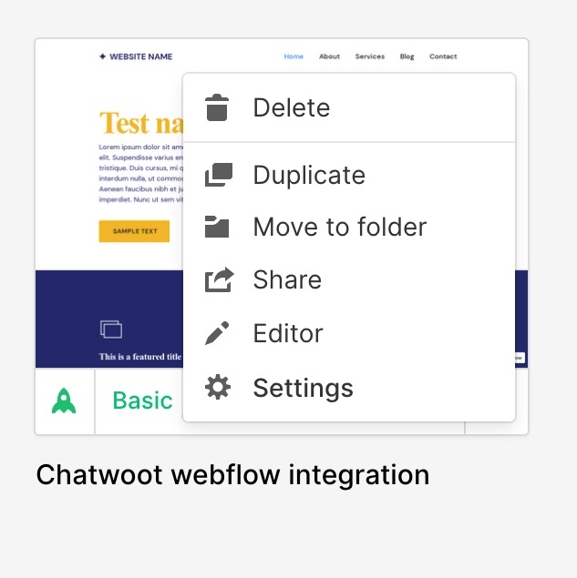

Add Chatwoot live chat widget to talk to your Webflow website visitors in realtime. Chatwoot helps you to chat with your visitors and provide expectional support in realtime. To use Chatwoot as your website live chat, follow the steps described below.

### 1. Create a website inbox in Chatwoot

Refer to [Website Channel](/docs/channels/website) document.

### 2. Install the generated script in Webflow
 

#### Go to website settings

Login to your Webflow account and select your website. Select Settings

 

#### Paste the script in Footer Code in Webflow

Go to **Custom Code** -> **Footer Code**. Paste the script in Footer Code section and save the changes.

### 3. Publish the changes

Click on Publish -> Select the website -> Publish to selected domains.

**Voila!** You have successfully integrated Chatwoot with Webflow.

