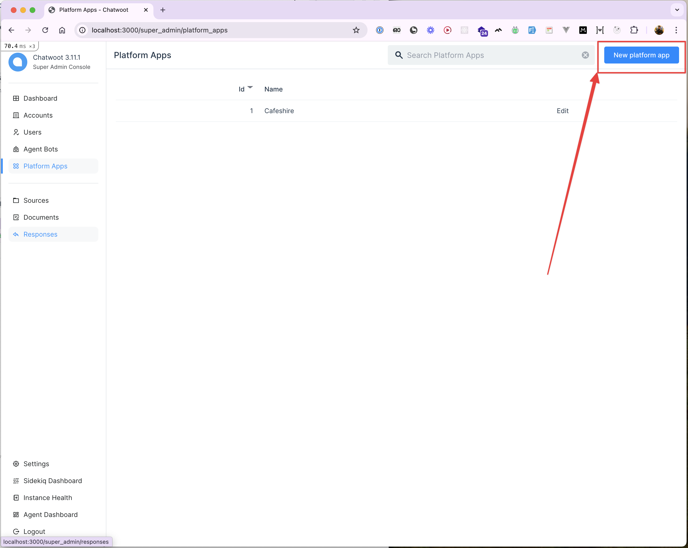
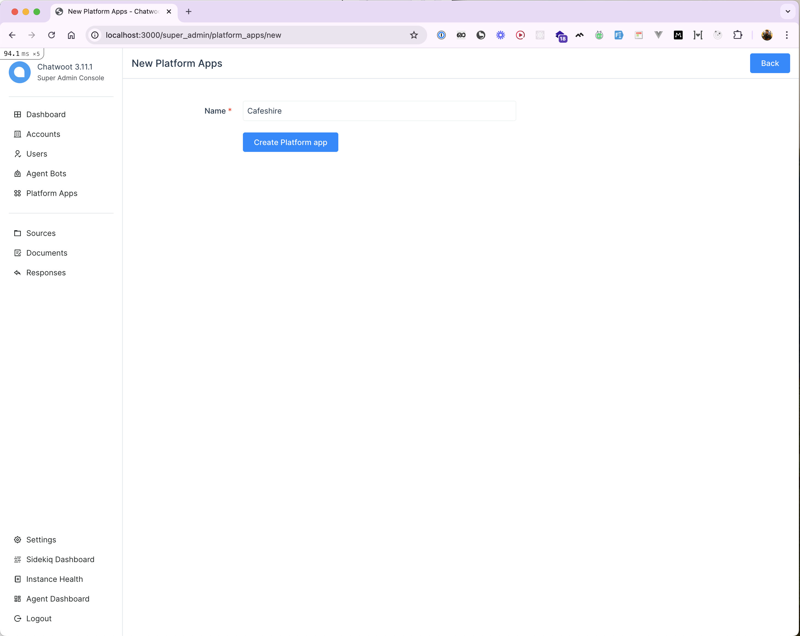
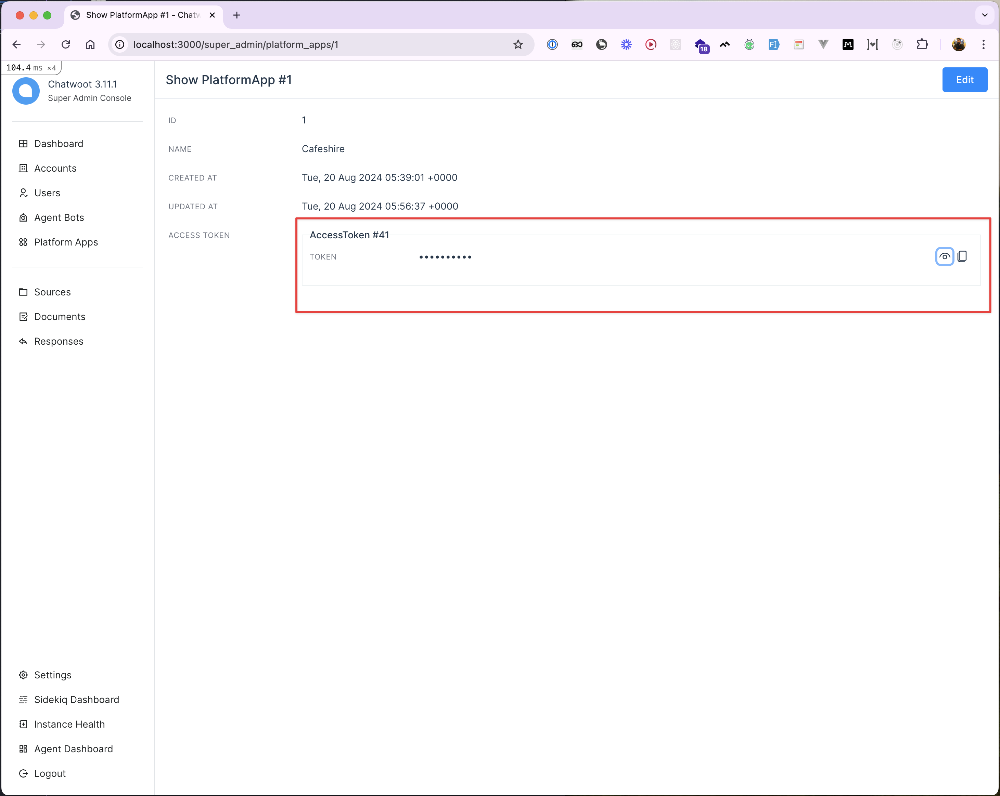
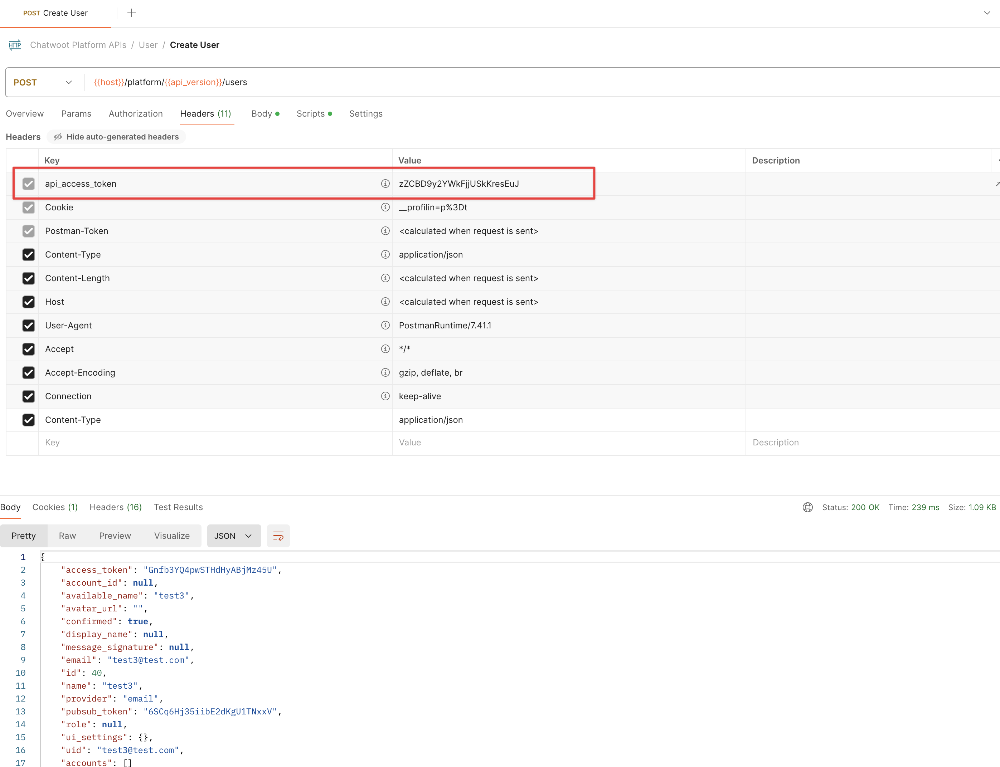

# Chatwoot Platform APIs

These APIs are used if you plan to build a conversation management interface into your existing software stack. The installation admin can use these APIs to manage users, accounts, and roles. These APIs could also be used to sync auth information from external systems into Chatwoot.

> **Note:** These APIs are available on `self-hosted` Chatwoot installations.

## Creating a Platform App

To create a platform app, follow these steps:

1. Go to the super admin portal and navigate to `super_admin/platform_apps`.

   

2. Click on the "New platform app" button.

   

3. Fill in the platform app name and click the "Create" button.

   

4. After creating the platform app, open it to view and copy the access token.

   

## Using the Access Token

We use the `access_token` to authenticate all these APIs. Please make use of the Postman collection to test these APIs.

### Testing the APIs

To test the APIs:

1. Copy the access token from the platform app.
2. Use it in the `Authorization` header of your API requests.

Here's an example of creating a user using the API:

Similarly, you can create `Account` and `Role` using the APIs.

## Reference

For more detailed information and to test the APIs, refer to our [Postman Collection](https://www.postman.com/chatwoot/workspace/chatwoot-apis/collection/162770-e5451b69-9f97-489b-b352-4ca7d8d82aff).