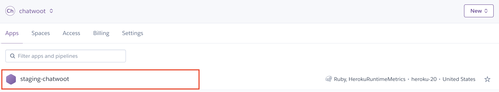
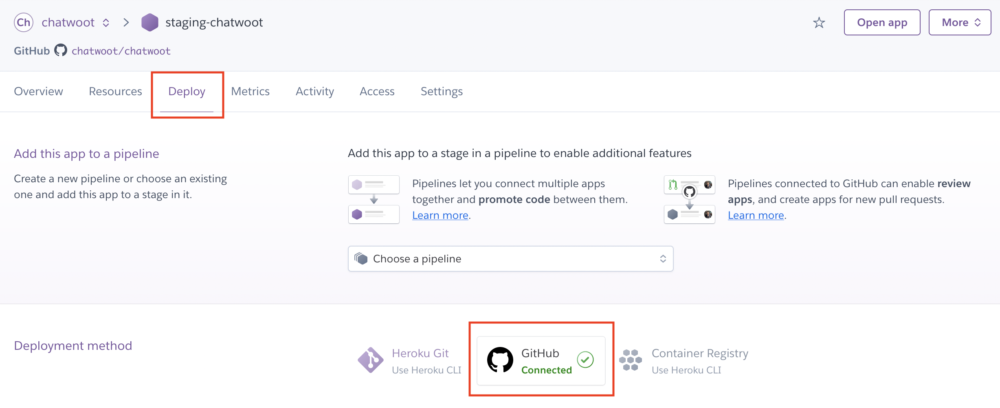
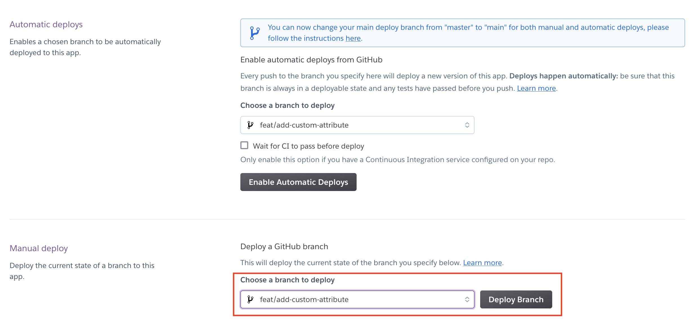

This document is a place to search for frequently asked questions about the engineering culture and internal process. We can create separate pages when required.

### How to deploy a branch to staging?

Make sure you have access to the staging infrastructure. If not, reach out to Sojan to provide you access. We use Heroku for our staging infra now. To deploy your branch to staging, follow the steps below.

1. Log in to your Heroku account, select the team from the dropdown.

2. You will be able to see the list of apps you have access to. Select `staging-chatwoot` from there.

3. Select the `Deploy` tab. Ensure that the deployment method `Github` is in the `connected` state. If not, click on it and authorize your Github account.

4. Scroll down to `Manual deploy` section. Select the branch you want to deploy and click on `Deploy Branch` button.

This process would take 10-15 minutes to complete. Once it is complete, open the [Staging URL](https://staging.chatwoot.com) to verify your changes.
