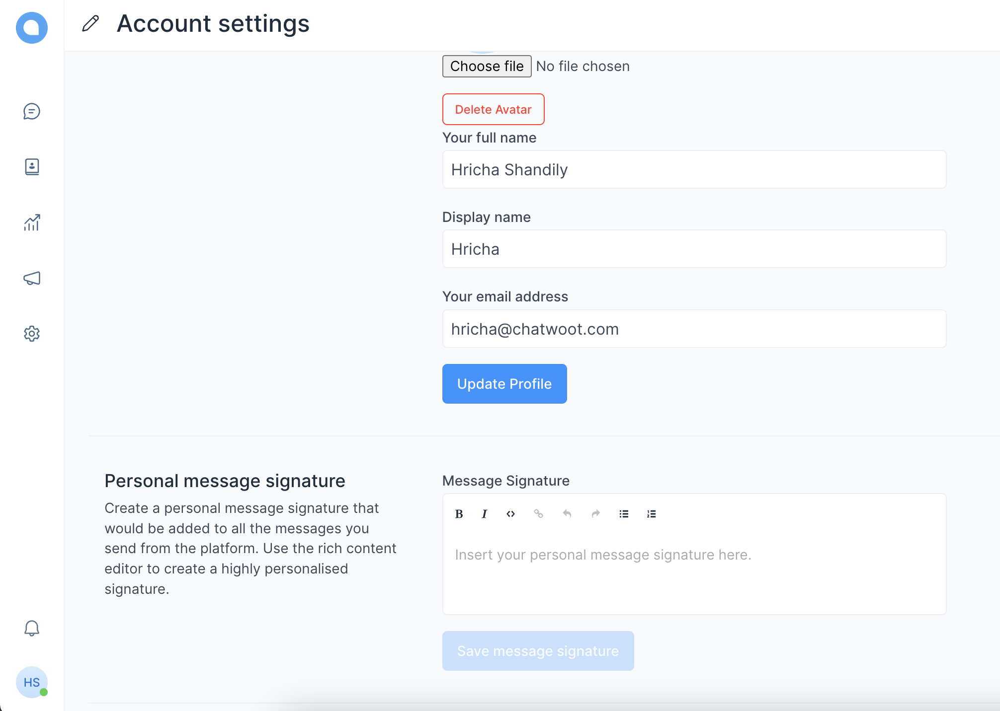
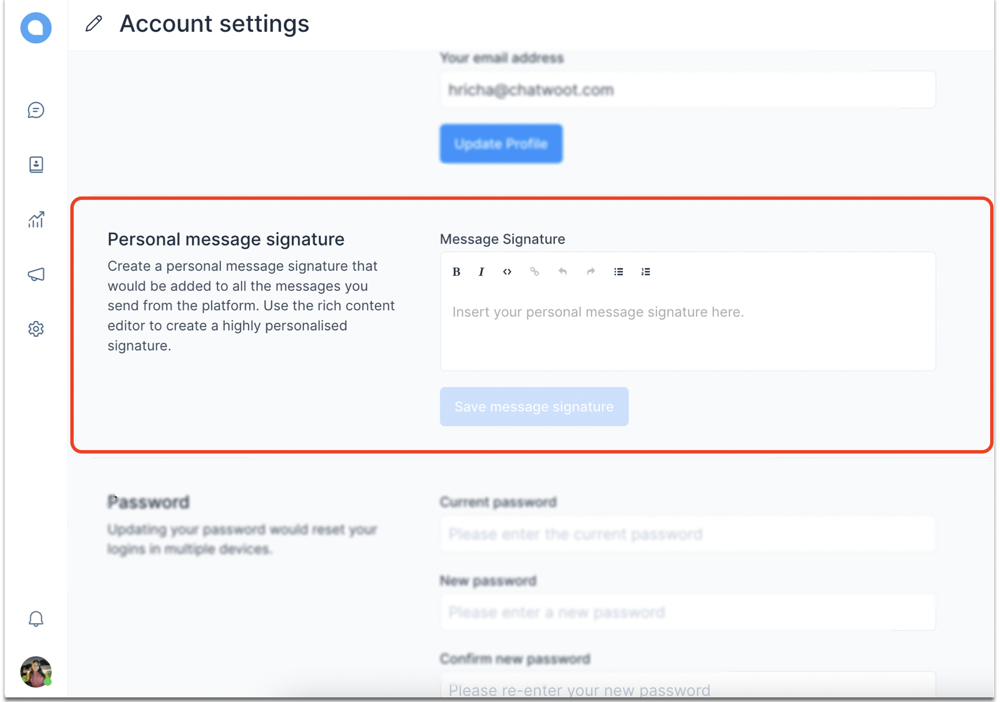
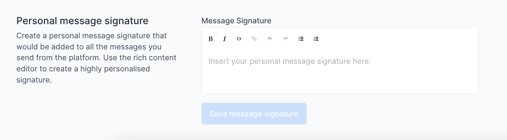
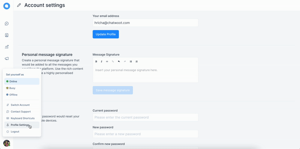
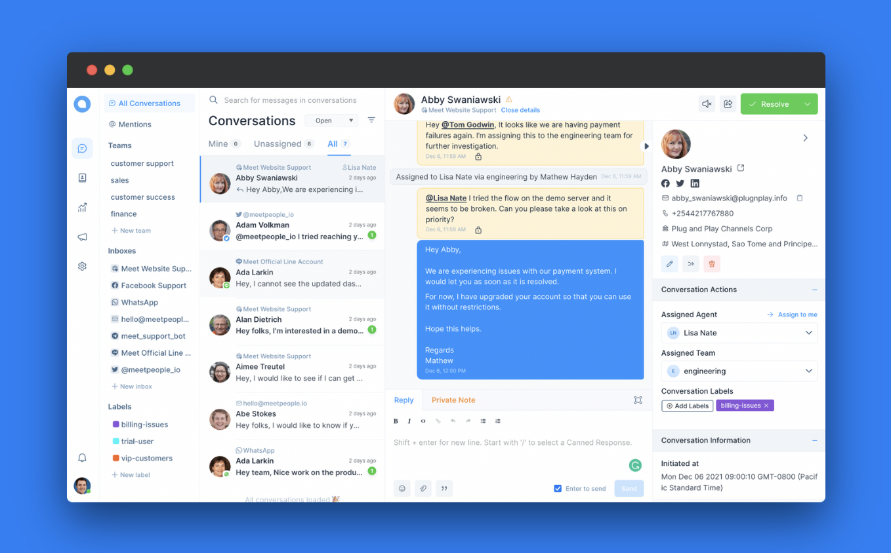

We at Chatwoot want to deliver the best user experience. Screenshots and screencasts become a very important part of the process when we want the end-user to feel as comfortable as possible using Chatwoot. For this, we must keep a few things in mind. So, let’s look at this in parts: what is the approach to be followed, and what are the basic guidelines to keep in mind. ⏬

## Approach to be followed

Having the right approach will take away all the guesswork from creating a screenshot. This will only take a couple of minutes. So, begin by asking yourself the following questions:

1. **Which channel am I publishing to?**
   Are you creating the screenshot/screencast for the help center, a landing page, a social media post, or a deck? Having this clarity will make the rest of the process easier.

2. **Who is the audience?**
   If you’re creating this for a Twitter post, the target audience is the following we have there. These are generally startup decision-makers, competitors, folks in the industry, well-wishers, community folks and even our users. If you’re creating the screenshot for the help center, you can be sure of the fact that these are our existing users who are looking for a specific answer. So, take a minute to determine who you’re creating the screenshot for so that you can tailor-make it for them and provide the best value possible.

3. **What is the broad intent of the screenshot?**
   If the intent is to introduce a new feature through Twitter, you might wanna keep the screenshot/screencast interesting (read: promotional) as well as functional. This means you can add a MacBook window around the screenshot, or add a frame around with a complimentary piece of text. If the purpose is to help the user in the help center, you can just focus on what the latest product dashboard looks like and show step-by-step instructions on how to solve the associated problem.

4. **Screenshot or screencast?**
   Once you know the answers to all the three questions outlined above, you can decide on whether a screenshot would serve your purpose better or a screencast. Here are some more points you can consider to help with this decision:

- Are you trying to outline an entire process or just a step in the way?
- Is the process so long that you’ll have to give too many screenshots and the reader will have to scroll too much?
- Is understanding every little step or screen in a defined process essential to the user?
- Which one do you think would be more attention-grabbing?
- Which format complements the context of the solution better?

## General Guidelines

Here are some basic things to keep in mind:

- Focus on the problem to be solved and deliver the right message through your images. Focus on the main part of the screenshot.
- Do not show the entire window if it is not adding any value to the screenshot.
- You can choose to zoom in on the part of the window that is core to the message you’re trying to convey or very lightly blur the background to help the viewer know which part of the image to focus on.
- Use a good contrast if you’re sketching or annotating on the screenshot. Ideally, one should understand the intended message of a screenshot at the first glance.
- Direct the eye of the reader. Use arrows if necessary.
- Do not hesitate to include more screenshots if it helps in getting the point across more clearly. Otherwise, record a screencast or GIF.
- Make sure that you are using a real-world example and not using content "Test Content" or names like "Test" in the screenshots.
- Make sure the screenshots do not expose any PII or production data. Use a staging account for taking screenshots.

**Let’s see an example**

Let us illustrate “how to add a personal message signature.” Look at the four options below:

**I.**

**II.**

**III.**

**IV.**

**_So, which one did you select?_**

We’re pretty sure you would’ve selected the fourth option because it checks all the boxes. Let’s see what those are:

- [ ] At a single glance, you can tell where the image wants you to focus.
- [ ] It gives you an idea about the entire screen you’d be viewing when finding this setting, while not compromising with the core message. As opposed to this, SS #3 wasn’t that helpful.
- [ ] All the unnecessary info is blurred, but only so much that you can see/read what the options above and below the “personal message signature” are but they wouldn’t eat up space in the screenshot and confuse you. This’ll help you locate this option more easily. However, notice that the side panel and “Account settings” are not blurred. It’s because these are important pieces of info for this particular screenshot.
- [ ] A red rectangle is added around the area I want you to focus on.

**_Alternatively_**, a gif should look something like this:

And these are the boxes the gif checks:

- [ ] It’s short and to the point.
- [ ] It clears away all the distractions by zooming in on the most important part of the gif.
- [ ] It’s sped up by 150% because nobody likes to look at an unnecessarily slow content piece.

:::note

Free tool used to edit this screenshot: [PineTools](https://pinetools.com/censor-photo-blur-pixelate)

Free tool used to edit the gif: [Ezgif](https://ezgif.com/)

:::

## Chatwoot Guidelines

Everything depends on the intent of the content you’re creating, as described above. However, keep the following things consistent when making a screenshot or screencast for Chatwoot.

- For sketching anything on the screenshot or screencast, use a shade of red `#FE2500`. Red attracts attention and would look good on a light UI like ours.
- For rectangular-shaped, landscape-oriented screenshots, keep the width at least 1,000 pixels. If you’re taking a portrait-oriented screenshot, try to keep the wide edge of 500 pixels.
- No need to add anything unnecessary if you’re publishing on the help centre. If you need to add a background for a social media post, use a colour that complements our brand colour or the brand color itself. This is the hex code for the shade of blue that we use: `#46A7F6`. Here’s an example is taken from [this](https://www.chatwoot.com/blog/the-complete-guide-to-building-your-customer-experience-strategy-in-2022/) blog:

If you want to use a complementary color instead, you can use [https://coolors.co/](https://coolors.co/) to create color palettes.

- Use [https://screenshotr.app/](https://screenshotr.app/) to add browser styles, mobile frames, backgrounds, keep platform-specific sizing, etc.
- When recording a GIF or screencast:
  - Zoom in on the important parts of the steps.
  - Remember that the way you use your cursor will direct the eye of the audience. So, use it accordingly.
  - If it’s a GIF, it would keep repeating the steps. Therefore, keep the total recorded process under 5 seconds. If it exceeds that, you might want to record a video with voice-over/music instead.
- Quickly send it for a marketing review. :)
