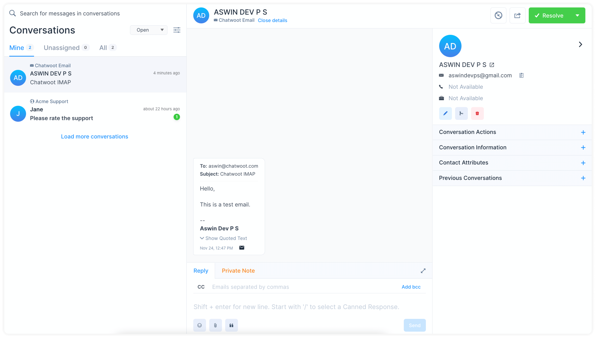

If you are using Gmail, [setup IMAP for Gmail in inbox settings](/docs/product/channels/email/gmail/enable-imap).

**Step 1**. Go to Settings → Inboxes → Email Inbox settings → Configuration tab.

**Step 2**. Select the checkbox `Enable IMAP configuration for this inbox`. You’ll be able to see the required fields as follows.

1. Address
2. Port
3. Email
4. Password

For help, refer to:

- 2-step enabled Gmail accounts. Refer : [Generate app password](/docs/product/channels/email/gmail/generate-app-password)
- All other Gmail accounts. Refer: [Allow less secure access](docs/product/channels/email/gmail/less-secure-access)

**Step 3**. Test if everything is working fine. Send an email to the IMAP configured email in Chatwoot. Check Chatwoot inbox for the new email. Open the email conversation in Chatwoot and verify the email details.

