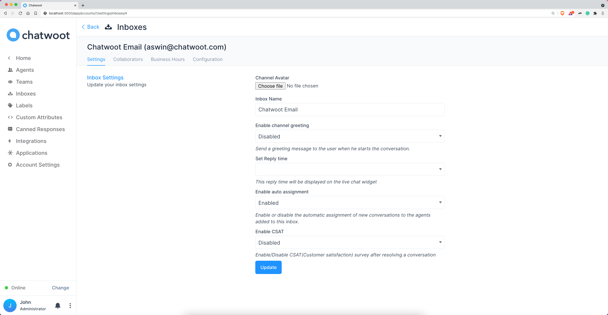
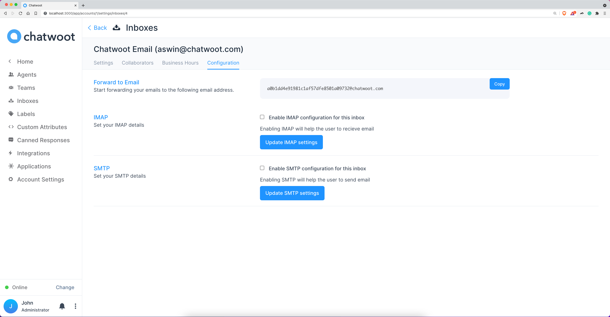
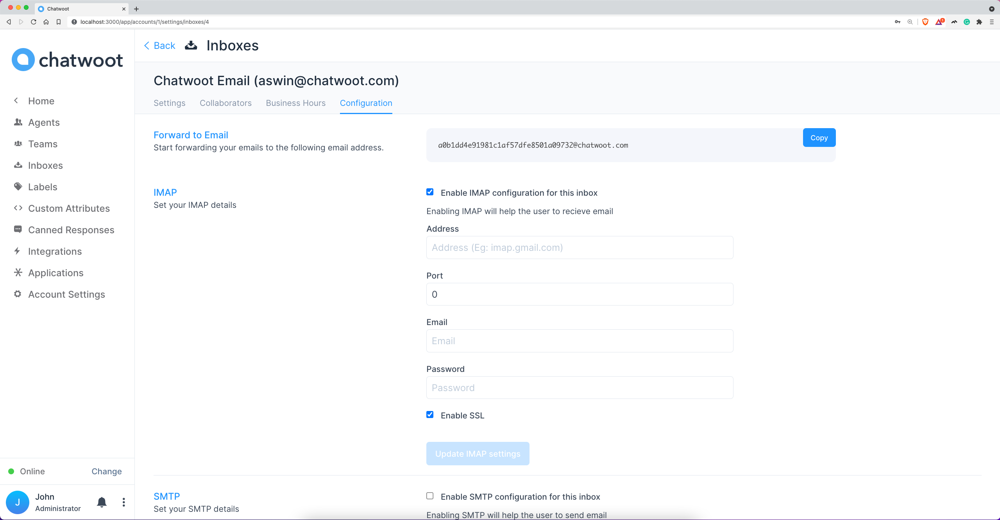
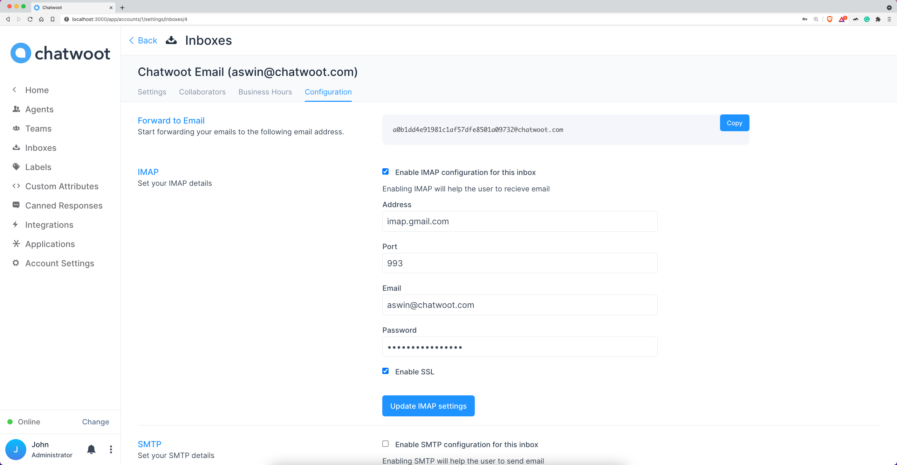
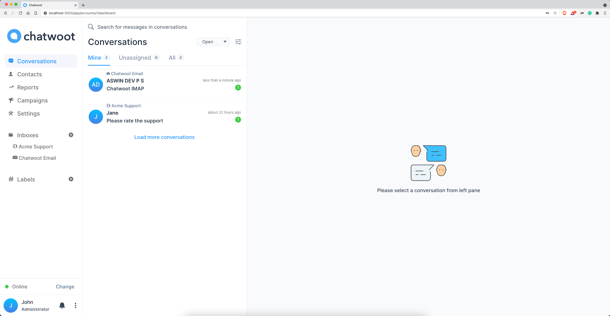
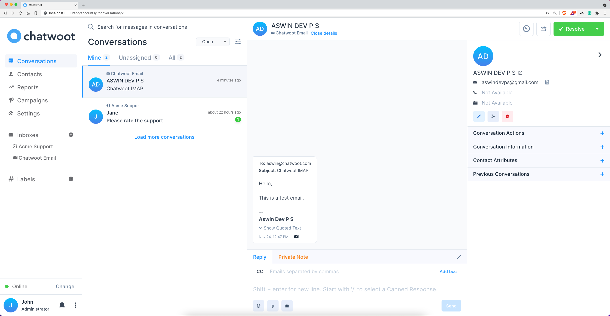

> **Note:** To setup IMAP for Gmail, please enable IMAP in inbox settings. [Enable IMAP](/docs/product/channels/email/gmail/enable-imap)

**Step 1**. Go to Settings > Inboxes > Email Inbox settings page.

**Step 2**. Select "Configuration" tab.

**Step 3**. To enable IMAP, select checkbox "Enable IMAP configuration for this inbox"

**Step 4**. Fill up below fields and click on "Update IMAP settings".

1. Address
2. Port
3. Email
4. Password
   - 2-step enabled Gmail accounts. Refer : [Generate app password](/docs/product/channels/email/gmail/generate-app-password)
   - All other Gmail accounts. Refer: [Allow less secure access](/docs/product/channels/email/gmail/less-secure-access)

**Step 6**. Send a mail to the IMAP configured email in Chatwoot.

**Step 5**. Check Chatwoot inbox for the new email.

**Step 5**. Open the email conversation in Chatwoot and verify the email details.

