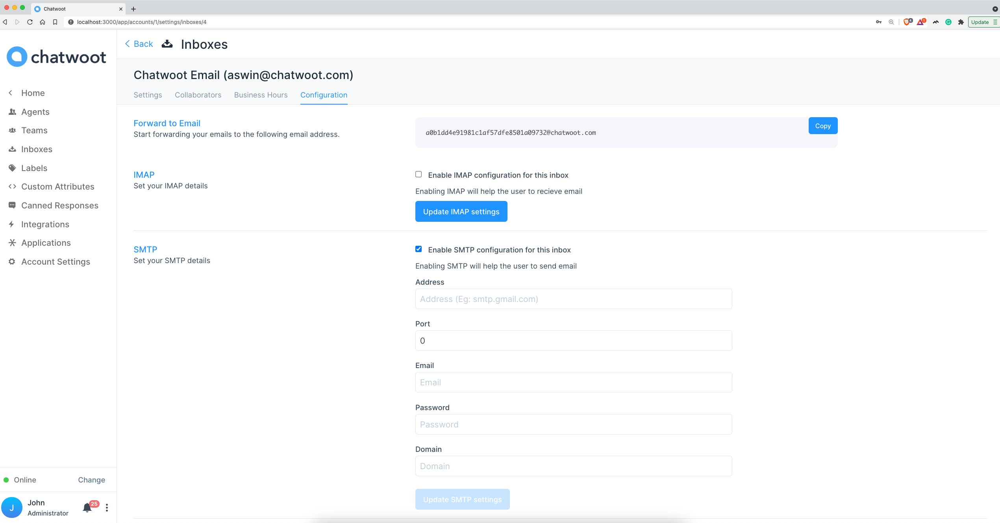
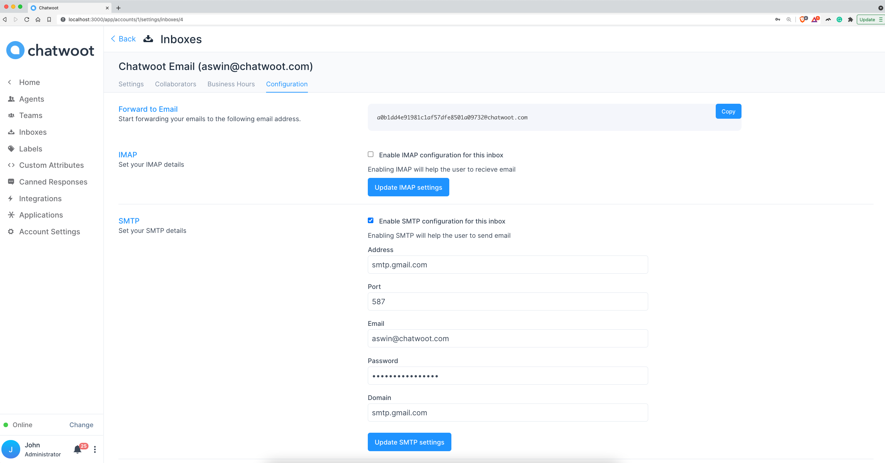
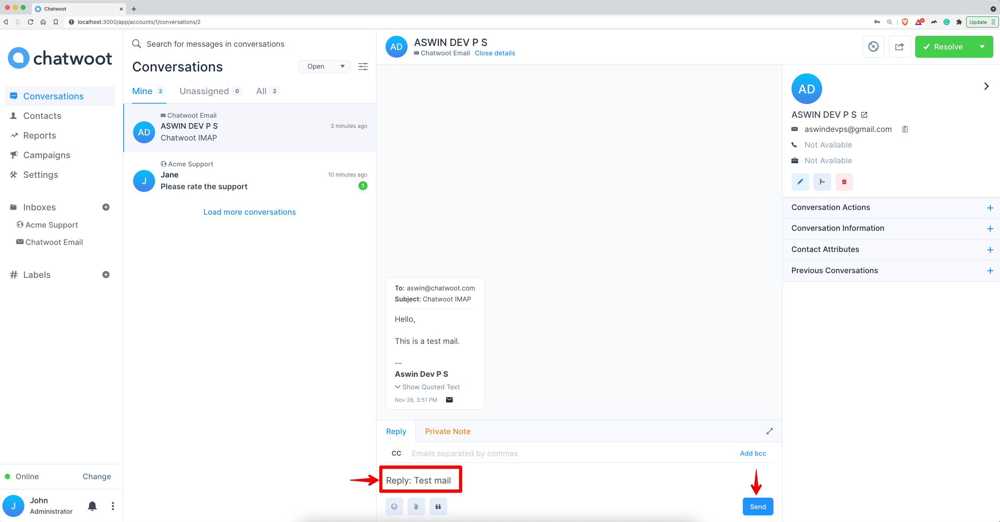
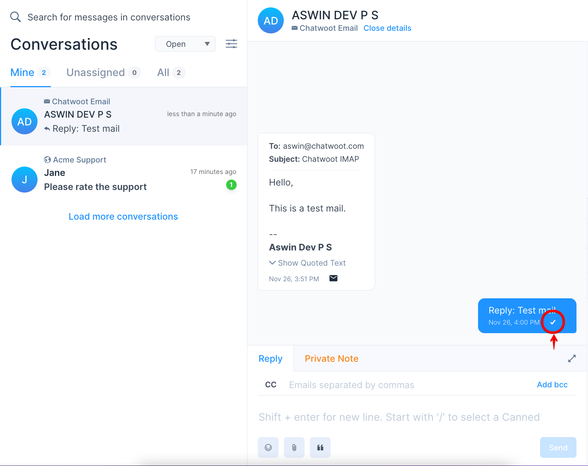

**Step 1**. Go to Settings > Inboxes > Email Inbox settings page.

**Step 2**. Select "Configuration" tab.

**Step 3**. To enable SMTP, select checkbox "Enable SMTP configuration for this inbox"

**Step 4**. Fill up below fields and click on "Update SMTP settings".

1. Address
2. Port
3. Email
4. Password
   - 2-step enabled Gmail accounts. Refer : [Generate app password](/docs/product/channels/email/gmail/generate-app-password)
   - All other Gmail accounts. Refer: [Allow less secure access](/docs/product/channels/email/gmail/less-secure-access)
5. Domain

**Step 5**. Open an existing email Conversation in Chatwoot.

**Step 6**. Type a reply message for the conversation and click on "Send" button.

**Step 6**. Verify that mail has delivered.

**Step 7**. Check receipient inbox for the delivered email.
