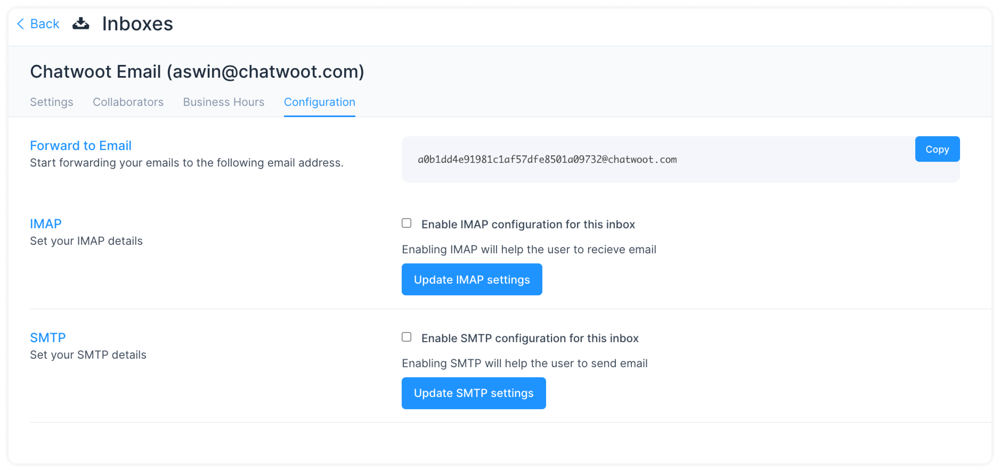

**Step 1.** Open your Chatwoot dashboard. Go to Settings → Inboxes → Add Inbox.

**Step 2**. Click on the "Email" icon.

**Step 3**. Enter the channel name (how you’d like to address this channel), your support email and click on Create Email Channel button.

**Step 4**. "Add agents" to your email inbox.

Hooray! You have successfully created a Email inbox.

**Step 5**. Configure your email settings. Go to Settings → Inboxes → Email Inbox settings → Configuration tab.

You can configure your Chatwoot email inbox in the following two ways.

1. [Forward to Email](/docs/product/channels/email/forward-email)
2. [Configure IMAP](/docs/product/channels/email/configure-imap)
