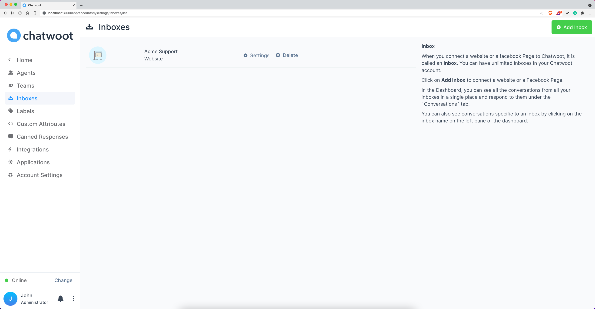
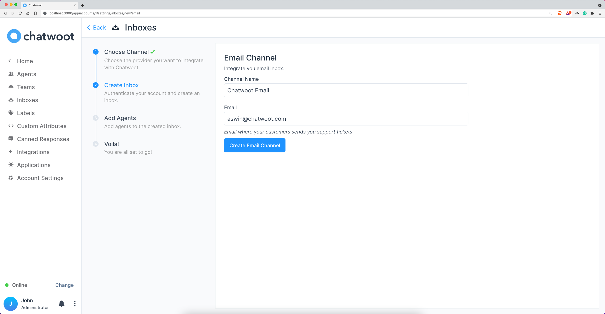
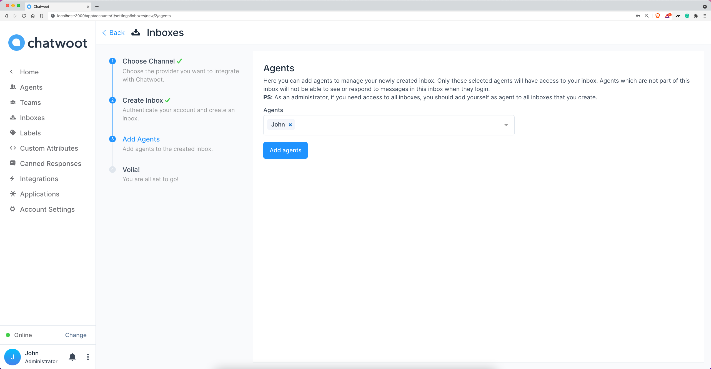
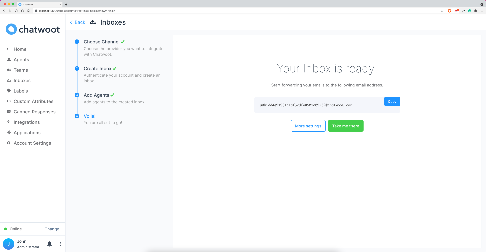

**Step 1**. Click on "Add Inbox" button from Settings > Inboxes page.

**Step 2**. Click on "Email" icon.

**Step 3**. Enter channel name, email and click on "Create Email Channel" button.

**Step 4**. "Add agents" to your email inbox.

**Step 5**. Hooray! You have successfully created a Email inbox. You will be able to manage emails in the Chatwoot Inbox.

**Step 6**. Go to Settings > Inboxes > Email Inbox settings.

**Step 7**. Select "Configuration" tab.

**Step 8**. You can configure Chatwoot email inbox in 2 ways.

1. [Forward to Email](/docs/product/channels/email/forward-email)
2. [Configure IMAP](/docs/product/channels/email/configure-imap)
