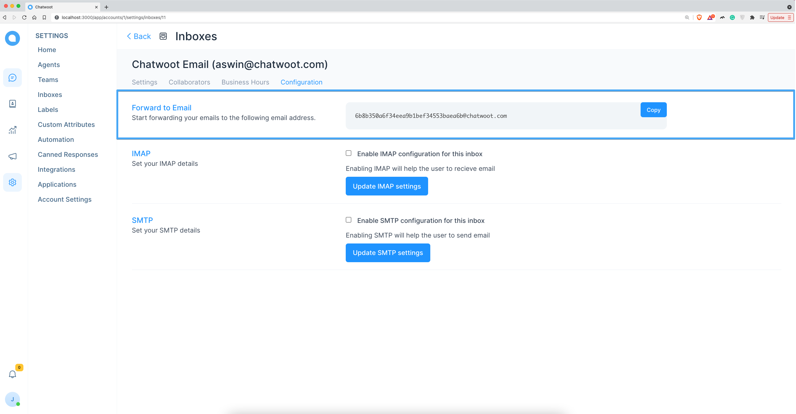

**Step 1**. Copy forward email address from confguration tab under inbox settings.

**Step 2**. Configure the copied email address as the forwarding email address in the email inbox.

1. [Add forwarding address](/docs/product/channels/email/gmail/add-forward-email) for Gmail Inbox

**Step 3**. Send a mail to the forwarding address added inbox.

**Step 4**. Check Chatwoot email inbox for the new email.
