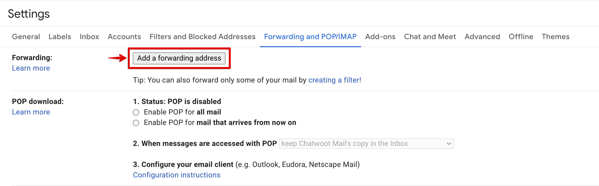
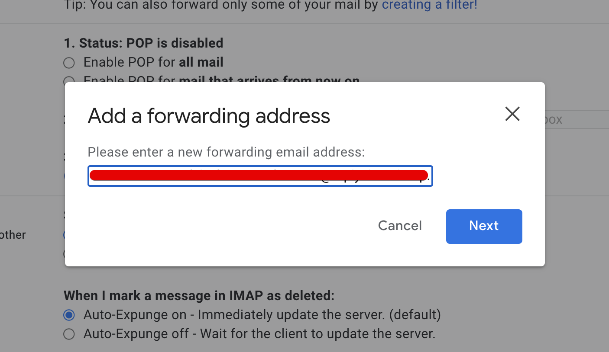
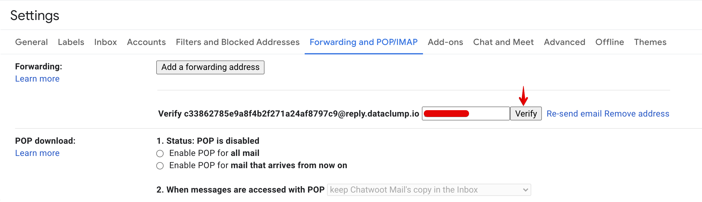
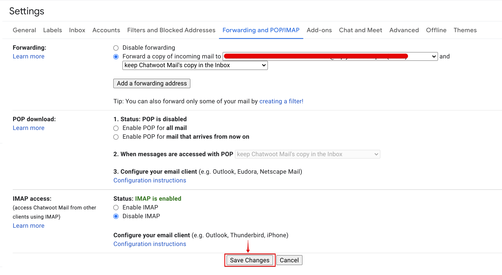

**Step 1**. Go to Gmail inbox and click on the settings icon on the top right corner.

**Step 2**. Click on "See all settings" button.

**Step 3**. Select "Forwarding and POP/IMAP" tab in the settings page.

**Step 4**. Click on "Add a forwarding address"

**Step 5**. Add the forwarding email address from Chatwoot and click on "Next".

**Step 6**. Confirm the forwarding address in the browser popup. The email inbox will send a verification code to the forwarding email address.

**Step 7**. Copy the verification code from Chatwoot email inbox.

**Step 8**. Paste the verification code and click on "Verify".

**Step 9**. Paste the verification code and click on "Verify".

**Step 10**. Select "Forward a copy of incoming mail" option. Choose the required action from second dropdown and click on "Save Changes".

