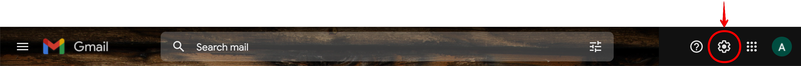
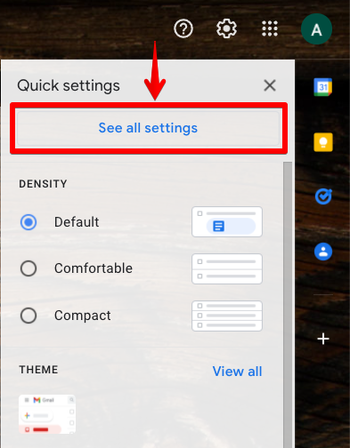
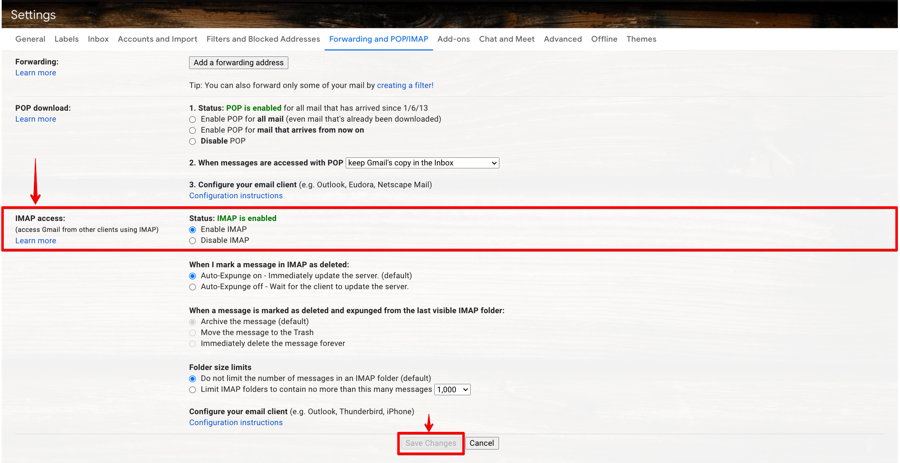

**Step 1**. Go to Gmail inbox and click on the settings icon on the top right corner.

**Step 2**. Click on "See all settings" button.

**Step 3**. Select "Forwarding and POP/IMAP" tab in the settings page.

**Step 4**. Choose "Enable IMAP" option under IMAP access section and click on "Save Chabges" button.

