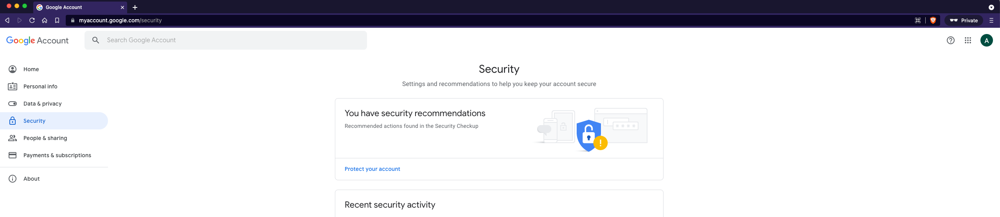
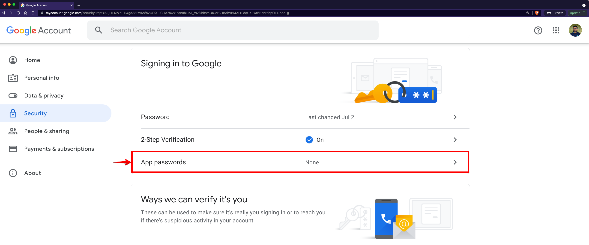
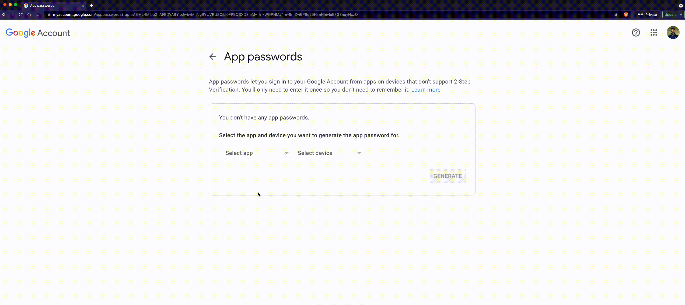

> **Note:** This is for gmail accounts which is enabled 2-step verification or managed by a organization.

**Step 1**. Go to [Google Account Security](https://myaccount.google.com/security)

**Step 2**. Click on "App passwords" under "Signing in to Google" section in the security page.

**Step 3**. Select Mail app, select a device and click on "GENERATE". Use the generated password to configure IMAP/SMTP.

