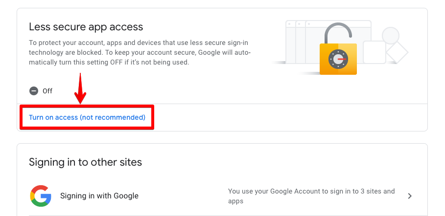
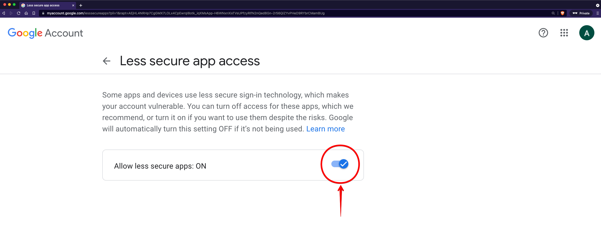

> **Note:** This option is not available for gmail accounts which is enabled 2-step verification or managed by a organization.

**Step 1**. Go to [Google Account Security](https://myaccount.google.com/security)

**Step 2**. Click on "Turn on access" under "Less secure app access" section in the security page.

**Step 3**. Toggle allow less secure apps to "ON". Now you can use your gmail account password to configure IMAP/SMTP.

