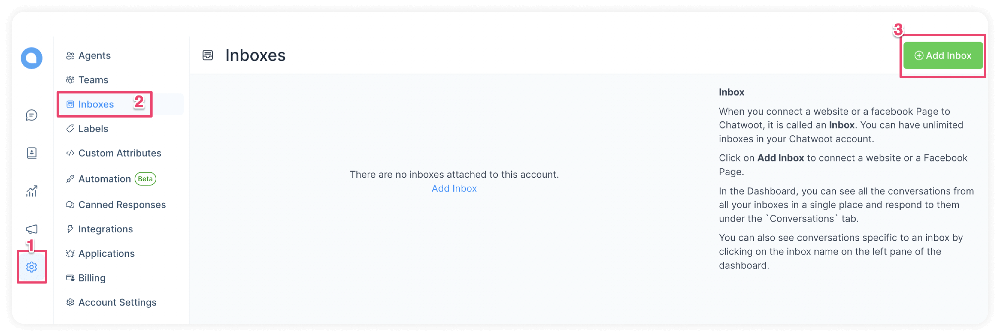
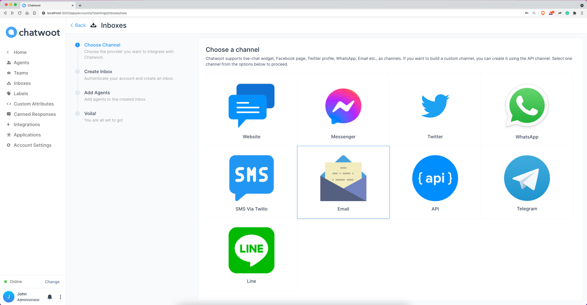
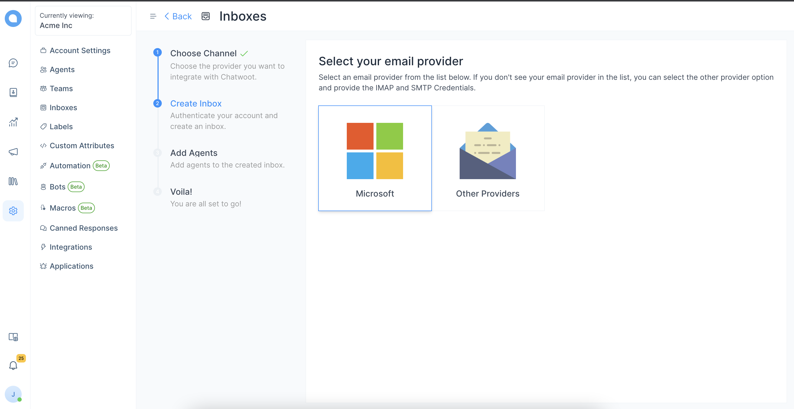
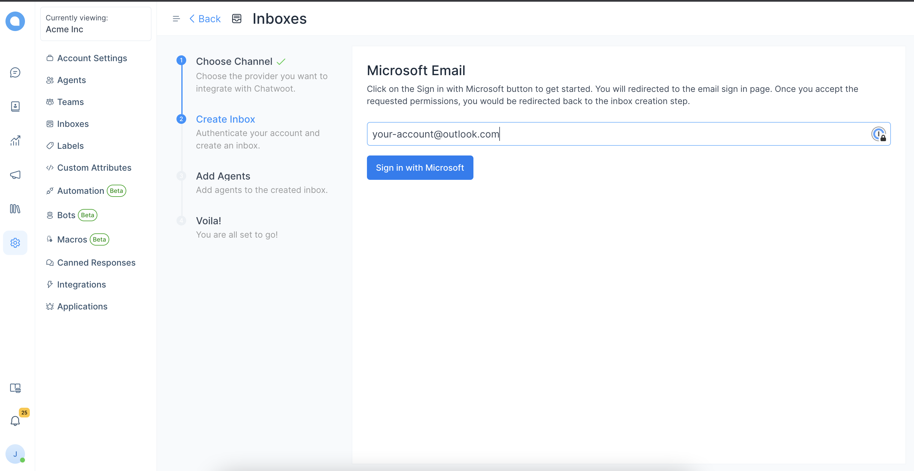
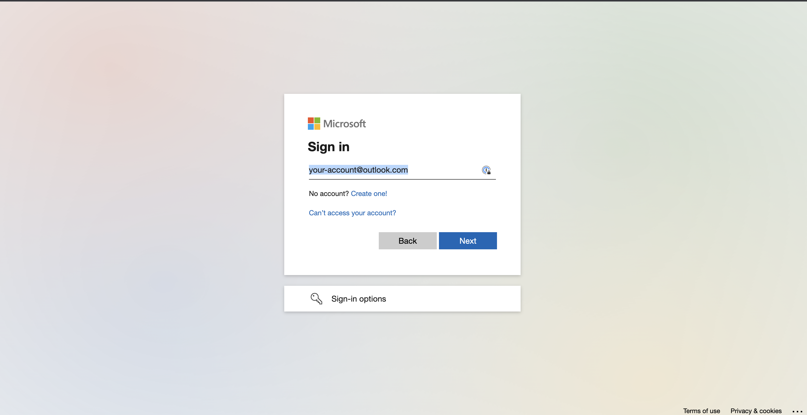
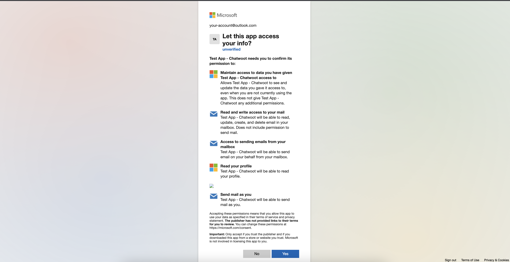
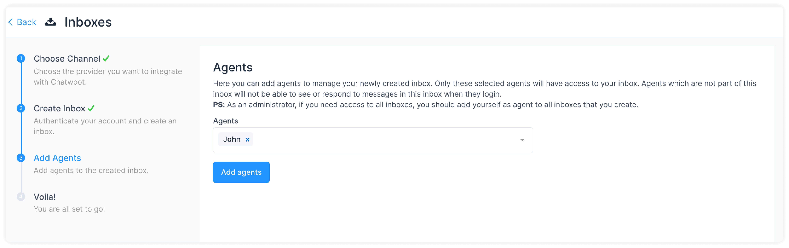
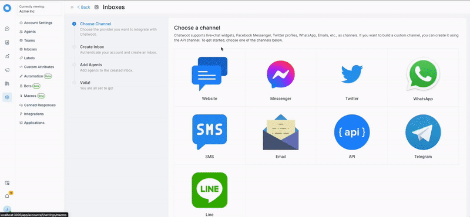
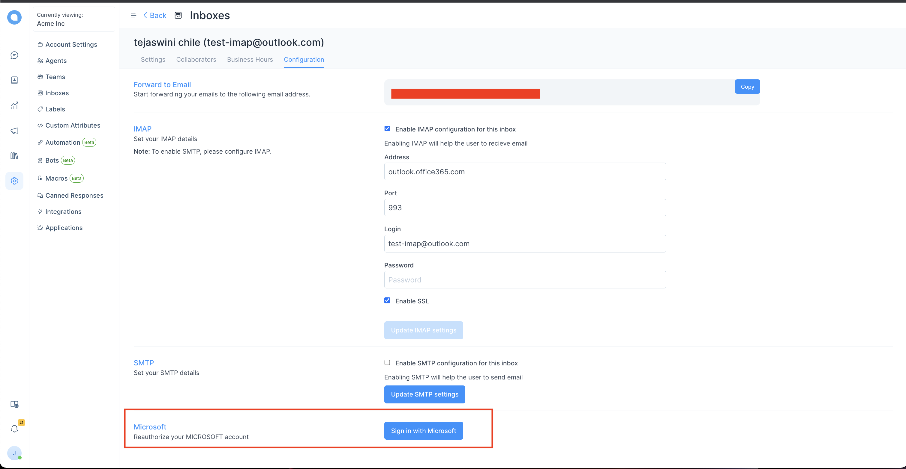

**Step 1.** Open your Chatwoot dashboard. Go to Settings → Inboxes → Add Inbox.

**Step 2**. Click on the "Email" icon.

**Step 3**. Click on the "Microsoft" icon.

**Step 4**. Add your outlook/microsoft email.

**Step 5**. Enter your Microsoft/Outlook credentials

**Step 6**. Allow "Chatwoot" app to read your email and reply to your email.

**Step 7**. "Add agents" to your email inbox.

Hooray! You have successfully created a Email inbox.

**Step 5**. Configure your email settings. Go to Settings → Inboxes → Email Inbox settings → Configuration tab.

Note: Please do not change anything in settings for now, as we have used the default values for IMAP and SMTP, we will be making these fields non-editable soon for outlook accounts.

We are using default IMAP settings to fetch emails, and SMTP to send, you don't have to set anything via configuration.

**Step 6**. If your access token get expired then you will need to re-authorize your microsoft account, which you can do via settings -> configuration page.

