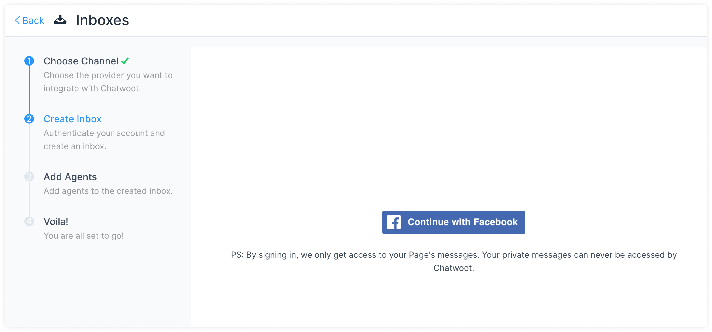
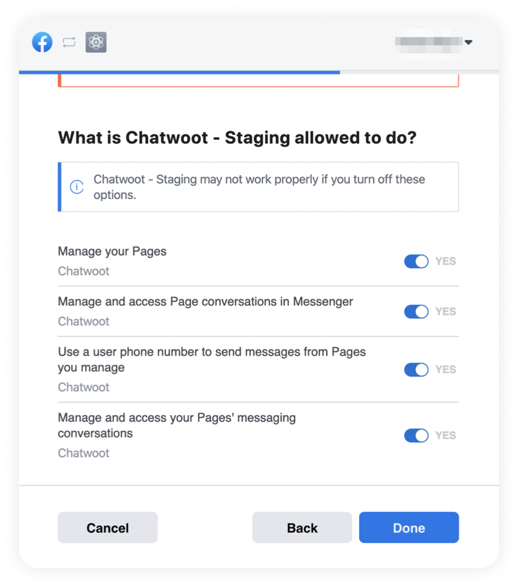
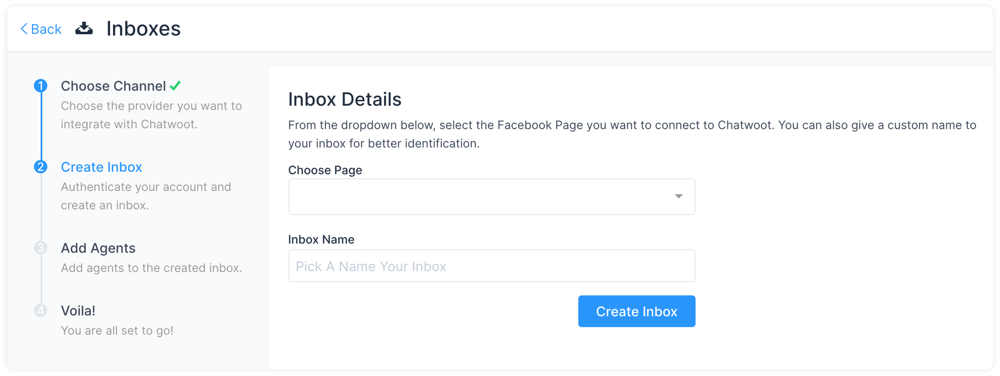
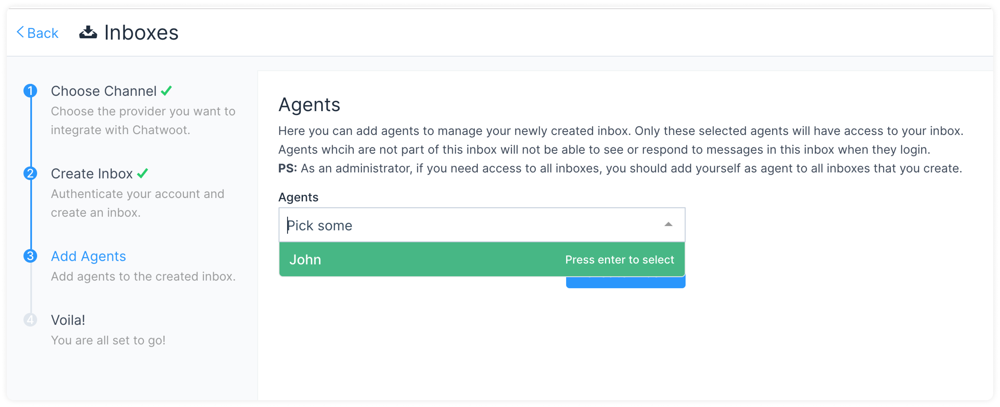
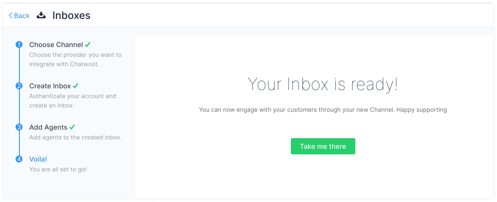
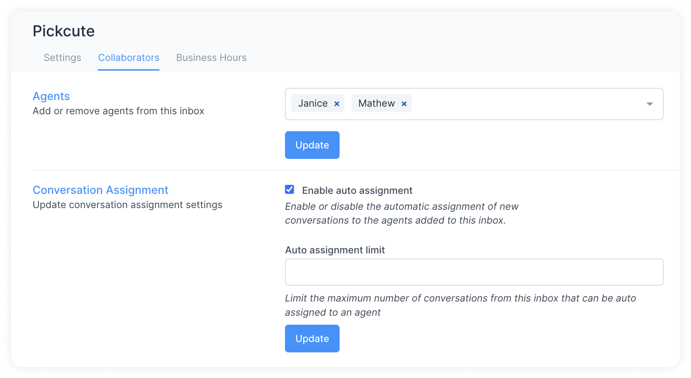
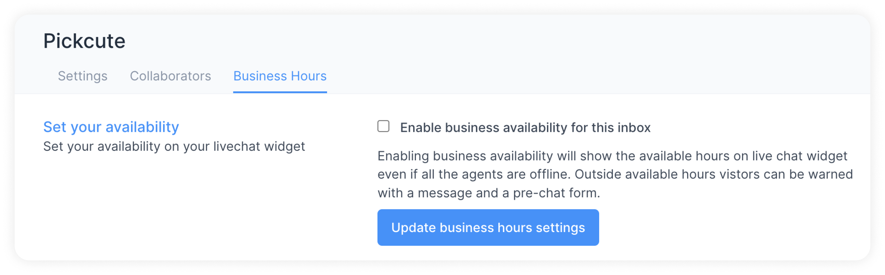
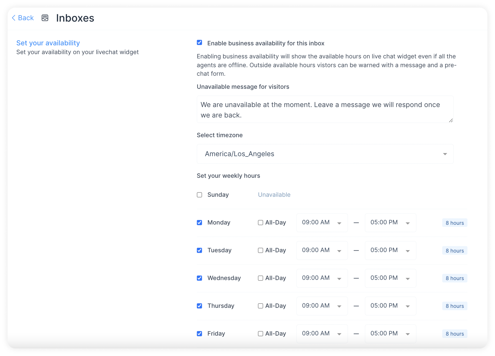

If you are using a self-hosted Chatwoot installation, please setup your Facebook app as described in the [this guide](https://www.chatwoot.com/docs/self-hosted/configuration/features/integrations/facebook-channel-setup).

For the cloud version of Chatwoot, please follow the steps below.

**Step 1**. Go to Settings → Inboxes → “Add Inbox”.

**Step 2**. Click on the "Messenger" icon.

**Step 3**. Click on Facebook login button. It will open a new window for you to login.

**Step 4**. Authenticate with Facebook and select the page you want to connect. Enable all permissions shown in the list. This will help Chatwoot to perform all the desired actions smoothly.

**Step 5**. You can now select your Facebook page from the dropdown menu that appears on Chatwoot.

**Step 6**. "Add agents" to your Facebook inbox.

Hooray! You have successfully created a Facebook inbox. Whenever a customer sends a message to your Facebook page, you will be able to see and reply to it in Chatwoot.

## Additional Inbox settings

Your freshly configured Facebook inbox should now appear in your list of inboxes. To see this and to make additional settings in your Facebook inbox, go to Settings → Inboxes → click the gear icon on the associated Facebook inbox. You will see the following screen:

### Settings tab

**Enable channel greeting.** Once you enable this, Chatwoot will send a greeting message to new conversations created through your Facebook inbox. 

**Enable CSAT**. Once you enable this, your Customer Satisfaction survey will be launched every time a ticket is resolved. The CSAT results can be viewed later in the Reports section.

**Reauthorize.** Whenever you need to reconnect and reauthorize your Facebook page, do it from this button.

### Collaborators tab

Click on the `Collaborators` tab.

Here, you can add Agents to the Inbox or delete Agents who have been already added in the Inbox.

You can also enable or disable the automatic assignment of new conversations to the agents added to this inbox.

Click on `Update` to save the changes.

### Business Hours tab

Click on the `Business Hours` tab. In this section, you can set the working hours of your team associated with the Facebook inbox.

Click on the check box for `Enable business availability for this inbox` if you have well-defined business hours.

Once the check box is ticked, the below section opens up. You can write your message to be displayed to the customer during OFF business hours.

You can also select the available business hours for each day of the week, along with the proper time zone.

Click on the Update Business Hour Setting Button.
