If you are using a self-hosted Chatwoot installation, please configure the Facebook app as described in the [guide to setup Facebook app](/docs/self-hosted/configuration/features/integrations/facebook-channel-setup)

**Step 1**. Click on "Add Inbox" button from Settings > Inboxes page.

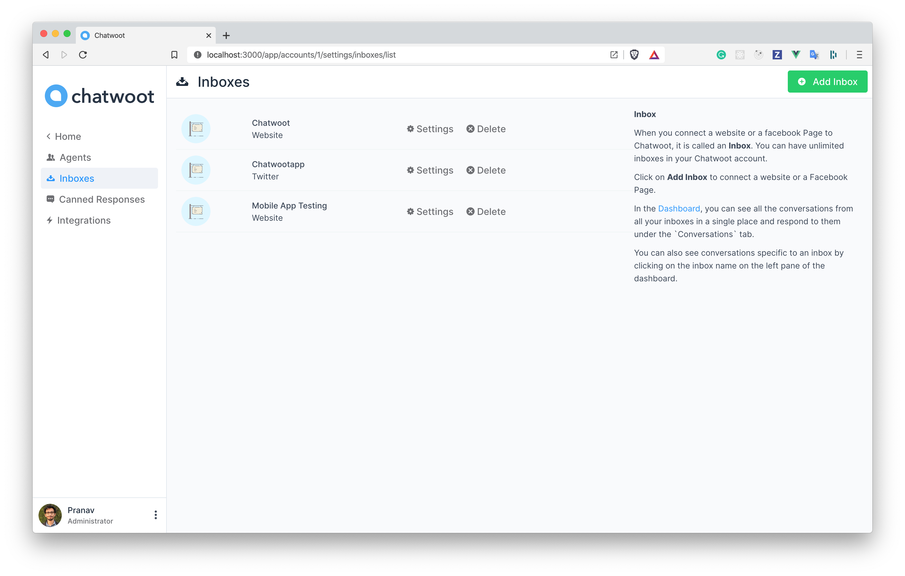

**Step 2**. Click on "Facebook" icon.

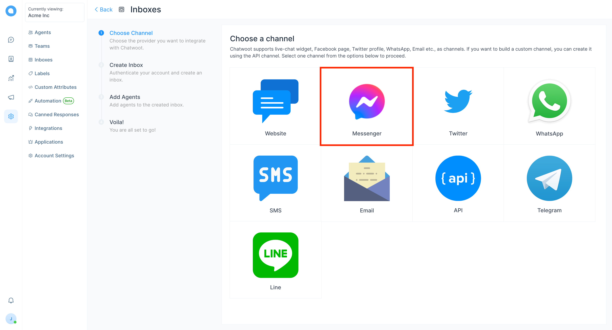

**Step 3**. Click on Facebook login button. It will open a new window for you to login.

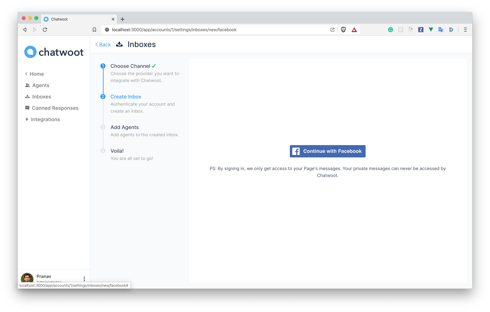

**Step 4**. Authenticate with Facebook and select the page you want to connect. Enable all permissions shown in the list, otherwise the app might not work.

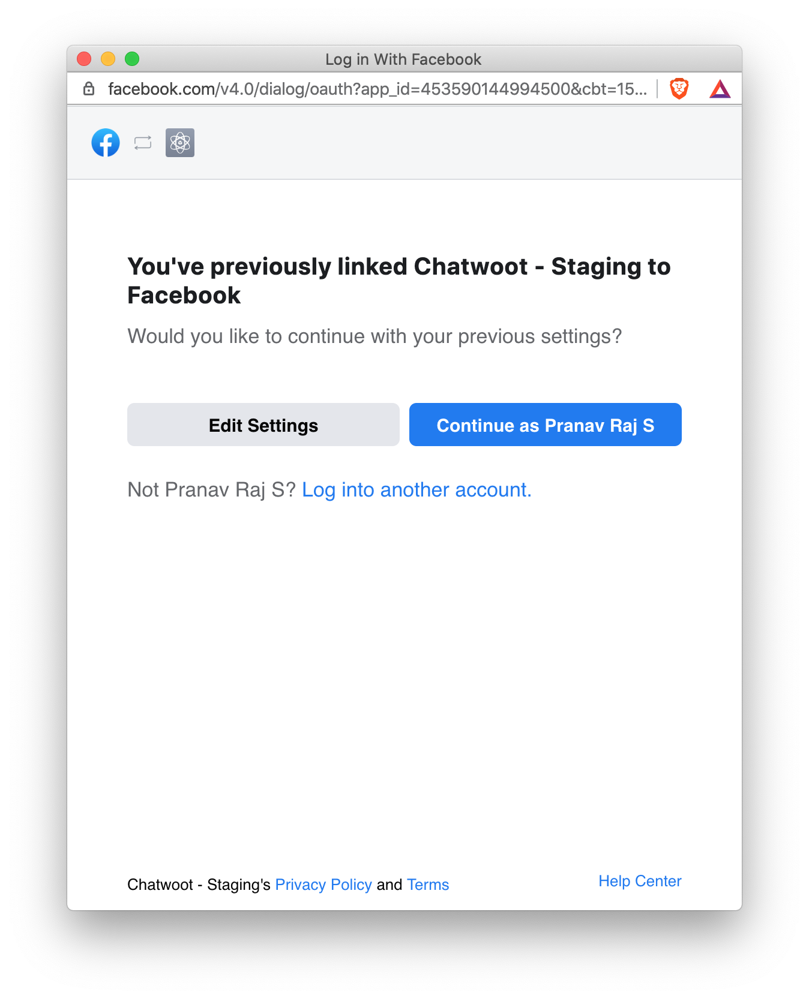

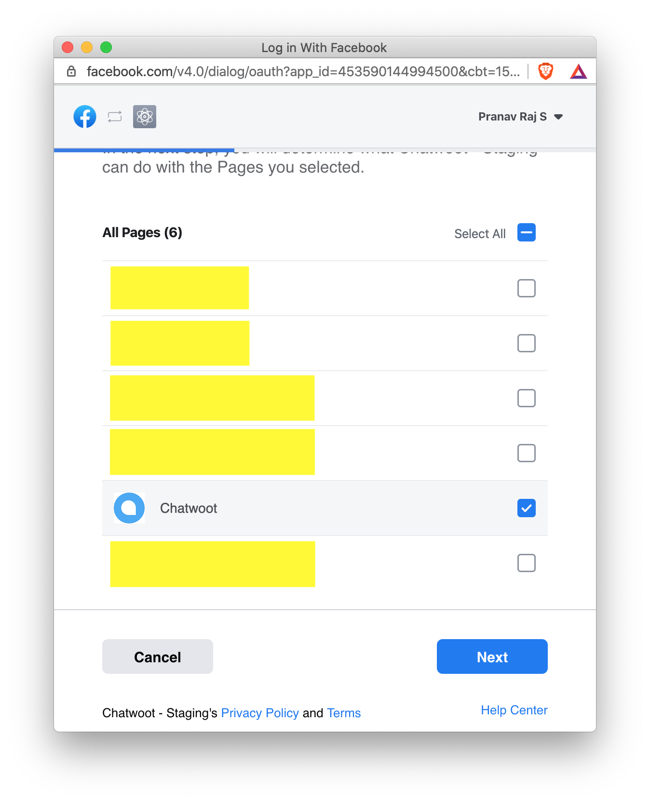

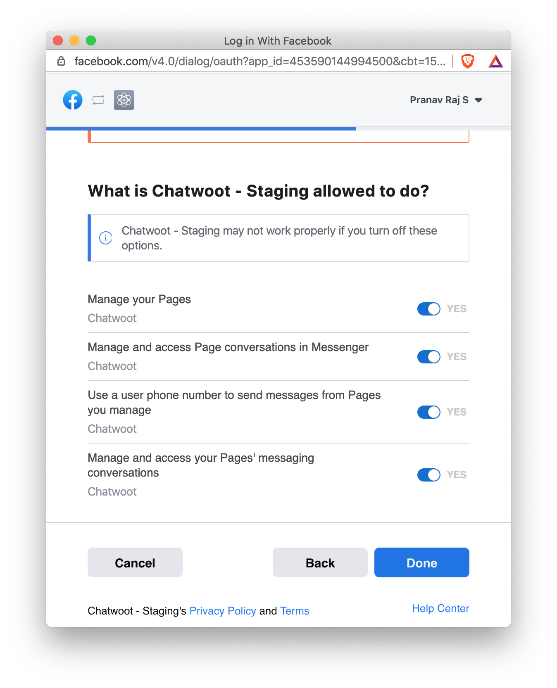

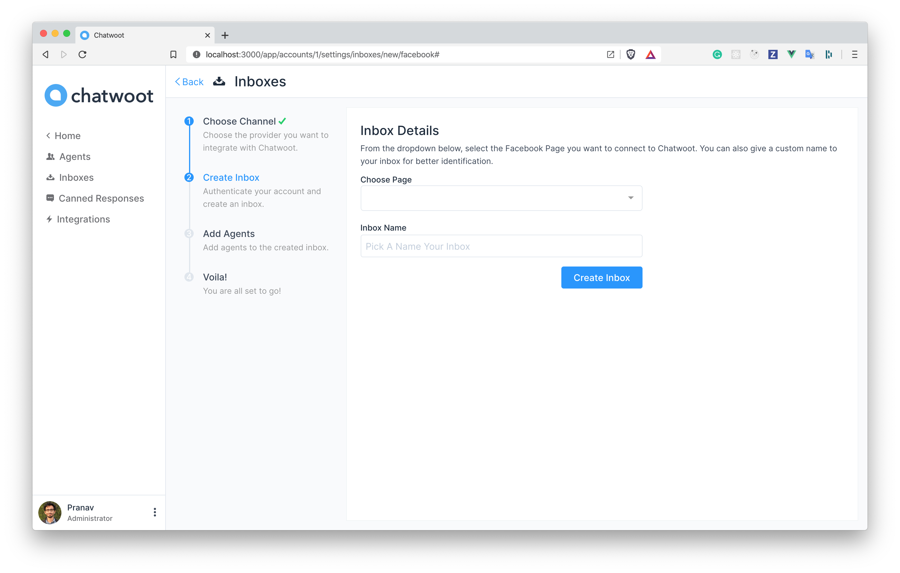

**Step 5**. "Add agents" to your Facebook inbox.

**Step 6**. Hooray! You have successfully created a Facebook inbox. Whenever a customer sends a message to your Facebook page, you will be able to see it here and manage it.

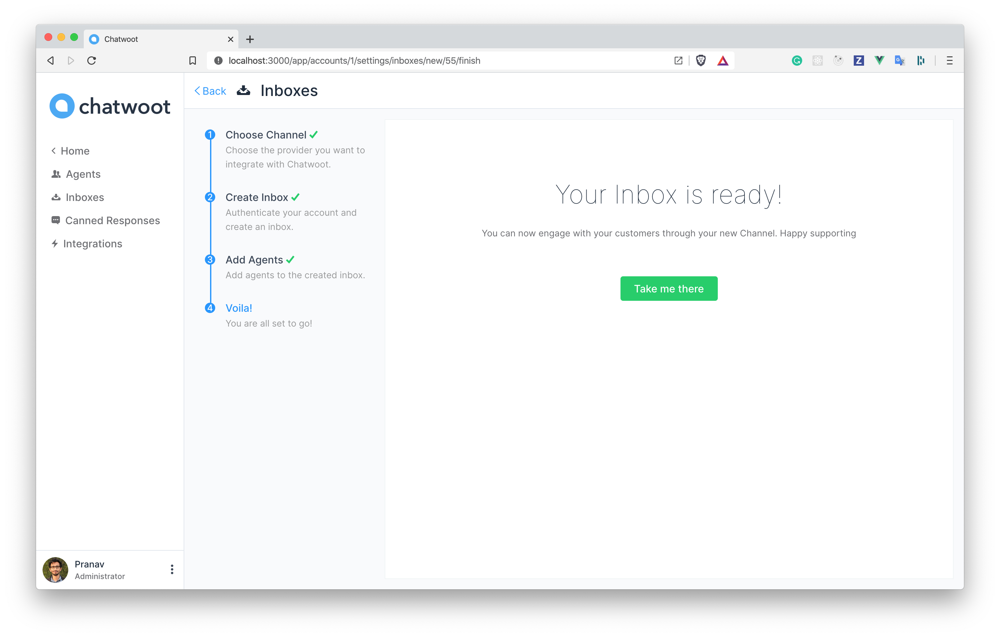

**Step 7**. If you want to update the agents who have access to the inbox, you can go to Settings > Inboxes.

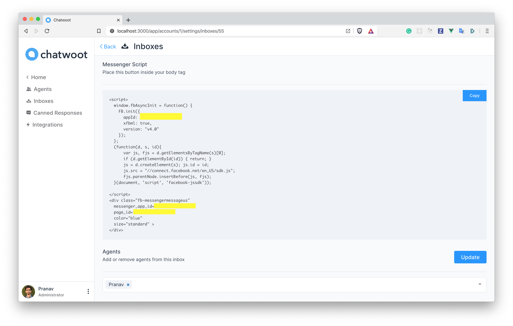

### Re-Authorize Facebook
**Step 1**. Go to inbox settings page of your facebook channel inbox.

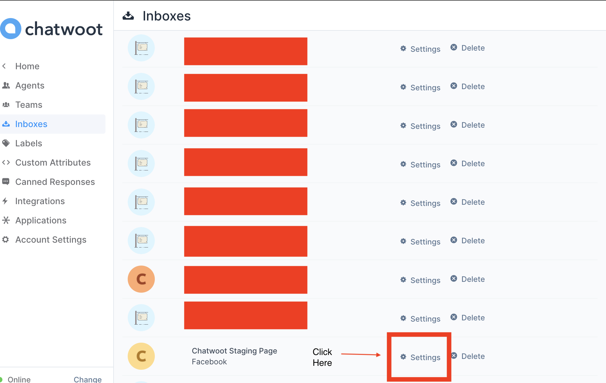

**Step 2**. You will see continue with facebook button, click on that.

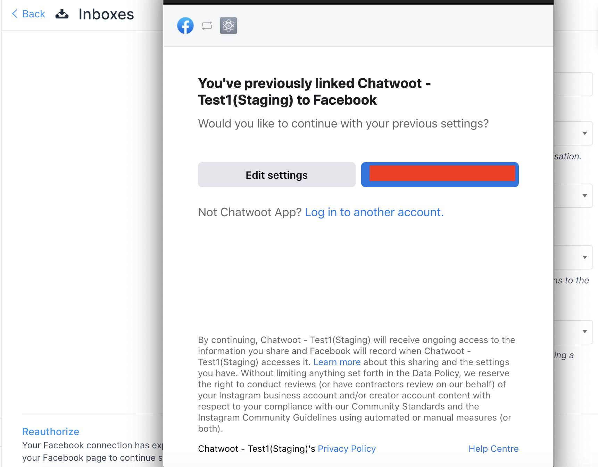

**Step 3**. Then authorize app to your facebook page by clicking on continue button.

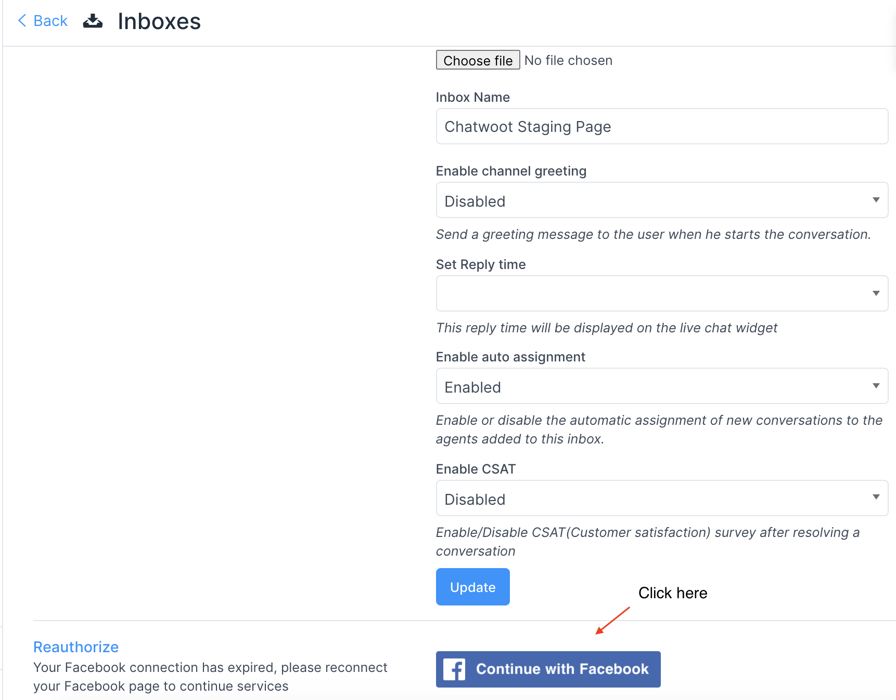

### FAQ:

1. I am not able to see messages received in facebook messenger in the connected chatwoot inbox:

Ans: Please make sure your Facebook page is connected only to the Chatwoot app, as according to Facebook's new app development, all the apps need to build a handover protocol. https://developers.facebook.com/docs/messenger-platform/handover-protocol

We are working on the workaround for the same which would be available in the upcoming releases.
For more information please follow this issue for the update: https://github.com/chatwoot/chatwoot/issues/4489
