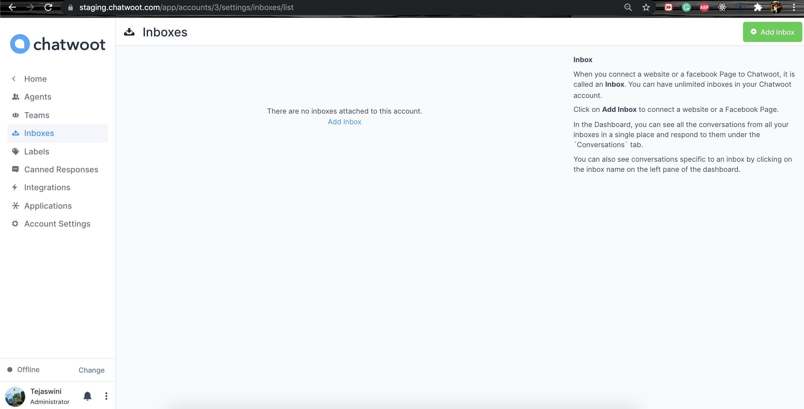
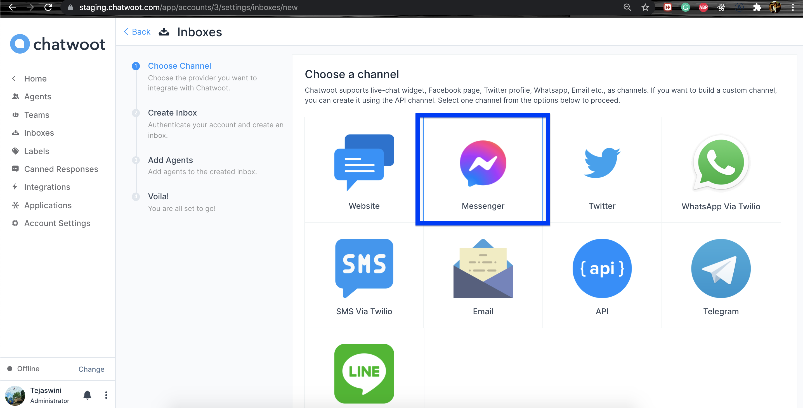
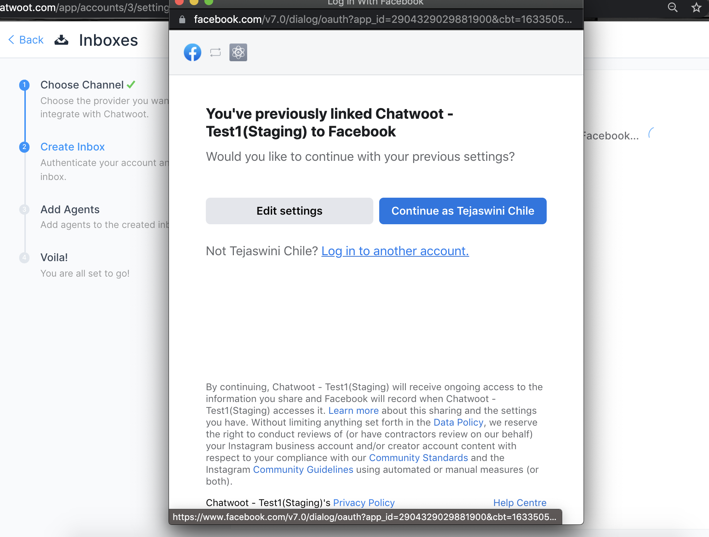
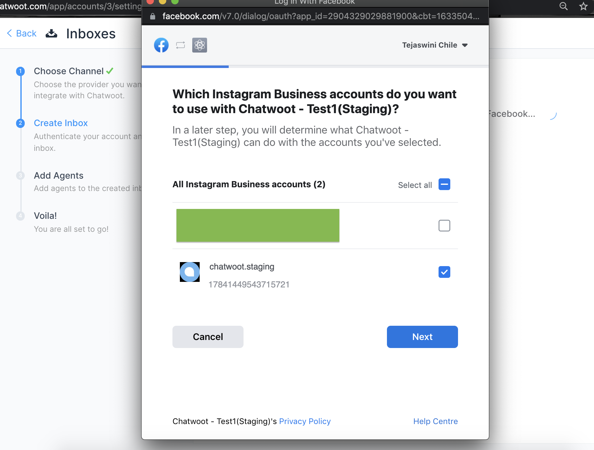
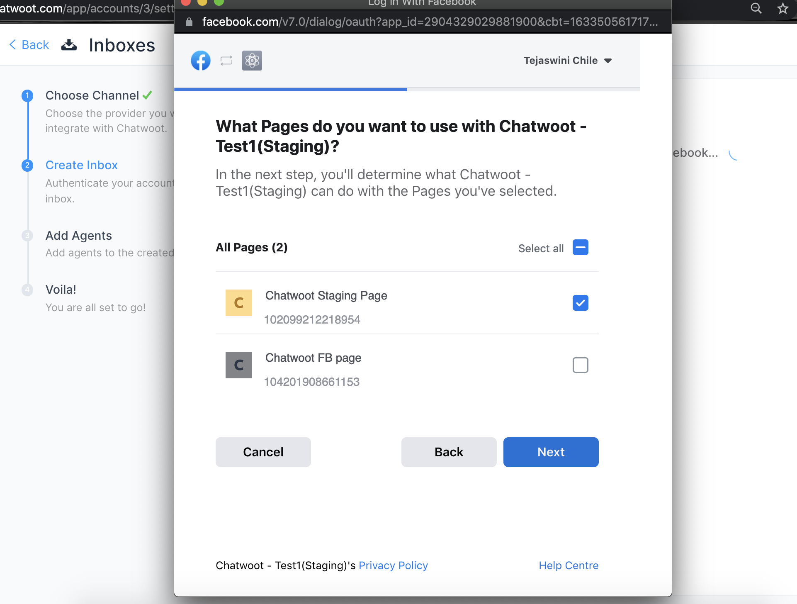
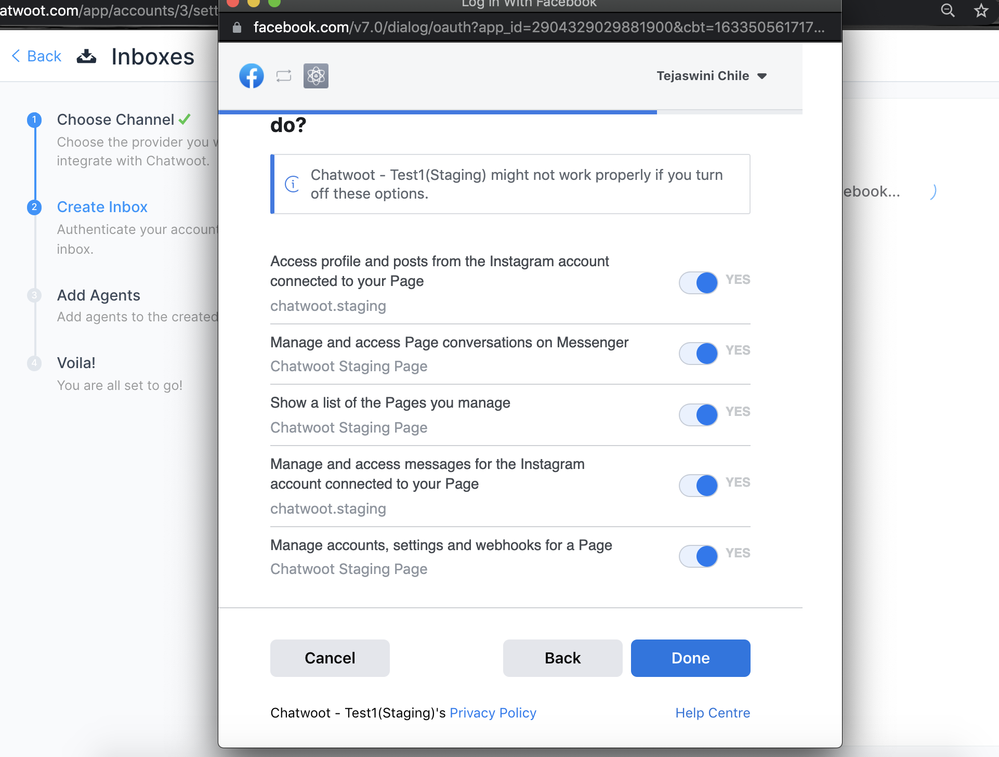
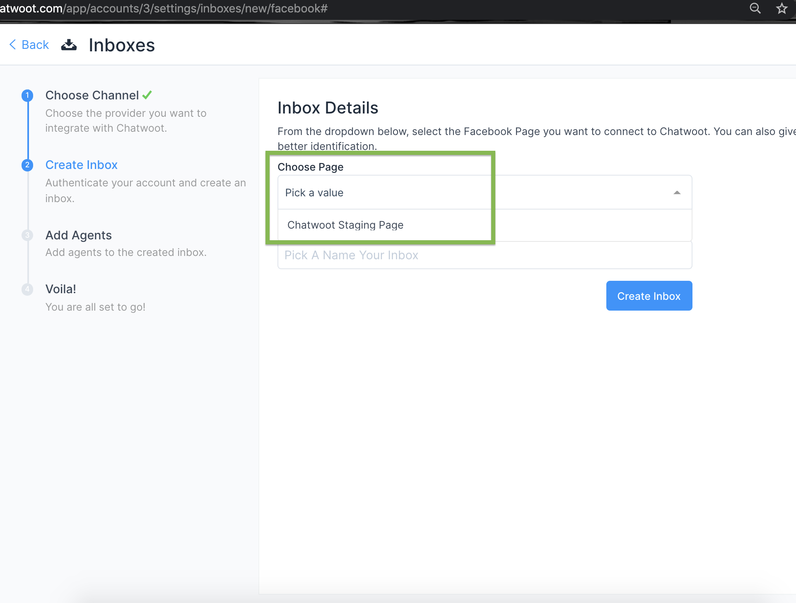
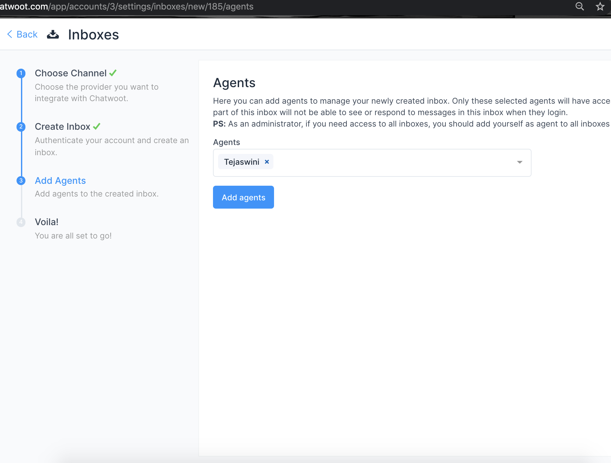
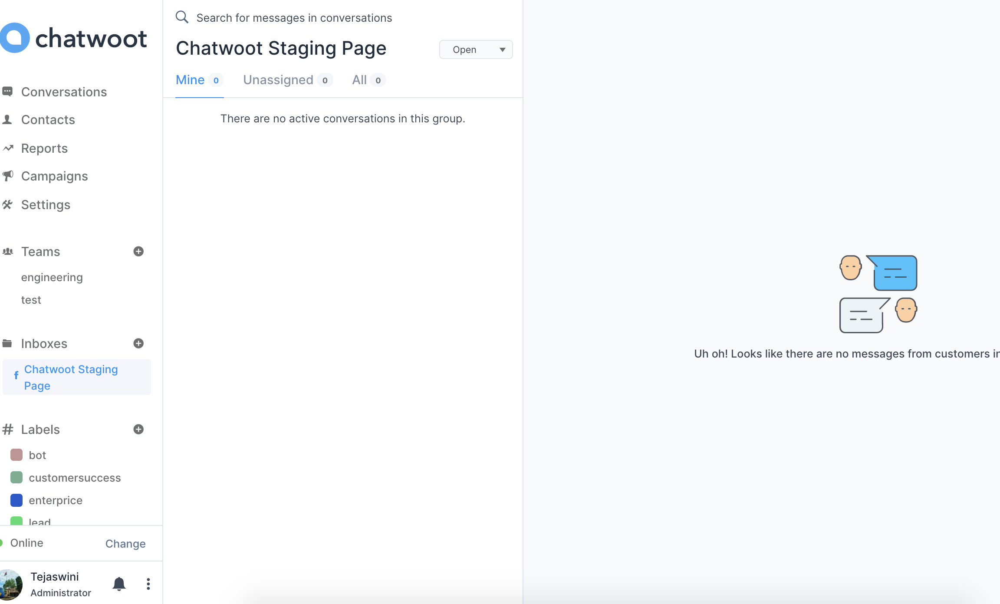
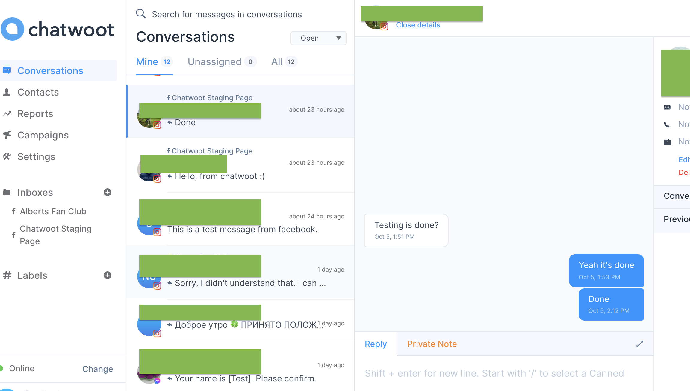

If you are using a self-hosted Chatwoot installation, please configure the Instagram app as described in the [guide to setup Instagram app](/docs/self-hosted/configuration/features/integrations/instagram-channel-setup)

**Pre-requisite**

**Step 1** Make sure you have instagram account. This link would help to setup business account: https://help.instagram.com/502981923235522/

**Step 2** Make sure your Facebook page is connected to the Instagram account, for which the Instagram account holder is admin.

You can do that setting here:

  1. Go to https://www.facebook.com/pages/?category=your_pages
  2. Select Your Page
  3. Go to Settings
  4. Select Instagram and connect your business account like below:
  >
  > 

***Now switch back to Chatwoot App.***

**Step 1**. Click on "Add Inbox" button from Settings > Inboxes page.

**Step 2**. Click on "Facebook" icon.

**Step 3**. Click on Facebook login button. It will open a new window for you to login.

**Step 4**. Authenticate with Facebook, select instagram account and select the page you want to connect. Enable all permissions shown in the list, otherwise the app might not work.

**Step 5**. "Add agents" to your Facebook inbox.

**Step 6**. Hooray! You have successfully created a Messenger inbox. Whenever a customer sends a message to your Instagram account or Facebook page, you will be able to see it here and manage it.

**Step 7**. If you want to update the agents who have access to the inbox, you can go to Settings > Inboxes.
