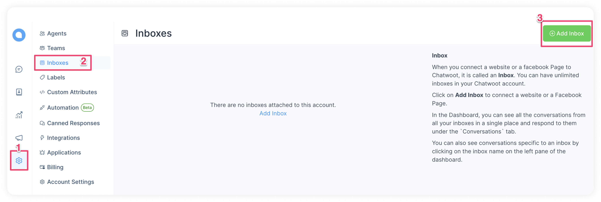
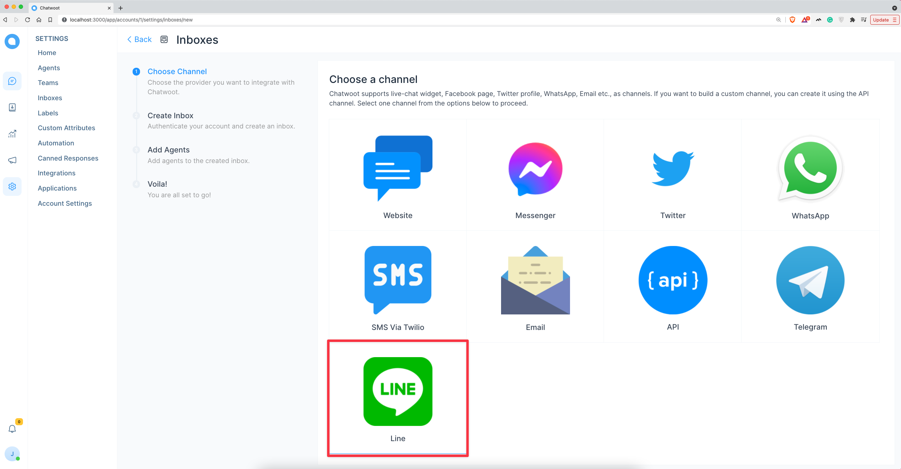
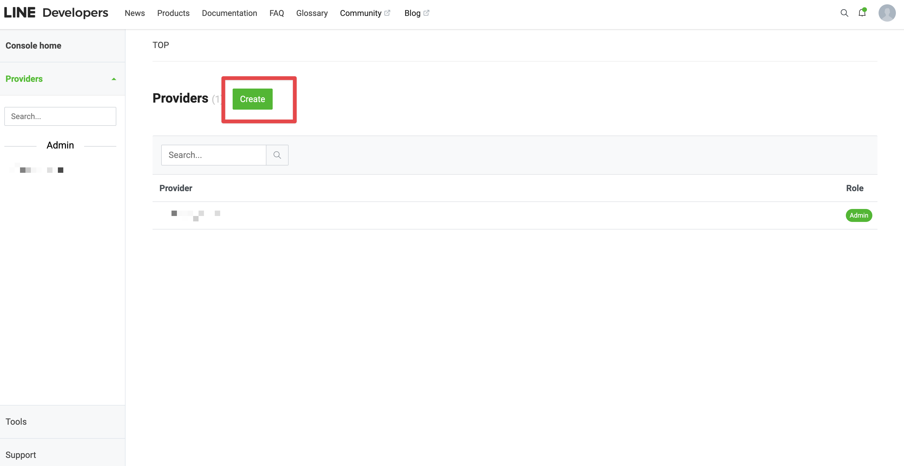
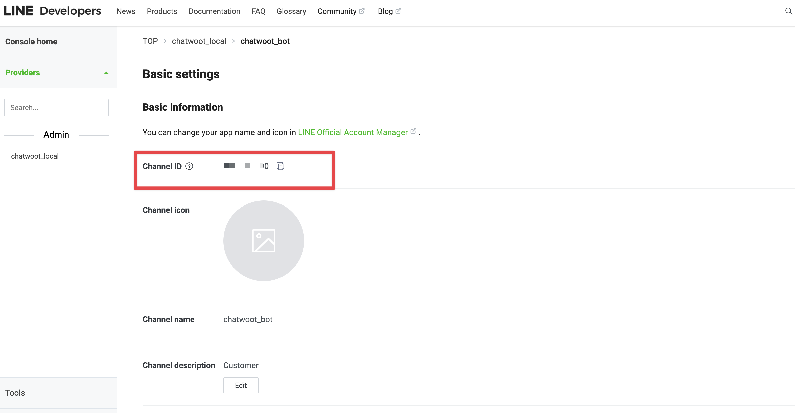
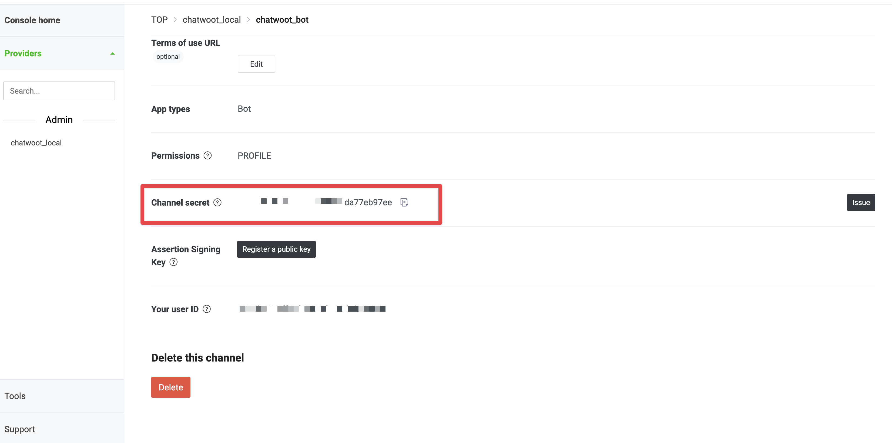
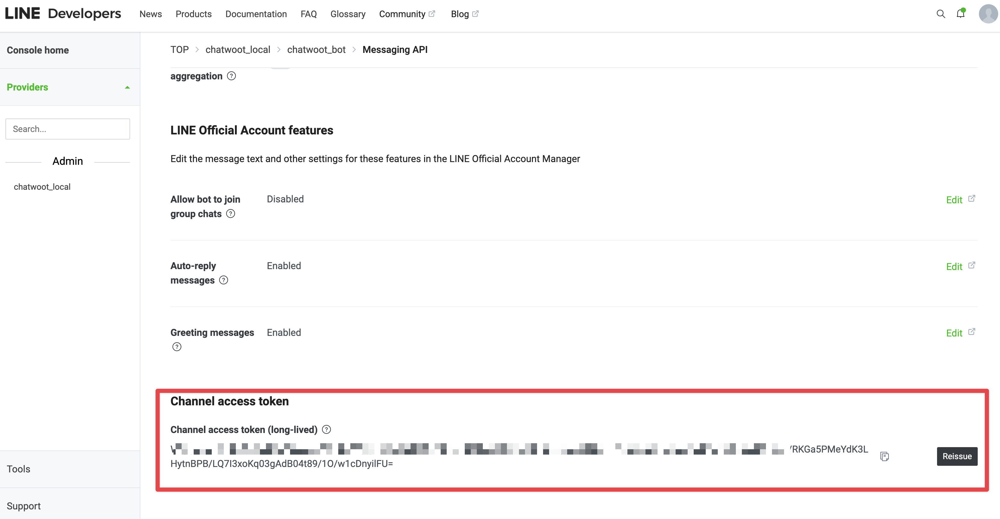
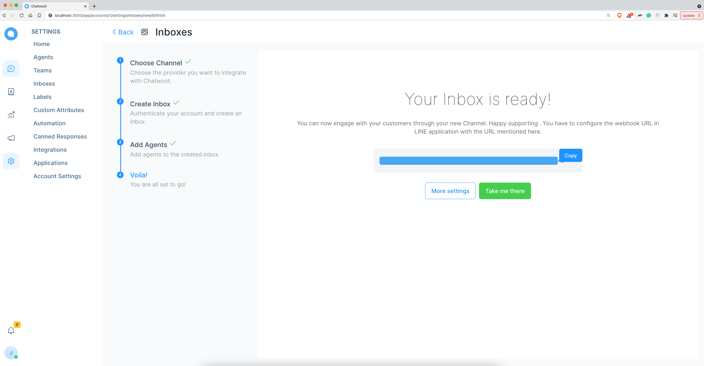
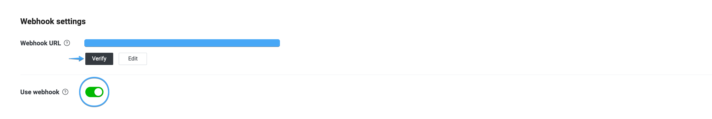

**Step 1**. Go to Settings → Inboxes → “Add Inbox”.

**Step 2**. Click on "Line" icon.

**Step 3**. Go to [Line Developer Console](https://developers.line.biz/console) and create a line account.

**Step 4**. Create a "Provider" in developer console.

**Step 5**. Create a new "Messaging API" channel(Bot) under the provider channels.

**Step 6**. Fill up below fields from line developer console( Messaging API Channel ).

1. Channel Name
2. LINE Channel ID
3. LINE Channel Secret
4. LINE Channel Token

LINE Channel ID

LINE Channel Secret

LINE Channel Token

 Click on "Create LINE Channel".

**Step 8**. "Add agents" to your Line inbox.

**Step 9**. Hooray! You have successfully created a Line inbox. Copy the Chatwoot Webhook URL.

**Step 10**. Go to "Messaging API" channel in developer console and configure webhook.

1. Verify Chatwoot webhook URL
2. Enable "Use webhook"

**Step 11**. Send a message to the Line bot.

**Step 12**. Check Chatwoot Line inbox for the new message.