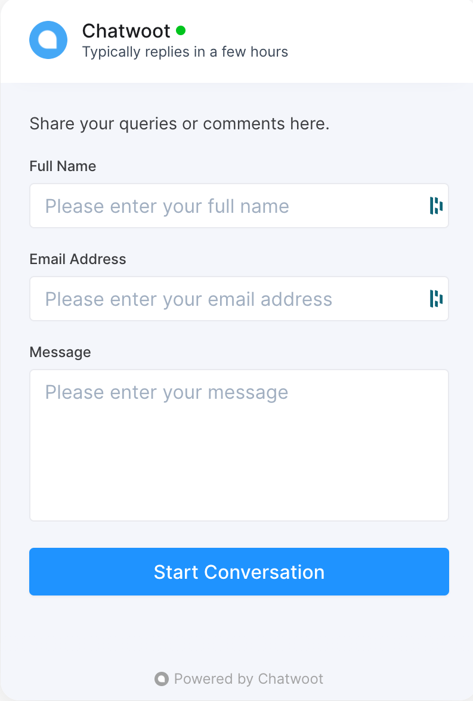
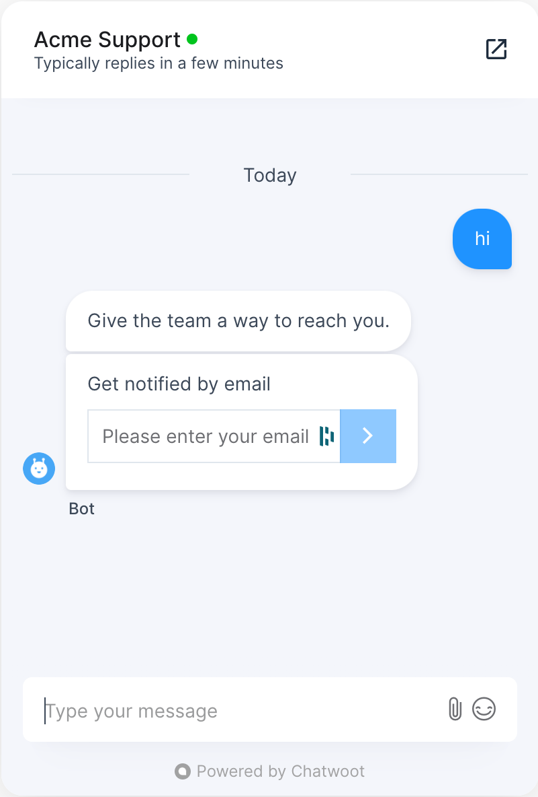
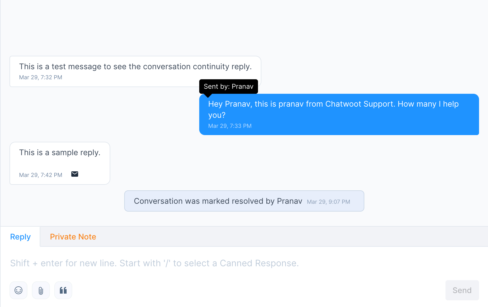

Chatwoot allows customers to continue chat conversations via email threads under the following cases. 

- If no agents are available and the customer leaves a message in the chat, 
- if the customer leaves the chat before the agent replies.

For this behaviour to happen, the email address of the contact should be populated into chatwoot CRM.

## Obtaining email address of contacts

You can prompt/update customer emails into chatwoot through the following ways. 

### 1.via Chatwoot SDK

If customer email is already known, you can supply it into chatwoot via the `setUser` method in our [SDK](/product/channels/live-chat/sdk/setup)

### 2.via PreChat Form
If a mandatory pre-chat form is enabled. the conversation starts with a screen as below 

### 3.via Email Collect Prompt
When the pre-chat form is disabled, and the customer email is unknown, chatwoot starts a conversation with an email collect prompt.

## Conversation Continuity

_Note_: Enable conversation continuity in self hosted installations via this [guide](/self-hosted/configuration/features/email-channel/conversation-continuity)

If the customer email is updated through any of the options mentioned above. When the agent replies and the customer is not active on the chat widget:

- The customer recieves an email thread with conversation summary over which they can continue the conversation.
- The agent recieves the customer replies from email, in their chatwoot dashboard, continued over the existing conversation thread.

The email icon in the chat bubble indicates that the customer reply arrived via email.
