**Step 1**. Go to the Inboxes page. Go to Settings → Inboxes → "Add Inbox" button.

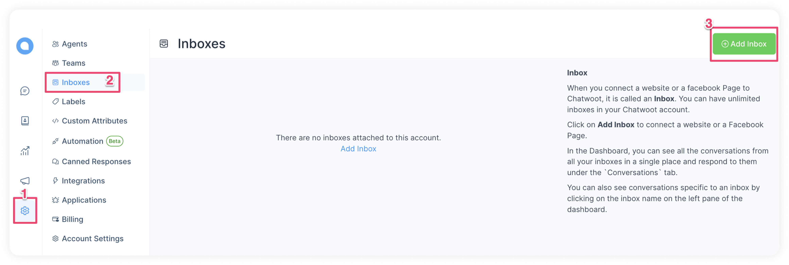

**Step 2**. Click on the "Website" icon.

**Step 3**. Enter your website name, URL, and other details as described below. 

| Field Name | Value | Remarks |
| --- | --- | --- |
| Website Name | Enter Name of your Website | eg: Example Inc. |
| Website Domain | Enter the link to your Website | eg: www.example.com |
| Widget Color | Select the color by clicking the pallet |  |
| Welcome Heading | Give a Greeting with which you would like to address the customer | eg: Welcome ! |
| Welcome Tagline | Give a Tagline representing your company | eg: Welcome to Example ! We are at your service 24x7 |
| Enable Channel Greeting | Select Enabled or Disabled | Enable to Send Greeting message when customer starts conversation |
| Channel Greeting Message | Give a greeting with which you would like to start the conversation | eg: Hi. How can we help you? |

Once all details are entered, click on “Create Inbox” Button.

**Step 4**. "Add agents" to your website inbox.

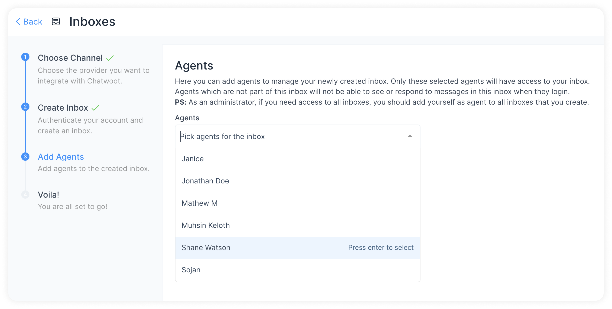

The conversations will be routed to agents only if they are associated with the inbox. Even if you are an Administrator, you need to add yourself as an agent to the Inbox to see the Inbox on your screen. 

Select the Agents from the drop-down and click on Add agents. If agents have not been added, follow the steps to [add agents](/docs/user-guide/add-agent-settings).

**Step 5**. Hooray! You have successfully created a website inbox. Now, add the widget to your website.

Copy and paste the code snippet shown on the page to your website and start supporting your customers.
You can click Copy button to copy and then [paste in the root file](/docs/user-guide/setting-up-chatwootwidget#root-file-of-website) of your website.

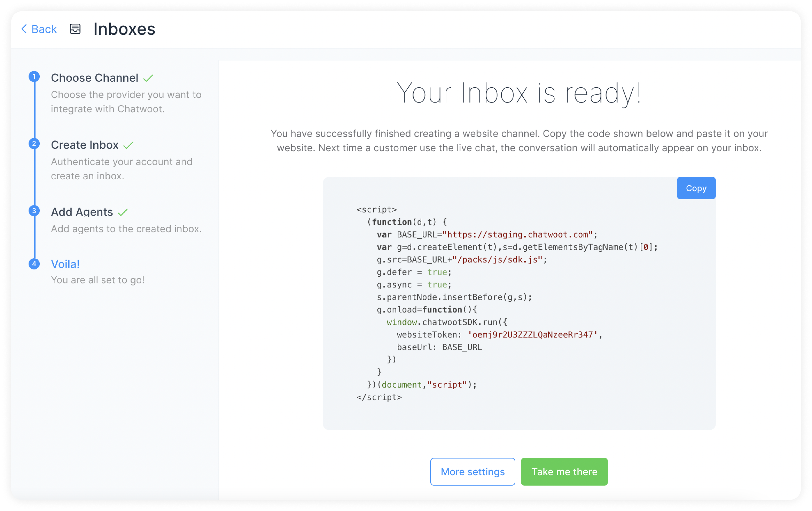

If you click on the `More settings` Button, you will be taken to the Additional Settings for Inbox. If you click on the `Take me there` button, you will be taken to the newly created Inbox directly.

**Step 6**. If you want to update the agents who have access to the inbox, go to Settings → Inboxes. You will be able to see your website inbox listed there. Click on Settings. You will be able to see the code as well as the list of agents who have access to the inbox.

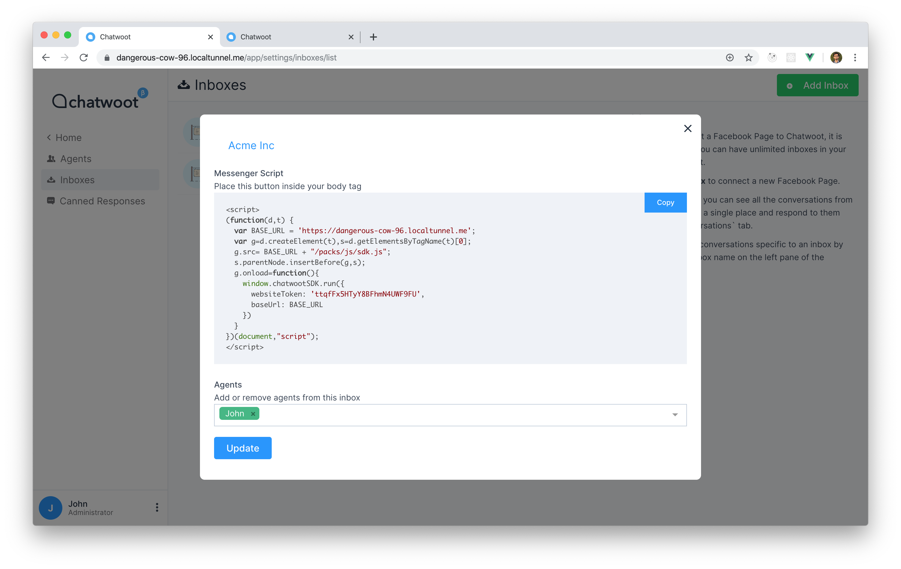

## Additional Inbox settings

On your Inboxes screen, click on the gear icon to reach the Settings page. You will see the following screen:

### Settings tab

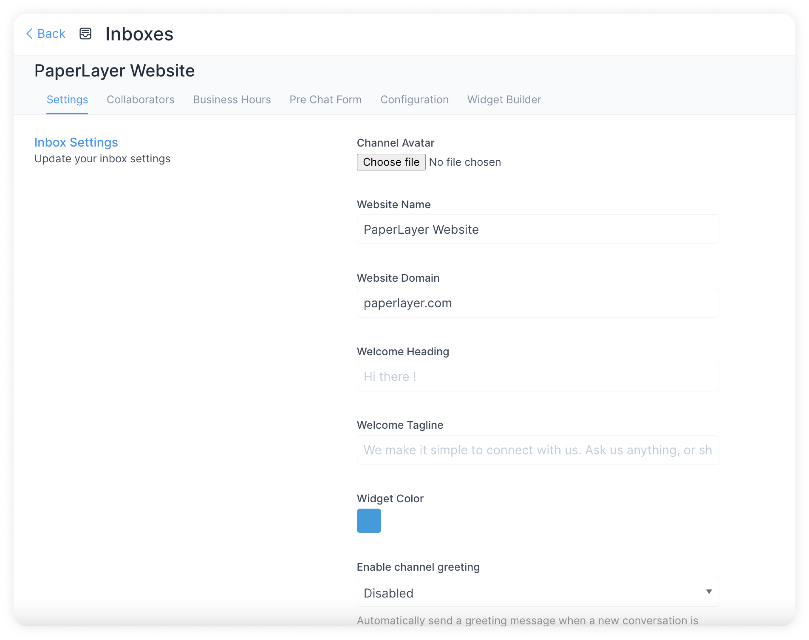

Scroll down to see more settings, where you can set up the various notifications you would like to receive when your website inbox starts functioning. 

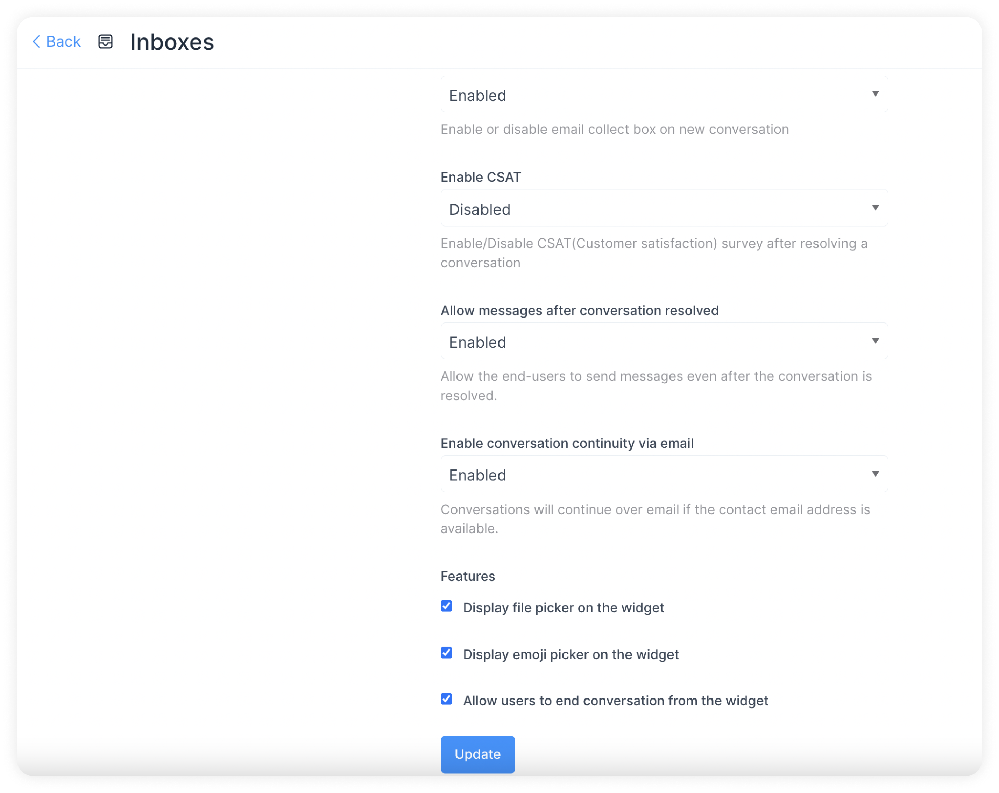

Here are a couple of examples for your understanding:

**Enable email collect box** is enabled by default. This means an automatic message to collect the e-mail id will be displayed once the customer starts a conversation. The customer/end user will receive a prompt to enter an e-mail id.

**Enable CSAT**. Once you enable this, your Customer Satisfaction survey will be launched every time a ticket is resolved. The CSAT results can be viewed later in the Reports section. 

Click on the **`Update`** button to save the changes you have made.

### Collaborators tab

Click on the `Collaborators` tab. 

Here, you can add Agents to the Inbox or delete Agents who have been already added in the Inbox.

You can also enable or disable the automatic assignment of new conversations to the agents added to this inbox.

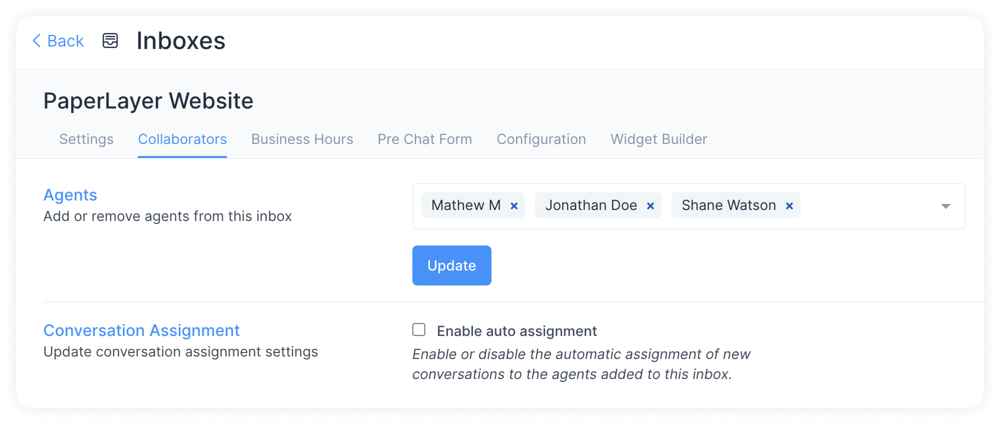

Click on `Update` to save the changes.

### Business Hours tab

Click on the `Business Hours` tab. In this section, you can set the working hours of your team.

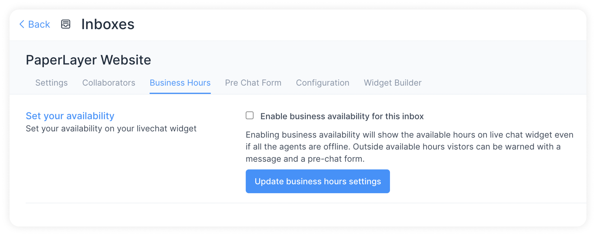

Click on the check box for `Enable business availability for this inbox` if you have well-defined business hours. 

Once the check box is ticked, the below section opens up. You can write your message to be displayed to the customer during OFF business hours. 

You can also select the available business hours for each day of the week, along with the proper time zone.

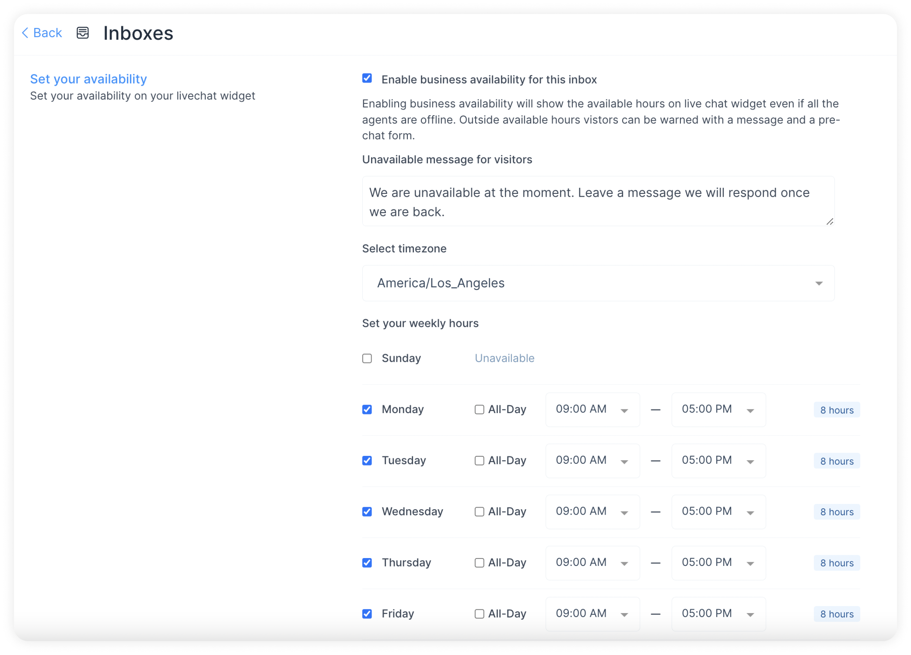

Click on the `Update Business Hour Setting` Button.

### Pre Chat Form Tab

Click on the `Pre Chat Form` tab. 

With this, you can [collect information about your customers](https://www.chatwoot.com/blog/pre-chat-form-automations/) as soon as they enter your live chat window/website widget. You can use this to collect customer info such as name and e-mail address before beginning the chat.

| Field Name | Value | Remarks |
| --- | --- | --- |
| Enable pre chat form | Select Yes or No | Yes if you want to use the prechat form. No if you do not want to |
| Pre Chat Message | Give a message to start a conversation with the customer | Hi, We need some information to serve you better |
| Visitors should provide their name and email address before starting the chat | Tick on the check box if you need the name and email address mandatorily | This will help us maintain our contact list better |

Click on the `Update` button. Pre Chat Form is enabled now.

### Configuration tab

Click on the “Configuration” tab. You can find the code snippet to be copied to the website here.

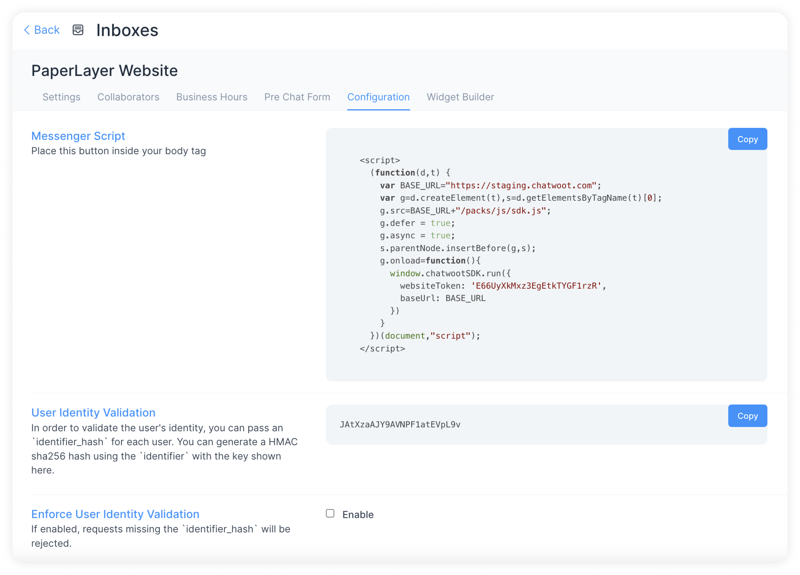

You can click on the `Copy` button to copy the code and [paste it into the root file](https://www.chatwoot.com/docs/user-guide/setting-up-chatwootwidget#root-file-of-website) of your website. 

### Widget Builder tab

You can customize your web widget with simple settings given on this page. You will be able to see your changes live.

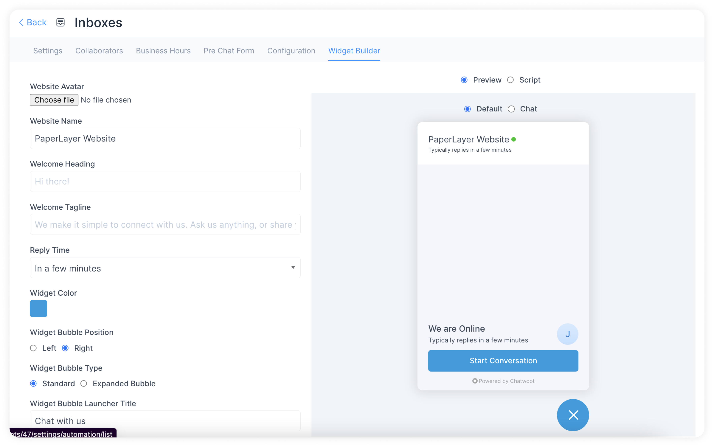

### Next steps

Find the detailed steps to configure each channel below:

➡️ [Facebook messenger channel](/docs/product/channels/facebook)

➡️ [Instagram channel](/docs/product/channels/instagram)

➡️ [Twitter channel](/docs/product/channels/twitter)

➡️ [WhatsApp channel](/docs/product/channels/whatsapp/whatsapp-cloud)

➡️ [SMS channel](/docs/product/channels/sms/twilio)

➡️ [Email channel](/docs/product/channels/email/create-channel)

➡️ [Connect a channel using API](/docs/product/channels/api/create-channel)

➡️ [Telegram channel](/docs/product/channels/telegram)

➡️ [Line channel](/docs/product/channels/line)
