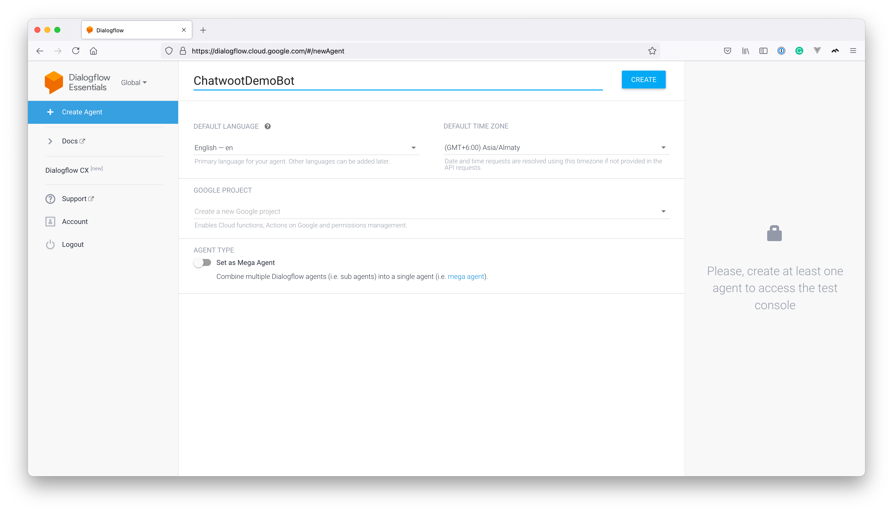
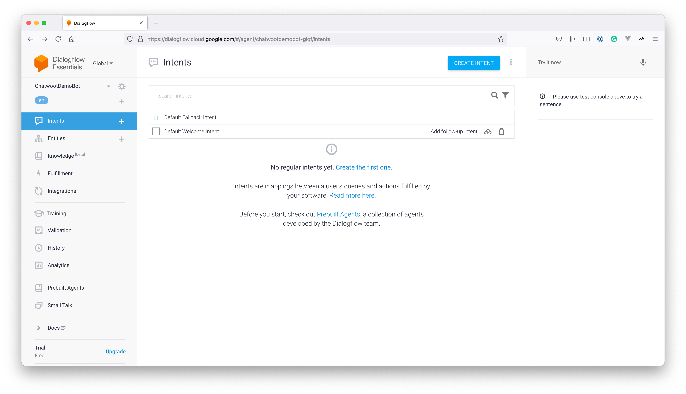
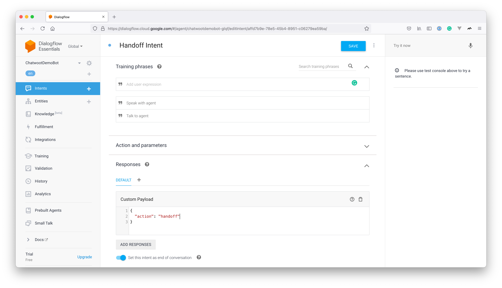
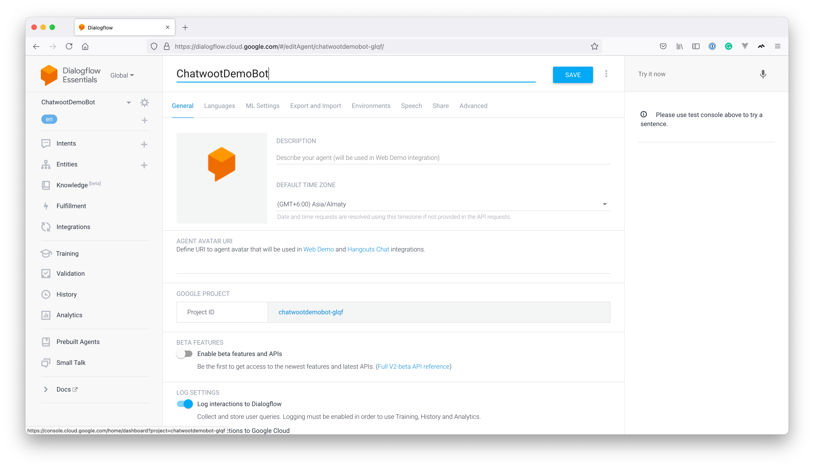
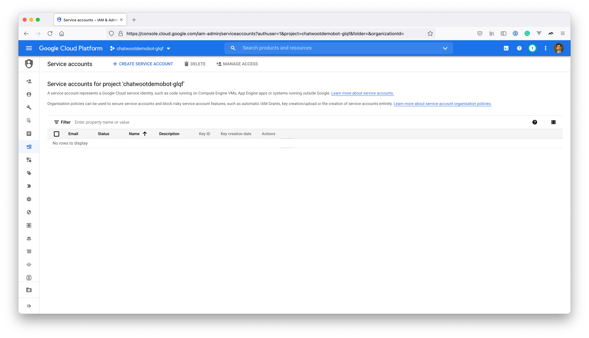
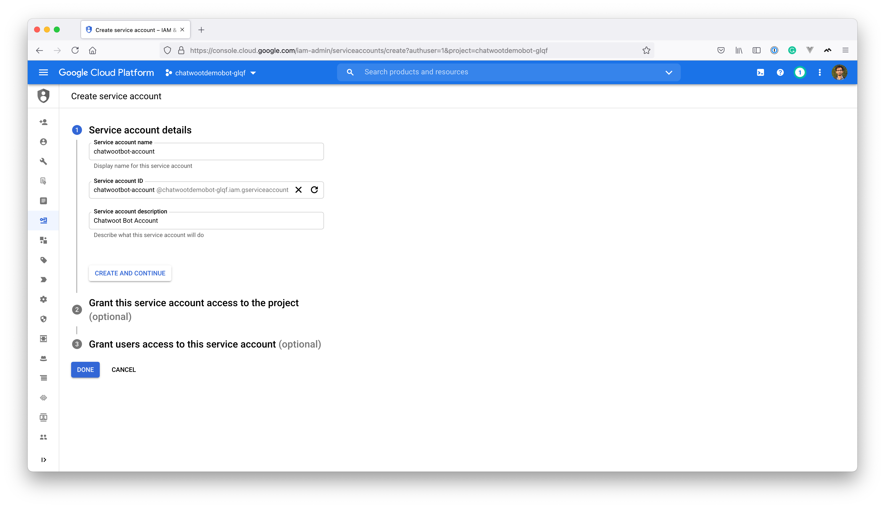
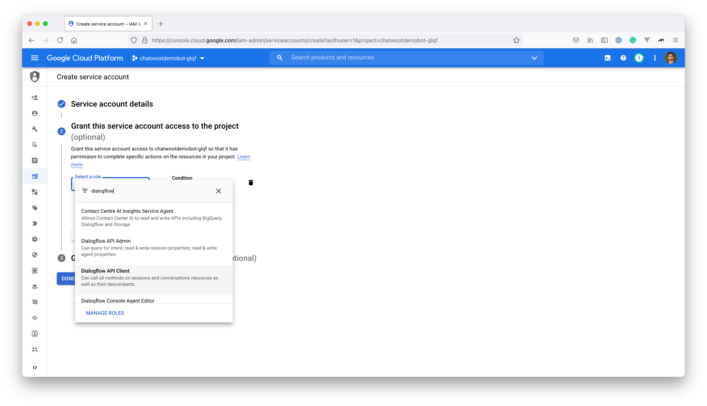
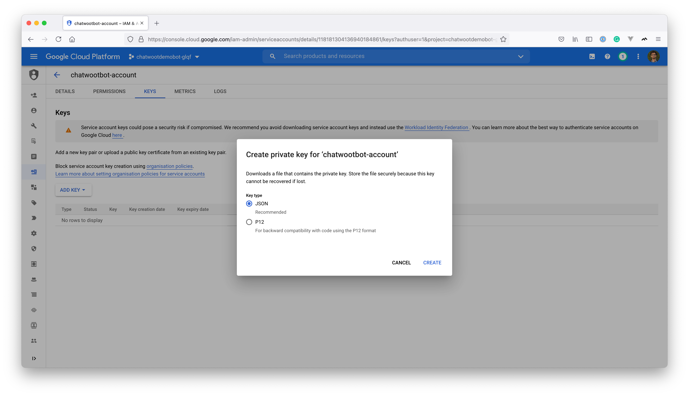
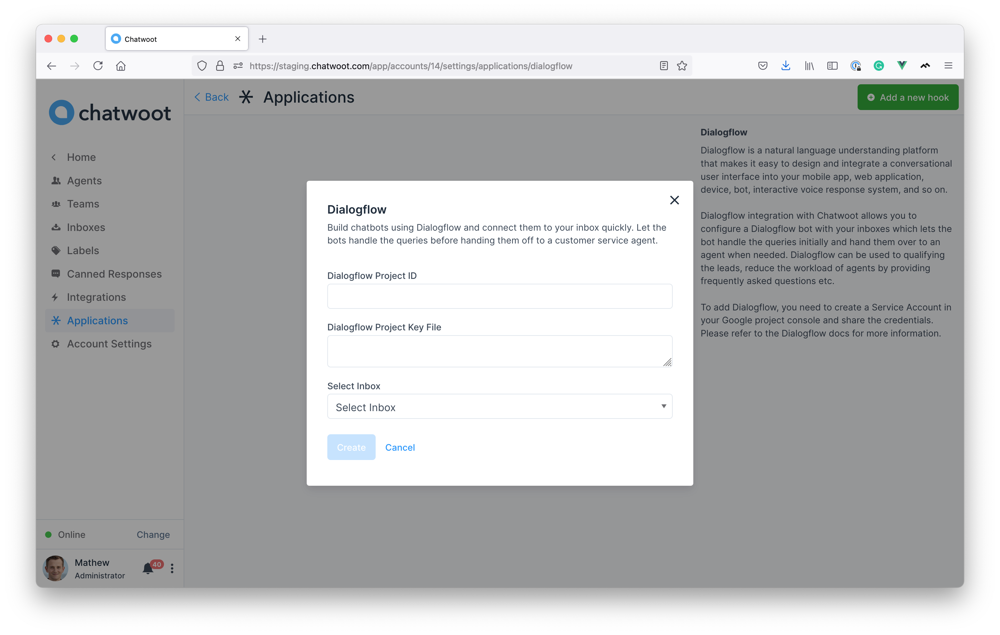

> Note: Currently, Dialogflow only works for website inboxes. Support for other channels added soon.

Chatbots are an essential part of every customer service platform. If you have many conversations happening in your account, scaling human support might not be effective. You could deploy a chatbot that helps answer trivial questions and hand it off to an agent only when necessary. Dialogflow and Rasa.ai are the top-rated NLP platforms that allow you to build a bot based on your use case. In this article, we will see how you can configure a Dialogflow chatbot with Chatwoot.

## Create a Dialogflow bot and configure handoff


### Create a new agent
Go to [Dialogflow Console](https://dialogflow.cloud.google.com). We will be using Dialogflow Essentials for this article. Click on "Create new agent". It would show options as shown below.



### Create intents

You will need to create intents based on how you want your bot to respond. There will be 2 default intents in the project called "Default Fallback Intent" and "Default Welcome Intent", as shown below



### Create a handoff intent

Once the user requests to talk to the agent, Dialogflow needs to inform Chatwoot that an agent can now take over the conversation.

Create an intent named "Handoff Intent" with training phrases like "Talk to an agent" or "Speak with an agent", etc. To handle the handoff intent, we will create a "Custom Payload" response as shown below.
```json
{
  "action": "handoff"
}
```



Now a basic bot configuration is complete, let us create a service account and connect it with Chatwoot.

## Create a service account

To connect this bot with Chatwoot, you need to create a service account on your Google Cloud console. Navigate to the project console in Google cloud by clicking on the **Project ID** in the project settings below.



Navigate to **IAM & Admin -> Service Accounts**. You will see a view like the one below. Click on "Create Service Account".



Provide a Service Account name and description as shown below.



To provide access, select Dialogflow API Client from the dropdown.



Continue and click on "Done". Now, you would be able to see the service listed in the dashboard. The next step is to create a key so that it can be shared with Chatwoot. Click on the service account and click on the "Keys" tab. Then, click on "Add Key". You will be able to see a screen like the one below.



Click on "JSON" and click on "Create". It would generate a key for your service account, download the key and save it for use later.

## Connect the service account to Chatwoot

Chatwoot has a native Dialogflow integration. Go to "Settings -> Applications -> Dialogflow". Click on "Configure", you will see a button to "Add a new hook".

You need to add "Project ID", "Project Key file", and an inbox to create a hook. (Copy the contents of the key file downloaded earlier and paste it in the text area)



Voila! The integration is complete.

Test out the website inbox to see if the initial query is handled by the bot or not.
