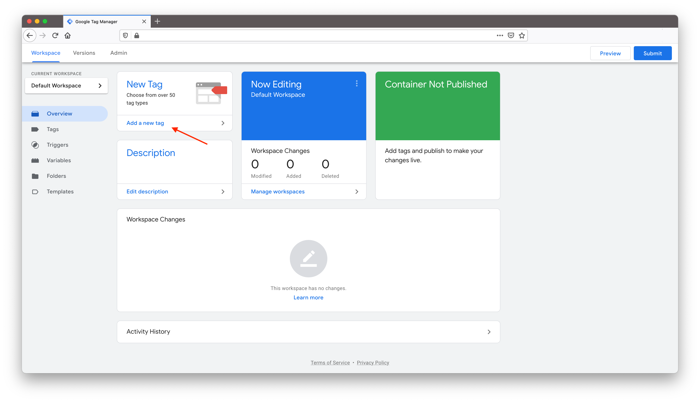
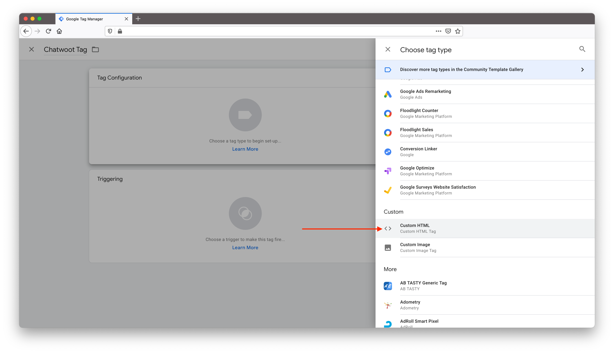
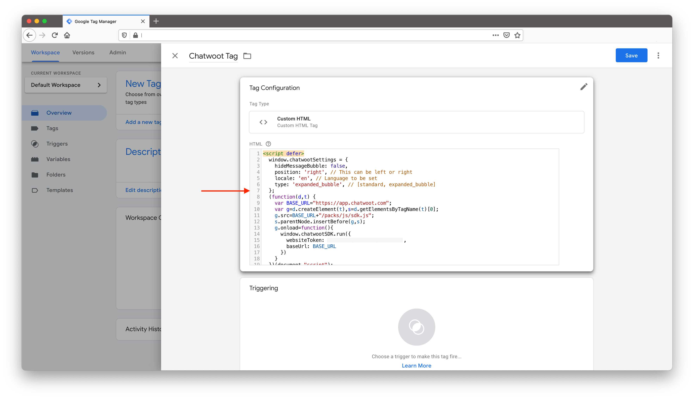
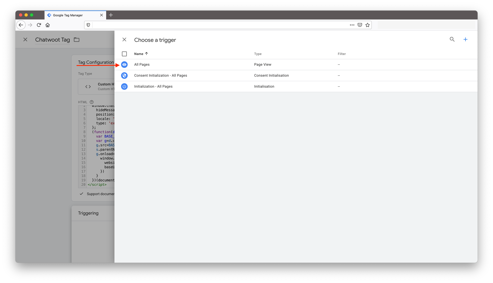
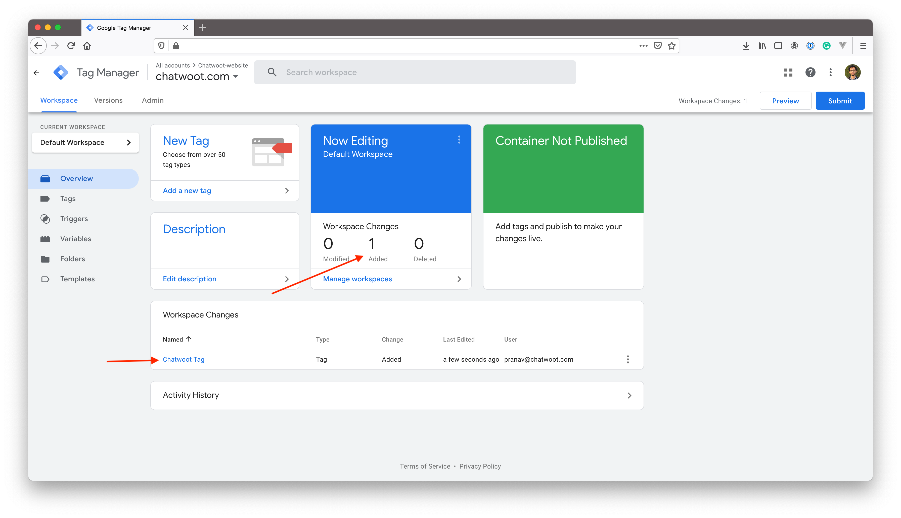
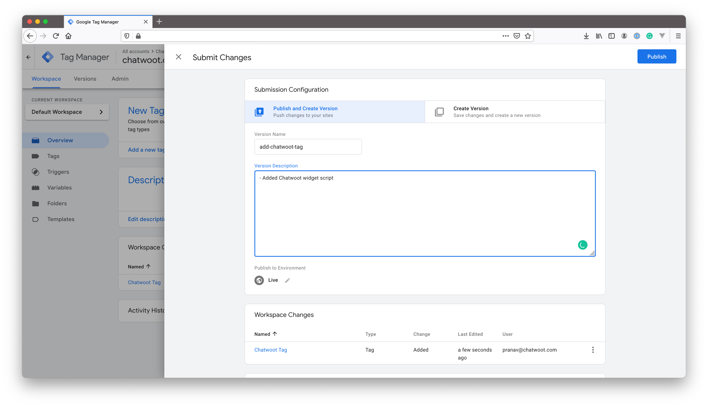

If you are using Google Tag Manager on your website, you can install Chatwoot from Google Tag Manager’s dashboard by creating a new tag for Chatwoot. To install the Chatwoot live-chat widget, please follow the steps below:

### 1. Access the tag manager console

Login to the Tag manager workspace with your Google account. You will be able to see a workspace similar to the one shown below.

### 2. Create new tag

Click on "Add a new tag" button from the dashboard. You will be presented with a popup to create a tag. Change the name from "Untitled Tag" to "Chatwoot" or something that makes sense to you.

Click on tag configuration, select "Custom HTML" tag type from the list as shown below.

Copy the script from the inbox configuration in Chatwoot to the HTML script textarea as shown below. Select "Support document.write" checkbox.

Click on triggering and select "All pages" from the list.

Click "Save" to save the tag. You will be able to see tag listed under Workspace changes.

Click on Submit to deploy the tag. Provide a version name and deploy the changes by click on "Publish".

You have successfully deployed the Chatwoot live-chat widget to your website using Google Tag Manager. Refresh your website to see the live chat widget appear on all pages.
