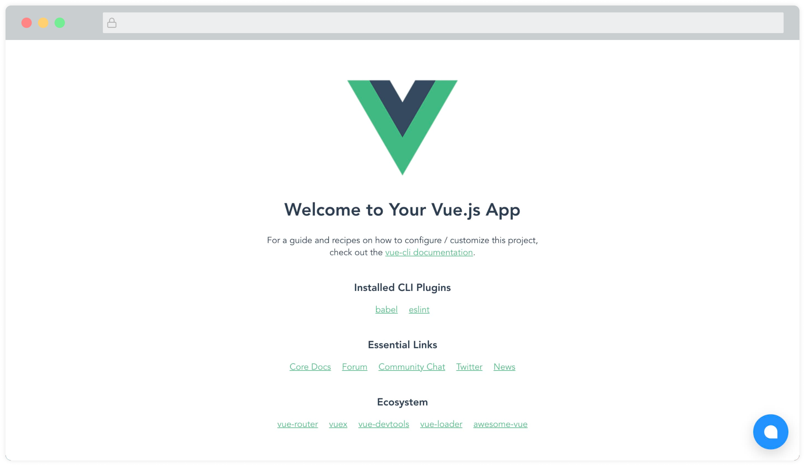

To integrate Chatwoot with your Vue.js application, you need to paste the Chatwoot widget script in your Vue.js application's `index.html` file.

Here is how to do this:

## 1. Get your widget script

Your widget script can be found in your Website Inbox settings.

Go to Settings -> Inboxes -> Select your Website channel > `Configuration` tab.

If you haven't created a website channel yet, you can find the step-by-step instructions [here](https://www.chatwoot.com/docs/product/channels/live-chat/create-website-channel).

## 2. Copy the script

Copy the script that was created in the `code` field of the channel.


## 3. Paste the script here

Open your Vue project and paste the script in the index.html file, right before the closing `</body>` tag.

```html
<body>
  <noscript>
    <strong
      >We're sorry but <%= htmlWebpackPlugin.options.title %> doesn't work
      properly without JavaScript enabled. Please enable it to continue.</strong
    >
  </noscript>
  <div id="app"></div>
  <!-- built files will be auto injected -->

  <!-- Chatwoot script goes here -->
  <script>
    (function (d, t) {
      var BASE_URL = "https://example.com";
      var g = d.createElement(t),
        s = d.getElementsByTagName(t)[0];
      g.src = BASE_URL + "/packs/js/sdk.js";
      g.defer = true;
      g.async = true;
      s.parentNode.insertBefore(g, s);
      g.onload = function () {
        window.chatwootSDK.run({
          websiteToken: "yZ7USzaEs7hrwUAHLGwjbxJ1",
          baseUrl: BASE_URL,
        });
      };
    })(document, "script");
  </script>
  <!-- Chatwoot script goes here -->
</body>
```

## 4. Check!

You will be able to see the Chatwoot widget on the page now. Something like this:



### Vue.js, Nuxt.js module

A community maintained module (Made by the awesome folks at [@productdevbook](https://github.com/productdevbookcom/chatwoot)) for integrating Chatwoot in your Vue 3 and Nuxt 3 projects is available. You can find a [demo here](http://vue-chatwoot-plugin.vercel.app/).

- View [Vue 3 module](https://github.com/productdevbookcom/chatwoot).
- View [Nuxt 3 module](https://github.com/productdevbookcom/chatwoot).
