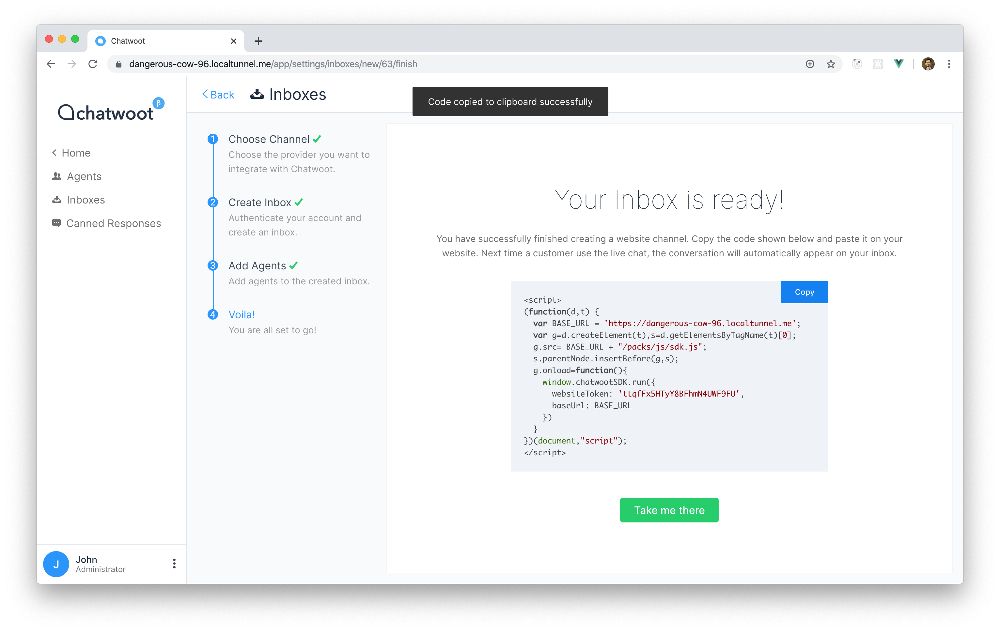
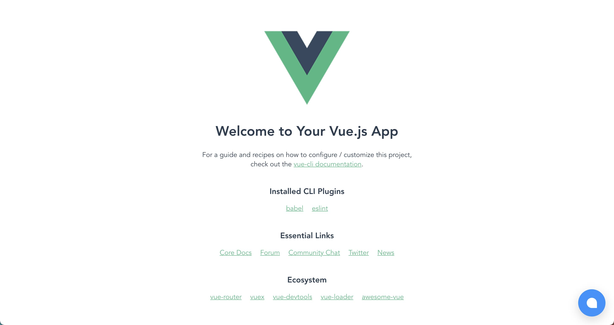

To integrate Chatwoot with a Vue.js application, you need to paste the chatwoot widget script in your Vue.js application's `index.html` file:

1. You can get the script from Settings > Inboxes > Select your Website channel > Click on the `Configuration` tab. If you haven't created a website channel yet, you can find the instructions [here](https://www.chatwoot.com/docs/product/channels/live-chat/create-website-channel).
2. Copy the script that was created in the `code` field of the channel.
   

3. Open your vue project and paste the script in the `index.html` file, right before the closing `</body>` tag.

```html
<body>
  <noscript>
    <strong
      >We're sorry but <%= htmlWebpackPlugin.options.title %> doesn't work
      properly without JavaScript enabled. Please enable it to continue.</strong
    >
  </noscript>
  <div id="app"></div>
  <!-- built files will be auto injected -->

  <!-- Chatwoot script goes here -->
  <script>
    (function (d, t) {
      var BASE_URL = "https://example.com";
      var g = d.createElement(t),
        s = d.getElementsByTagName(t)[0];
      g.src = BASE_URL + "/packs/js/sdk.js";
      g.defer = true;
      g.async = true;
      s.parentNode.insertBefore(g, s);
      g.onload = function () {
        window.chatwootSDK.run({
          websiteToken: "yZ7USzaEs7hrwUAHLGwjbxJ1",
          baseUrl: BASE_URL,
        });
      };
    })(document, "script");
  </script>
  <!-- Chatwoot script goes here -->
</body>
```

4. You would be able to see the Chatwoot widget on the page now.


