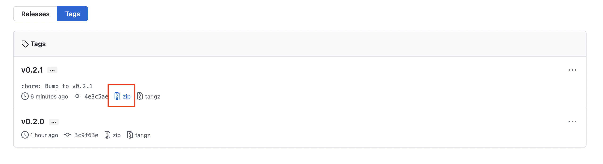
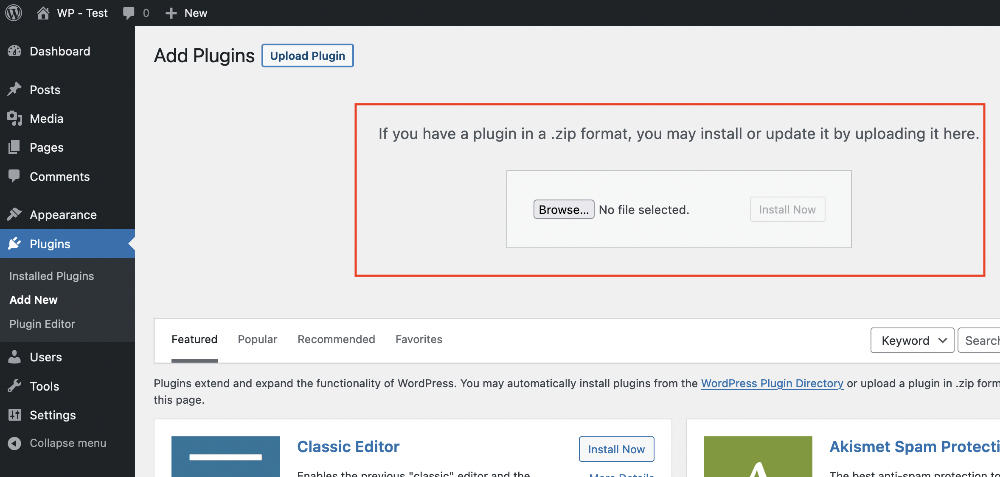
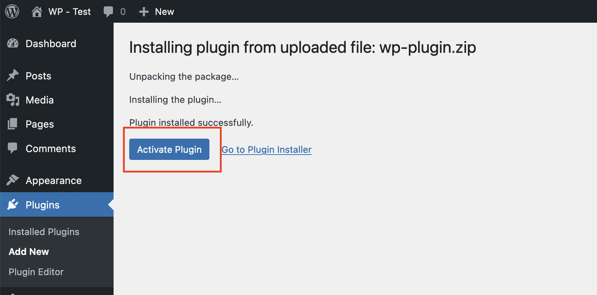
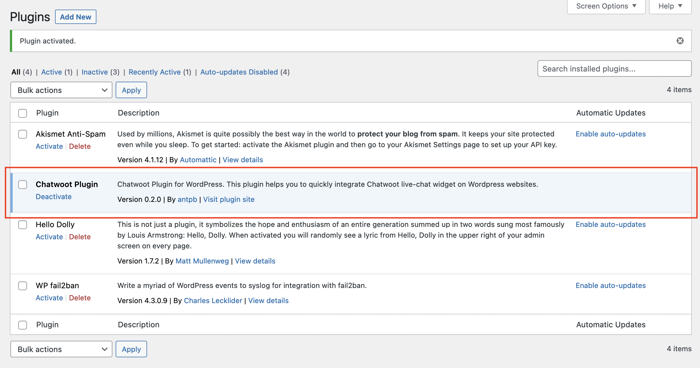
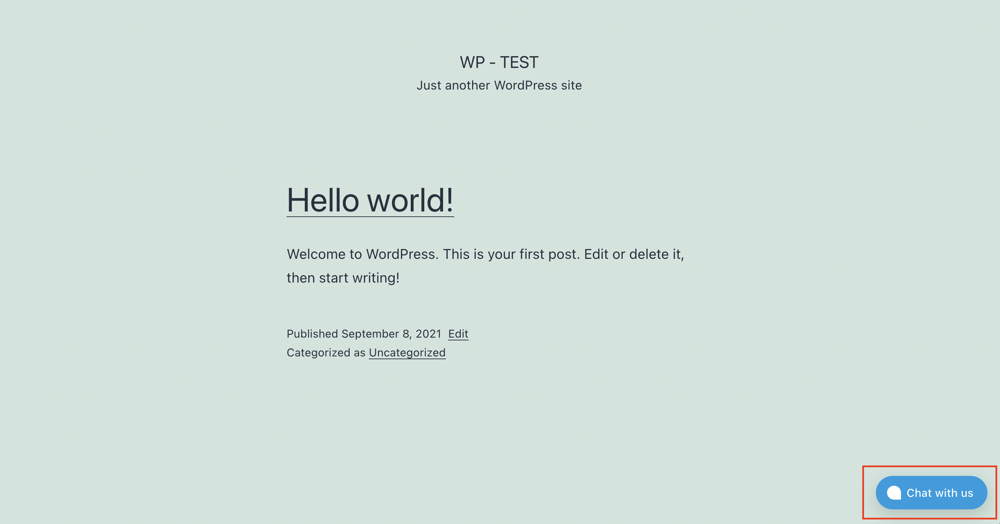

WordPress is a popular content management system. Chatwoot provides native integration with WordPress so that you can use the live-chat support function. To use Chatwoot live-chat on the WordPress website, follow the steps shown below.

### 1. Download the plugin

Download the Zip file of the latest Chatwoot WordPress plugin from Github (https://github.com/chatwoot/wp-plugin/tags) as shown below.

### 2. Upload the plugin to your WordPress website

Log in to your WordPress Admin panel, click on Plugins from the Sidebar. You will be able to see the "Add New" button.

You will be to see an option to upload the plugin, as shown below. Click on upload and select the zip file download in step 1.

Once the plugin is uploaded, you will see a success screen with the "Activate Plugin" option, as shown below. Click on "Activate Plugin."

Hooray! The plugin is now installed. To complete the configuration, you need to share the credentials from the Chatwoot app, as shown in the below steps.

### 3. Configure the plugin

There will be a new settings for Chatwoot under "Settings" menu. Click on that to update the live-chat configuration.

Configure your Chatwoot plugin to make it work. You need to create a website inbox on your Chatwoot installation. Please refer to this [guide](https://www.chatwoot.com/docs/product/channels/live-chat/create-website-channel) to create a website channel inbox.

Available website settings are as follows:

| Option | Description |
| -- | -- |
| Chatwoot Website Token / Installation URL | Once you create a website channel inbox in your Chatwoot installation, you will get a script. Token and the URL can be copied as shown below.  |
| Widget Design | Chatwoot supports two designs for the live-chat widget, Standard Design, and Expanded Bubble design. You can see the details about it [here](/docs/product/channels/live-chat/sdk/setup#widget-designs). |
| Widget Position | Based on your preference, you can select where to place the live-chat widget on the website. The available options are Left & Right |
| Language | Chatwoot support 30+ languages. The default language is English. |
| Launcher text | This is an optional field. If you use the expanded bubble design, you can use the launcher text to customize the text displayed on the bubble. |

### 4. Verify the plugin is working correctly

Once you provide the correct values, click on "Save Changes." Then, visit your website and see if the widget appears on the website.

