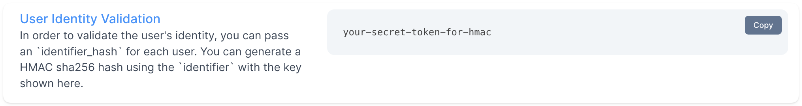

Identity verification is an important security feature that helps ensure that conversations between customers and support agents are private and secure. By verifying the identities of both parties, identity validation helps prevent impersonation and unauthorized access.

If your users can log into your app, it's always recommended to enable identify verification. Chatwoot uses a HMAC based identity verification. It is cryptographic algorithm that uses a secret key (provided by Chatwoot) and a unique identifier to generate a code, this code can then be used to verify the user on the frontend.

## Generating HMAC

To generate the HMAC you need to first get the secret key for your Chatwoot inbox. The key can be found in `Settings > Inboxes > Settings > Configuration > Identity Validation`



To use HMAC for identity validation in your web widget, you'll need to generate an HMAC using this key. You can generate this HMAC using any programming language in the backend. Most languages have built in cryptographic functions to generate the token, if not popular implementations always exist. You can find examples of popular programming languages at the end of this page.

## Verifying the HMAC

Once you've generated an HMAC for an identifier using the key above, you can use the HMAC to validate the identity of the sender. To do this, send the HMAC along with the identifier to your Chatwoot server via the SDK.

### Verification on the web

```js
window.$chatwoot.setUser(`<unique-identifier-key-of-the-user>`, {
  name: "", // Name of the user
  email: "", // Email of the user
  identifier_hash: "<identifier-hash>" // Identifier Hash generated in the previous step
}
```

If the HMACs match, you can be confident that the person who sent the identifier is authorized to do so. All unverified users, will show up with alert mark, stating that the identity is not verified.


### Verification in React Native

You can integrate the identity verification in React Native as well. You can find the documentation to setup Chatwoot for React Native [here](/docs/product/channels/live-chat/integrations/react-native-widget)

```jsx
const App = () => {
  const user = {
    identifier: "john@gmail.com",
    name: "John Samuel",
    email: "john@gmail.com",
    identifier_hash: "<identifier-hash>",
  };

  return (
    <ChatWootWidget
      websiteToken="WEBSITE_TOKEN"
      baseUrl="https://app.chatwoot.com"
      isModalVisible={showWidget}
      user={user}
    />
  );
};
```

## Enforcing verification

In case you want to enforce verification for all users, you can do so by enabling the `Enforce User Identity Validation` option in the inbox settings.


_If this option is enabled any incoming message from a unverified user will be rejected._

## Sample HMAC Generation for popular languagees

### PHP

```php
<?php

// Define your key and message
$key = 'your-secret-token-for-hmac';
$message = 'some-unique-identifier';

// Generate the HMAC
$identifier_hash = hash_hmac('sha256', $message, $key);
?>

```

### Javascript (Node.js)

```js
const crypto = require("crypto");

// Define your key and message
const key = "your-secret-token-for-hmac";
const message = "some-unique-identifier";

// Generate the HMAC
const identifierHash = crypto
  .createHmac("sha256", key)
  .update(message)
  .digest("hex");
```

### Ruby

```ruby
require 'openssl'

# Define your key and message
key = 'your-secret-token-for-hmac'
message = 'some-unique-identifier'

# Generate the HMAC
identifier_hash = OpenSSL::HMAC.hexdigest('sha256', key, message)
```

### Elixir

```elixir
# Define your key and message
key = 'your-secret-token-for-hmac'
message = 'some-unique-identifier'

# Generate the HMAC
signature = :crypto.hmac(:sha256, key, message)

identifier_hash = Base.encode16(signature, case: :lower)
```

### Golang

```go
package main

import (
	"crypto/hmac"
	"crypto/sha256"
	"encoding/hex"
	"fmt"
)

func main() {
	// Define your key and message
	key := []byte("your-secret-token-for-hmac")
	message := []byte("some-unique-identifier")

	// Generate the HMAC
	hash := hmac.New(sha256.New, key)
	hash.Write(message)
	identifierHash := hex.EncodeToString(hash.Sum(nil))

	// Print the HMAC
	fmt.Println(identifierHash)
}

```

### Python

```py
import hashlib
import hmac

# Define your key and message
secret = bytes('your-secret-token-for-hmac', 'utf-8')
message = bytes('some-unique-identifier', 'utf-8')

# Generate the HMAC
hash = hmac.new(secret, message, hashlib.sha256)
identifier_hash = hash.hexdigest()
```
