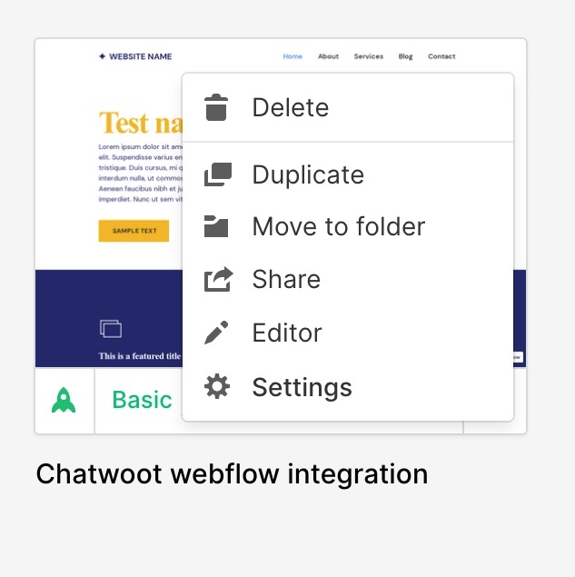
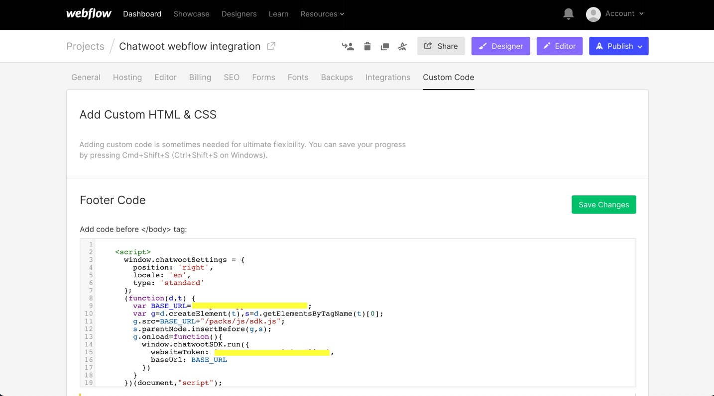
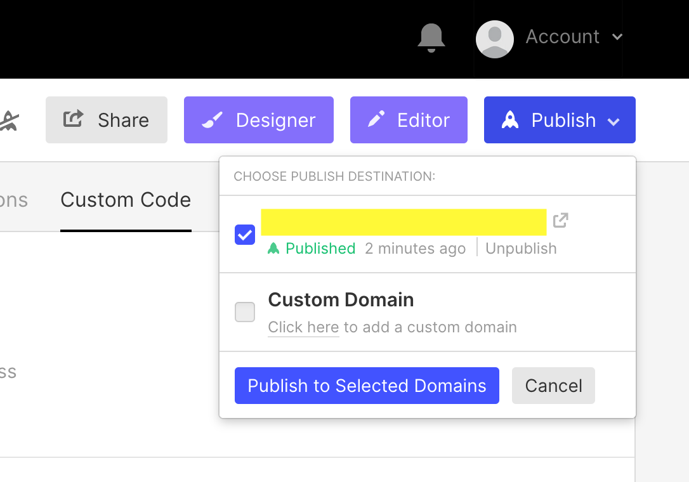
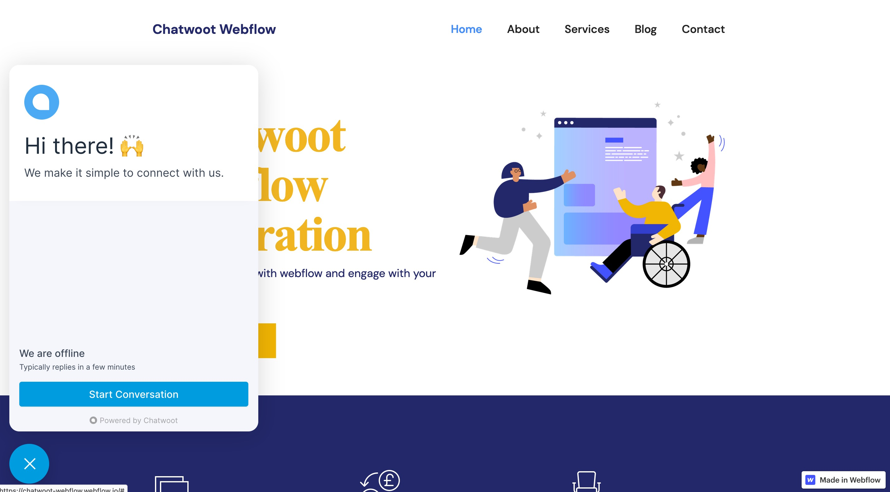

If your website is created with Webflow and you want to talk to your Webflow website visitors in real time, you can add the Chatwoot live chat widget to your website. To use Chatwoot as your website live chat, follow the steps described below.

## 1. Create a website inbox in Chatwoot

Refer to [Website Channel](/docs/product/channels/live-chat/create-website-channel) document.

## 2. Install the generated script in Webflow

### Go to website settings

Login to your Webflow account and select your website. Select Settings.

 

### Paste the script in Footer Code in Webflow

Go to **Custom Code** -> **Footer Code**. 

Paste the script in the Footer Code section. Save the changes.

## 3. Publish the changes

Click on Publish -> Select the website -> Publish to selected domains.

**Voila!** You have successfully integrated Chatwoot with Webflow.

