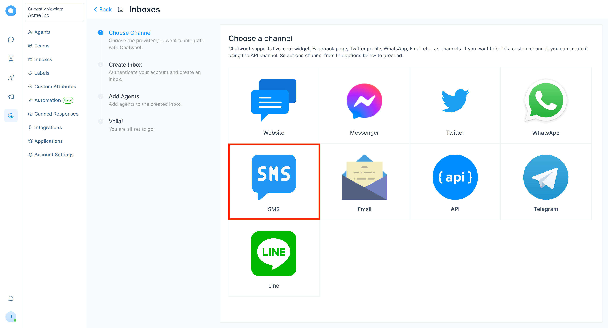
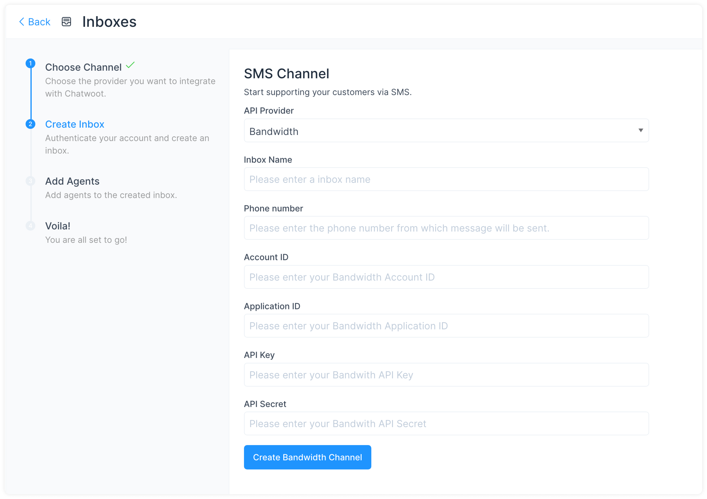
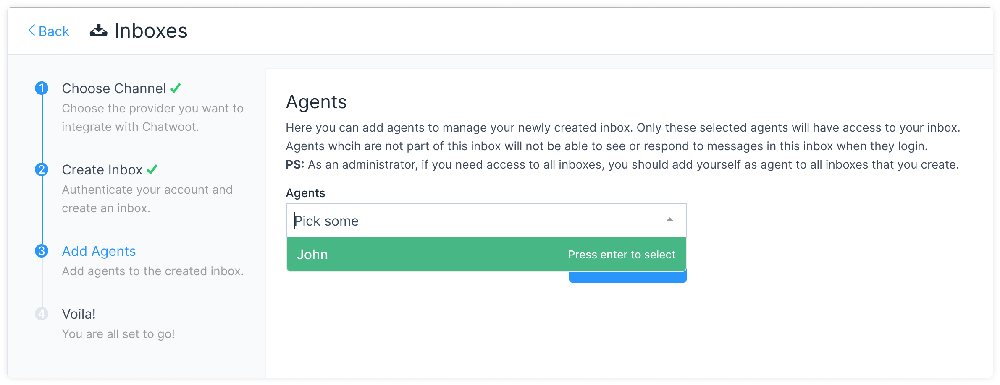
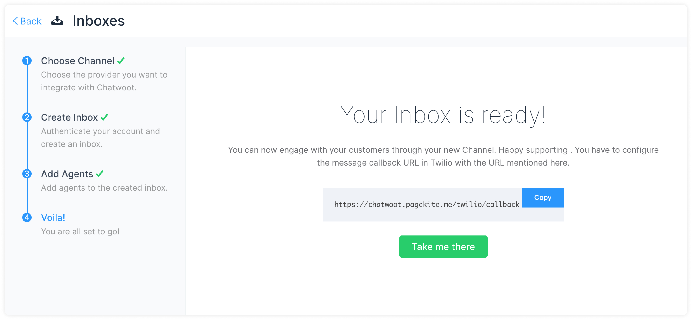

**Step 1**. Open your Chatwoot dashboard. Go to Settings → Inboxes → Add Inbox.

**Step 2**. Click on the "SMS" icon.

**Step 3**. Choose "Bandwidth" as the API provider and configure the inbox. Fill in the appropriate details. 

Click `Create Bandwidth Channel` after filling in the information.

**Step 4**. "Add agents" to your inbox.

Hooray! You have successfully created an SMS inbox.

You will start receiving the messages in your Chatwoot dashboard.
