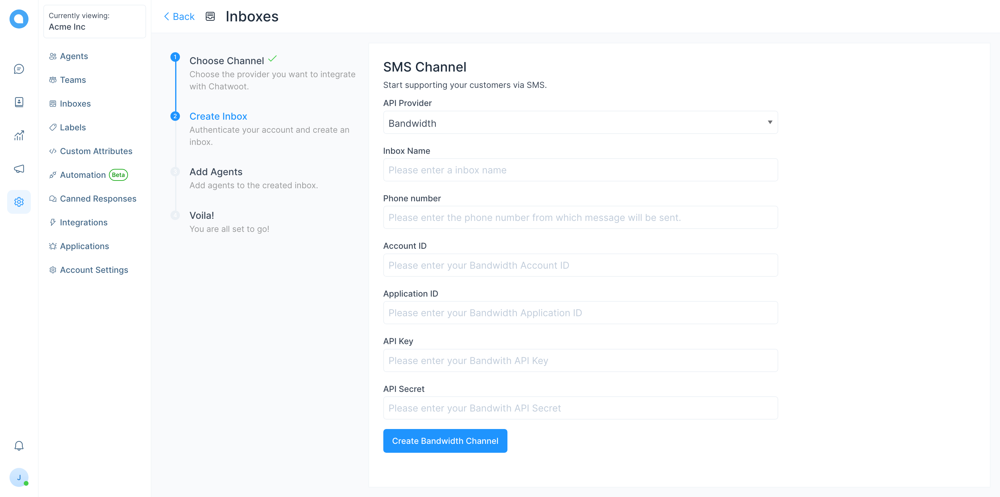
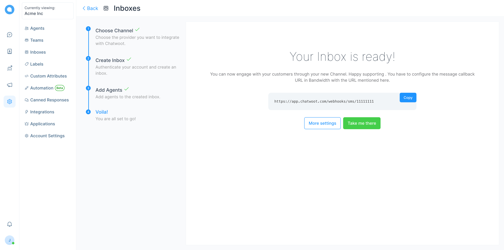

**Step 1**. Go to "Settings" page by clicking the settings icon in the left sidebar.

**Step 2**. Select "Inboxes" from left side panel and Click on "Add Inbox" button.

**Step 3**. Click on the SMS Icon.

**Step 4**. Select `Bandwidth` as the provider option and Configure the inbox.

Click `Create Bandwidth Channel` after filling in the information.

**Step 5**. "Add agents" to your inbox.

**Step 6**. Hooray! You have successfully created a sms inbox.

You will start receiving the messages in the dashboard whenever a customer sends you one.