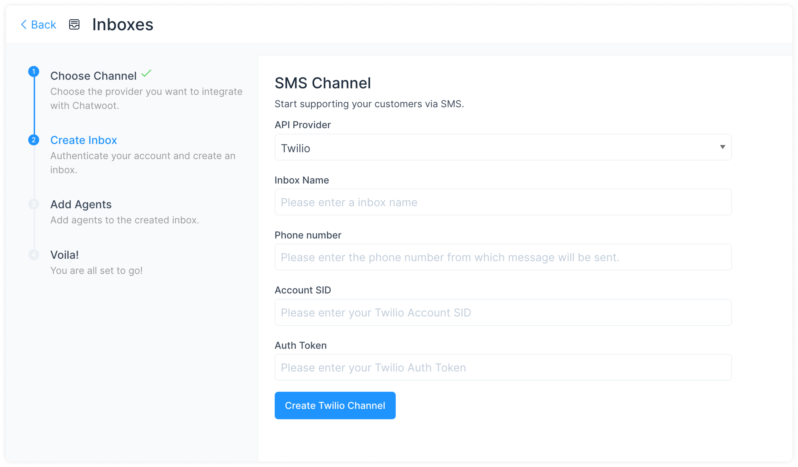

**Step 1**. Open your Chatwoot dashboard. Go to Settings → Inboxes → Add Inbox.

**Step 2**. Click on the "SMS" icon.

**Step 3**. Choose "Twilio" as the API provider and configure the inbox. Fill in the appropriate details. 

These are the inputs required to create this channel:

| Input        | Description                                                                                                           | Where can I find it                                                                            |
| ------------ | --------------------------------------------------------------------------------------------------------------------- | ---------------------------------------------------------------------------------------------- |
| Channel Name | This is the name inbox, this will be used across the application.                                                     | N/A                                                                                            | 
| Phone Number | This is the number you will be using to communicate with your customer. This has to be verified in Twilio.            | Enter your number as in the Twilio Dashboard                                                   |
| Account SID  | Account SID in Twilio Console                                                                                         | Login to Twilio Console. Here, you would be able to see the Account SID and the Auth Token     |
| Auth Token   | Auth token for the account                                                                                            | Login to the Twilio Console. Here, you would be able to see the Account SID and the Auth Token |

Click `Create Twilio Channel` after filling in the information.

**Step 4**. "Add agents" to your inbox.

Hooray! You have successfully created an SMS inbox.

You will start receiving the messages in your Chatwoot dashboard.

## Configuring Chatwoot with Twilio Studio 

If you are using Twilio Studio for a custom conversation flow, updating the webhook URL directly will break your existing integration.

For such cases, you can [follow the steps given here](https://www.chatwoot.com/docs/product/channels/whatsapp/twilio#configuring-chatwoot-with-twilio-studio).
