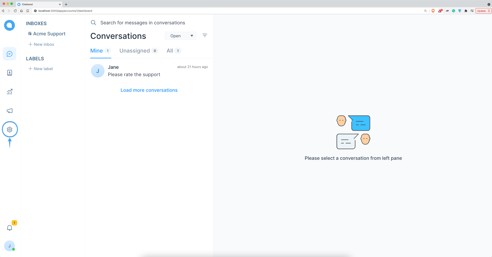
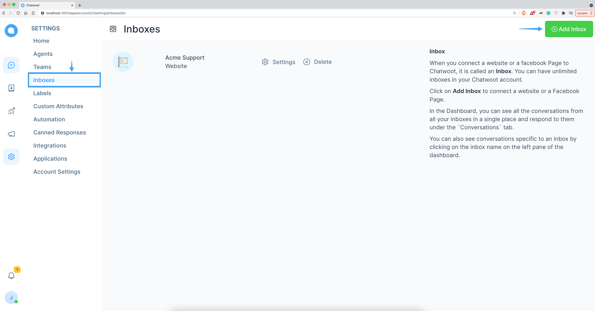
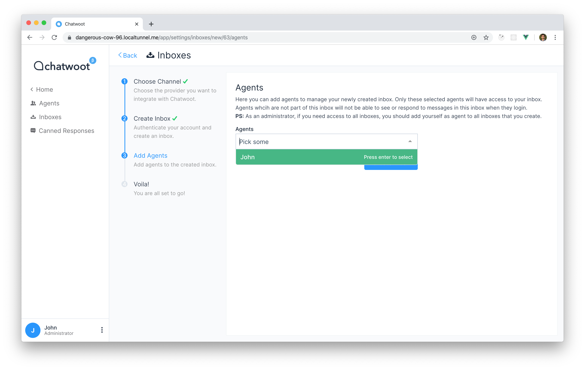
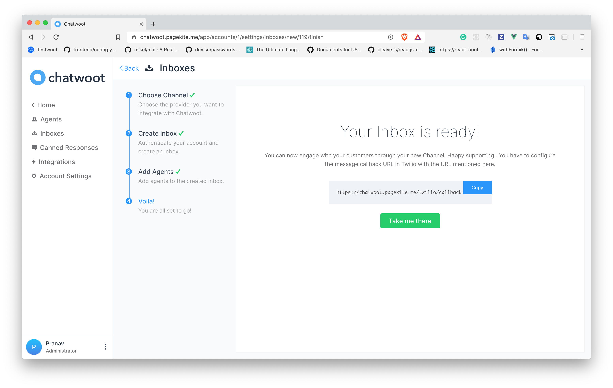
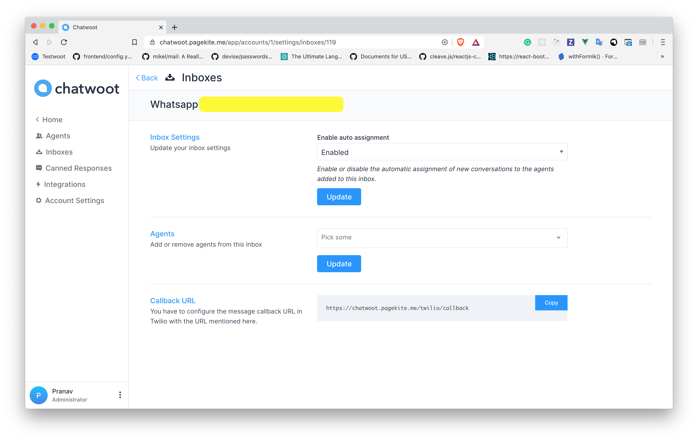
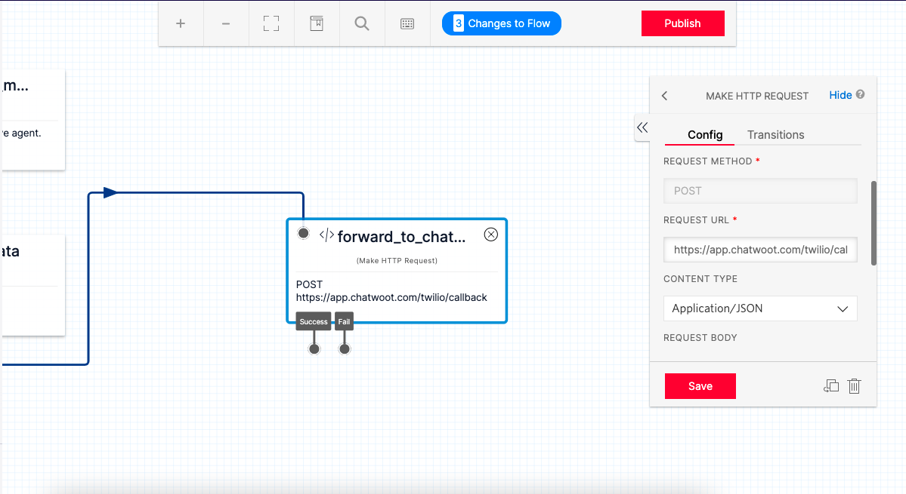

**Step 1**. Go to "Settings" page by clicking the settings icon in the left sidebar.

**Step 2**. Select "Inboxes" from left side panel and Click on "Add Inbox" button.

**Step 3**. Click on the SMS Icon.

**Step 4**. Select `Twilio` as the provider option and Configure the inbox.

These are the inputs required to create this channel:

| Input        | Description                                                                                                           | Where can I find it                                                                            |
| ------------ | --------------------------------------------------------------------------------------------------------------------- | ---------------------------------------------------------------------------------------------- |
| Channel Name | This is the name inbox, this will be used across the application.                                                     | N/A                                                                                            | 
| Phone Number | This is the number you will be using to communicate with your customer. This has to be verified in Twilio.            | Enter your number as in the Twilio Dashboard                                                   |
| Account SID  | Account SID in Twilio Console                                                                                         | Login to Twilio Console. Here, you would be able to see the Account SID and the Auth Token     |
| Auth Token   | Auth token for the account                                                                                            | Login to the Twilio Console. Here, you would be able to see the Account SID and the Auth Token |

Click `Create Twilio Channel` after filling in the information.

**Step 5**. "Add agents" to your inbox.

**Step 6**. Hooray! You have successfully created a whatsapp/sms inbox.

You will start receiving the messages in the dashboard whenever a customer sends you one.

**Step 7**. If you want to update the agents who have access to the inbox, you can go to Settings > Inboxes.

## Configuring Chatwoot with Twilio Studio 

If you are using twilio studio for a custom conversation flow, Updating the webhook url directly will break your exising Integration. 

For such cases you can follow the given steps. 

1. Identify the step in your flow where you want the `agent handoff` to happen.
2. Add a `make http request widget` as shown below with the give values

**REQUEST METHOD** : POST

**REQUEST URL**: https://app.chatwoot.com/twilio/callback

**CONTENT TYPE**: Application/JSON

**REQUEST BODY**: `{{trigger.message | to_json }}` ( make changes as required based on your flow variables)

> HTTP request widget will forward the message body to Chatwoot. This will create a conversation in Chatwoot from where the agent can reply. 

3. Make sure that your flow can handle the user reponses to Agent Replies. 