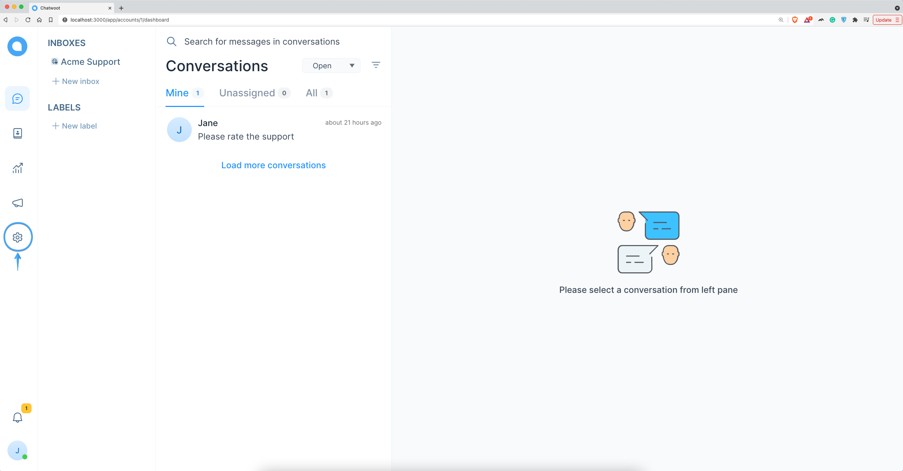
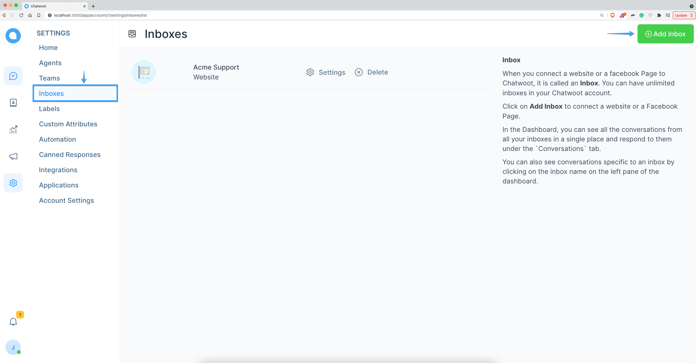
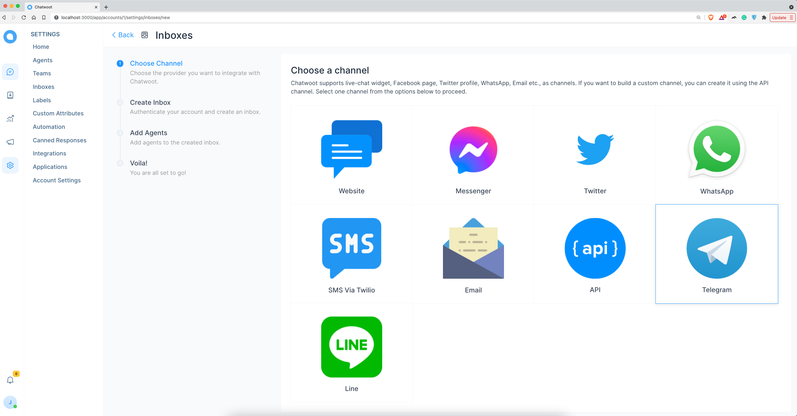
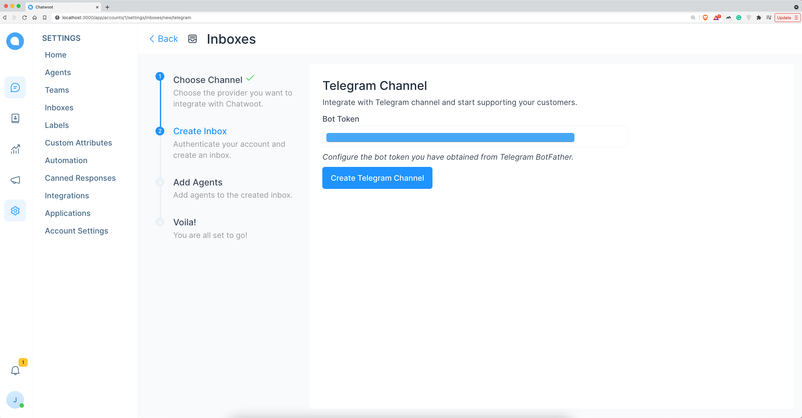
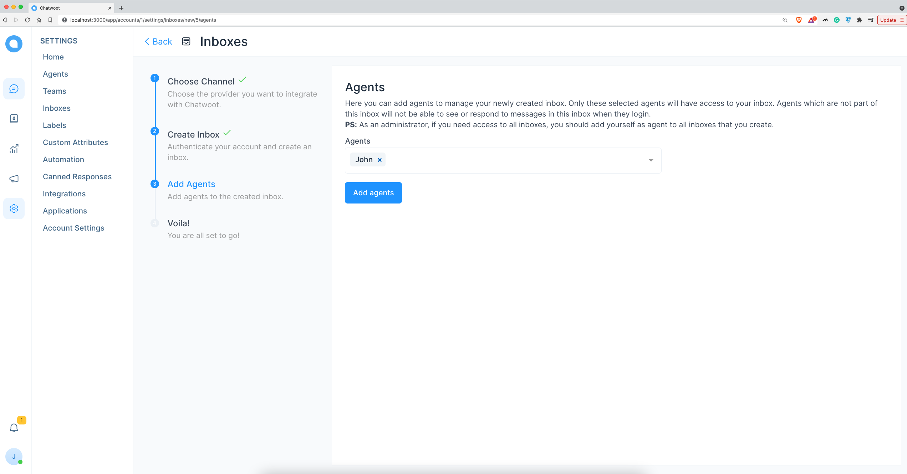
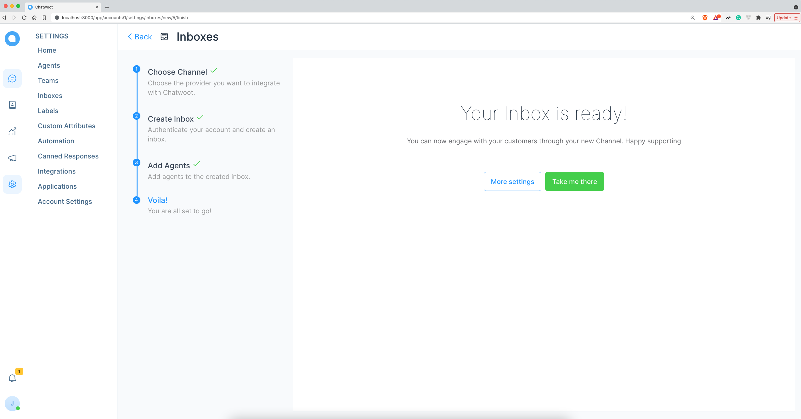
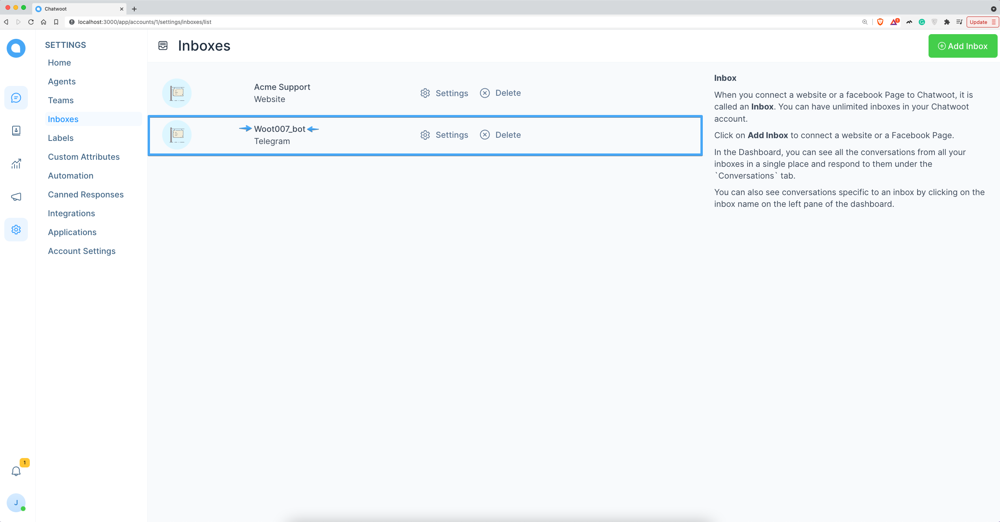
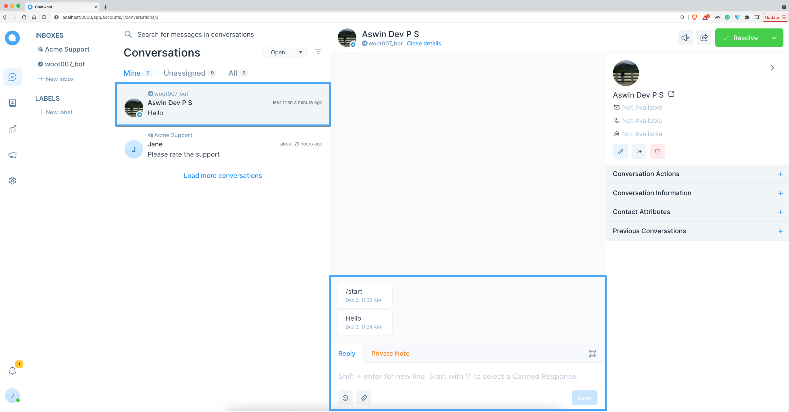

**Step 1**. Go to "Settings" page by clicking the settings icon in the left sidebar.

**Step 2**. Select "Inboxes" from left side panel and Click on "Add Inbox" button.

**Step 3**. Click on "Telegram" icon.

**Step 4**. Create a new telegram bot using Telegram [BotFather](https://telegram.me/BotFather).

**Step 5**. Enter the API token of the telegram bot and click on "Create Telegram Channel".

**Step 6**. "Add agents" to your telegram inbox.

**Step 7**. Hooray! You have successfully created a Telegram inbox.

**Step 8**. Go to the Inbox settings page and verify that the inbox name matches the bot username created using BotFather.

**Step 9**. Send a message to the telegram bot.

**Step 10**. Check Chatwoot telegram inbox for the new message.

