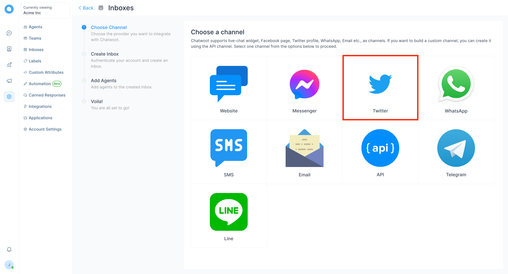
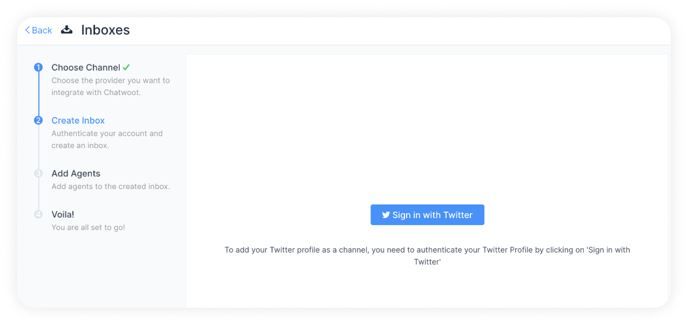
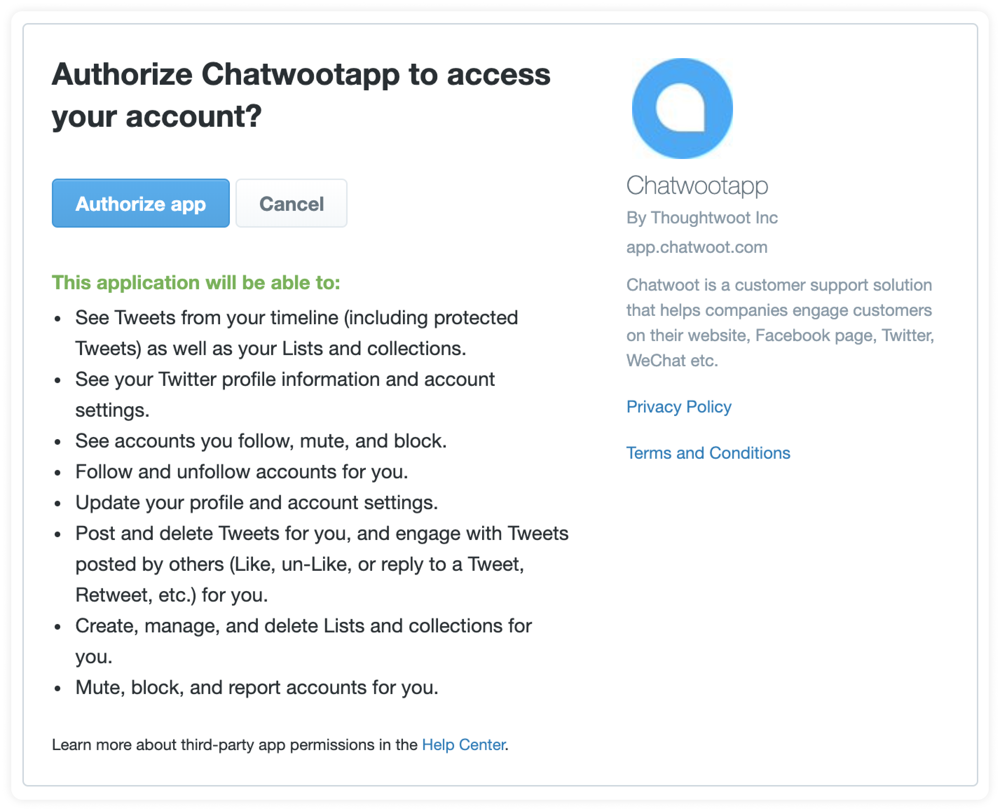
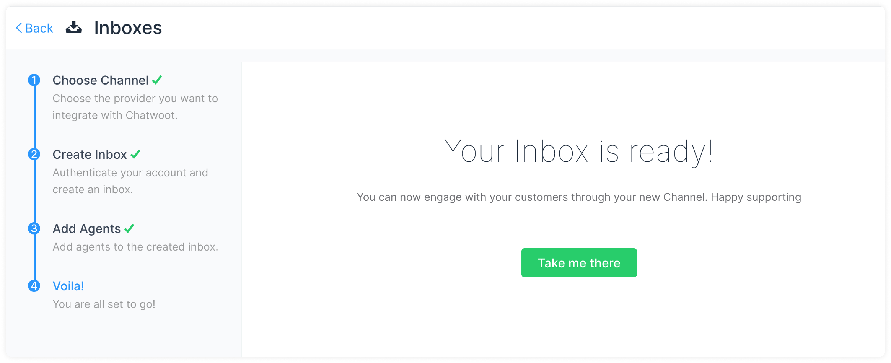
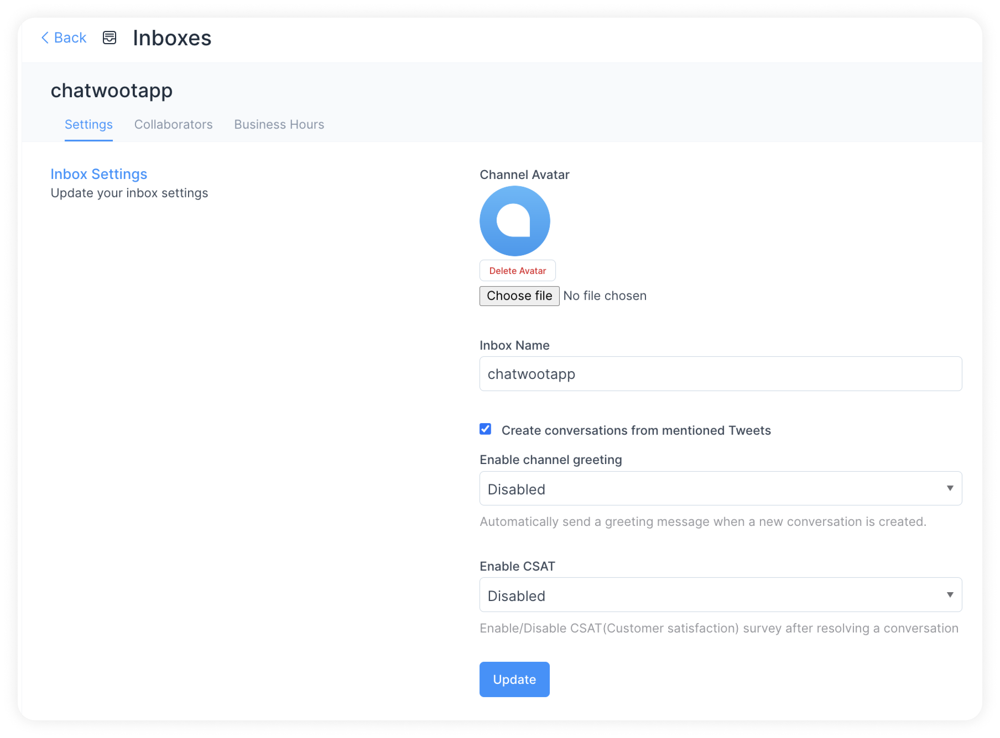
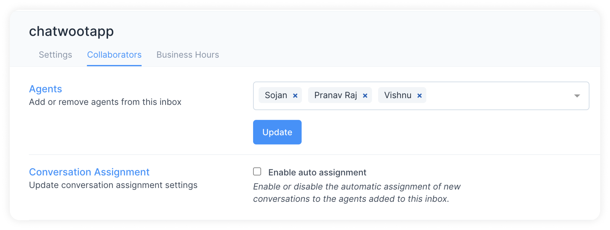
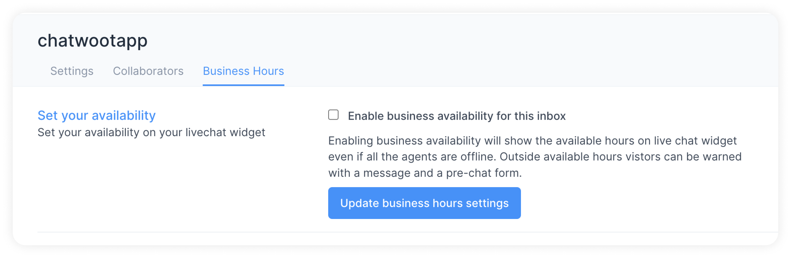

If you are using a self-hosted Chatwoot installation, please setup your Twitter inbox as described in [this guide](/docs/self-hosted/configuration/features/integrations/twitter-channel-setup).

 

_**NOTE: Twitter integration has been temporarily discontinued as a result of modifications made by Twitter to its APIs. This includes limitations on the number of requests raised per minute, plus substantial pricing changes.**_

 

For the cloud version of Chatwoot, please follow the steps below.

**Step 1**. Go to Settings → Inboxes → “Add Inbox”.

**Step 2**. Click on the "Twitter" icon.

**Step 3**. Click on the "Sign in with Twitter" button.

**Step 4**. You will be redirected to Twitter. Click on the "Authorize app" button.

**Step 5**. "Add agents" to your Twitter inbox.

Hooray! You have successfully created a Twitter inbox. You will now be able to manage Twitter DMs as well as tweets mentioning you from Chatwoot.

## Additional Inbox settings

Your freshly configured Twitter inbox should now appear in your list of inboxes. To see this and to make additional settings in your Twitter inbox, go to Settings → Inboxes → click the gear icon on the associated Twitter inbox. You will see the following screen:

You can make some basic changes here. 

### Settings tab

**Enable channel greeting.** Once you enable this, Chatwoot will send a greeting message to new conversations created through your Twitter inbox.

**Enable CSAT**. Once you enable this, your Customer Satisfaction survey will be launched every time a ticket is resolved. The CSAT results can be viewed later in the Reports section.

### Collaborators tab

Click on the `Collaborators` tab. Here, you can add Agents to the Inbox or delete Agents who have been already added in the Inbox.

You can also enable or disable the automatic assignment of new conversations to the agents added to this inbox.

Click on `Update` to save the changes.

### Business Hours tab

Click on the `Business Hours` tab. In this section, you can set the working hours of your team associated with the Twitter inbox.

Click on the check box for `Enable business availability for this inbox` if you have well-defined business hours.

Once the check box is ticked, the below section opens up. You can write your message to be displayed to the customer during OFF business hours.

You can also select the available business hours for each day of the week, along with the proper time zone.

Click on the Update Business Hour Setting Button.
