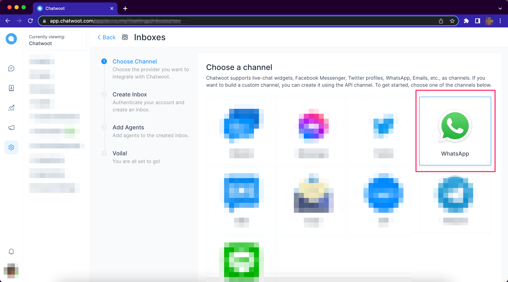
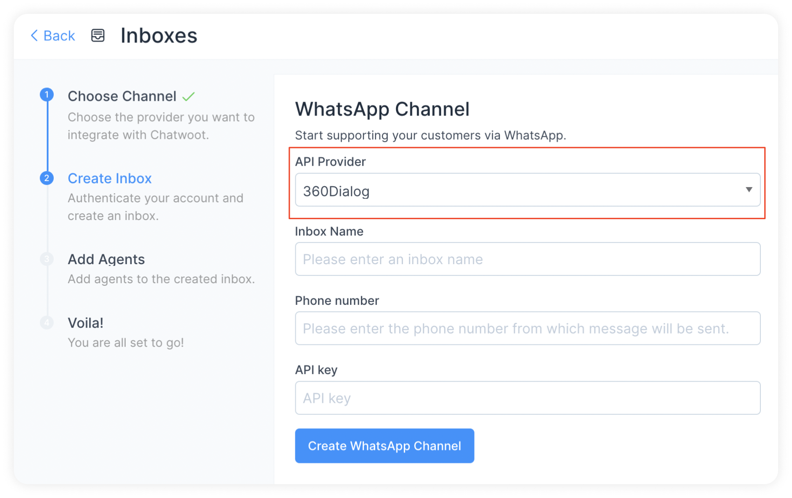

# Setup your WhatsApp channel with 360Dialog API

**Step 1**. Open your Chatwoot dashboard. Go to Settings → Inboxes → Add Inbox.

**Step 2**. Click on the "WhatsApp" icon.

**Step 3**. Choose "360Dialog" as the API provider. Fill in the appropriate details.

Rest of the steps are the same as given in [this document](https://www.chatwoot.com/docs/product/channels/whatsapp/twilio).
