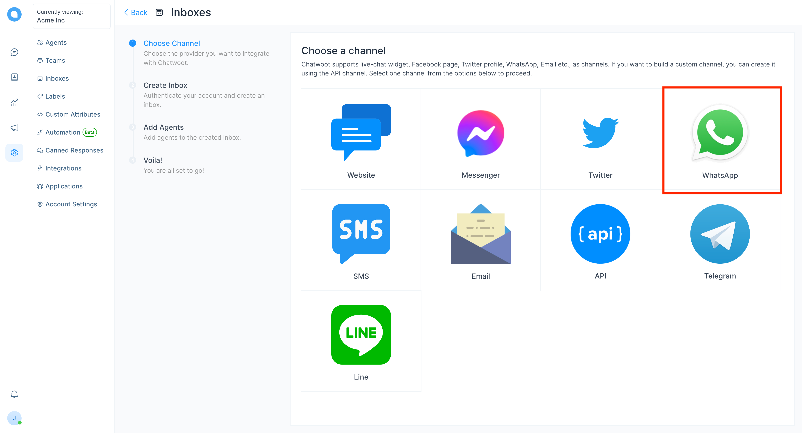
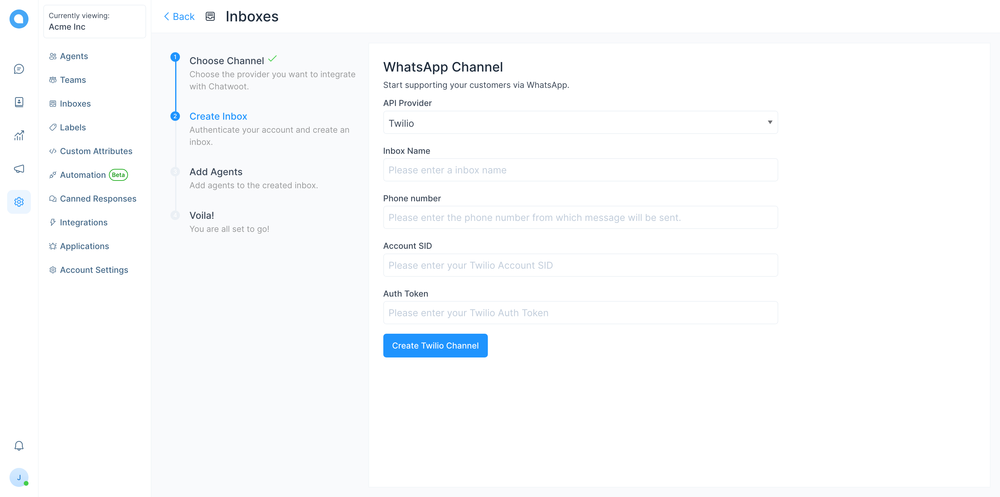
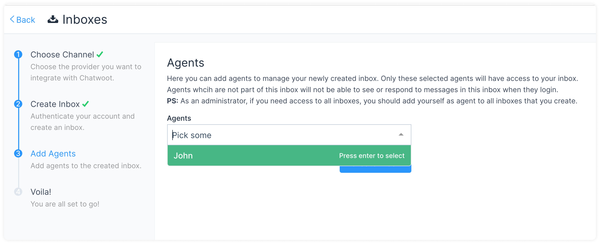
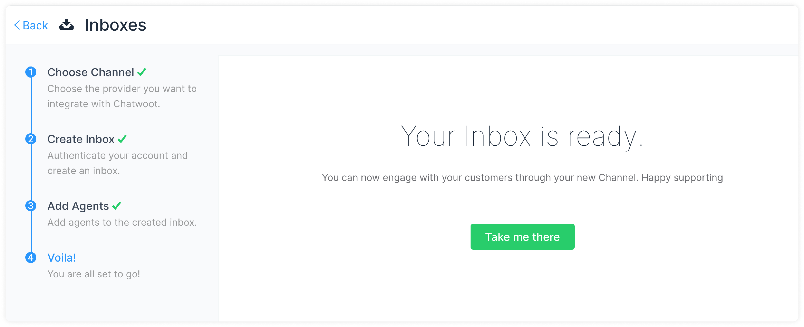
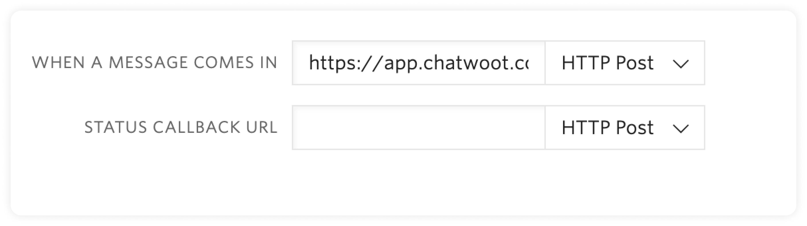
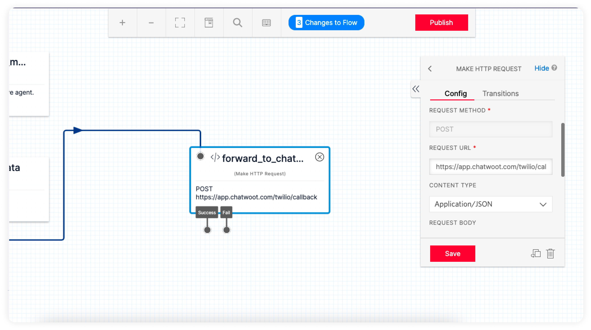

# Setup your WhatsApp channel with Twilio

**Step 1**. Open your Chatwoot dashboard. Go to Settings → Inboxes → Add Inbox.

**Step 2**. Click on the "WhatsApp" icon.

**Step 3**. Choose "Twilio" as the API provider. Fill in the appropriate details.

| Input        | Description                                                                                                           | Where can I find it                                                                            |
| ------------ | --------------------------------------------------------------------------------------------------------------------- | ---------------------------------------------------------------------------------------------- |
| Inbox Name | This is the name inbox, this will be used across the application.                                                     | N/A                                                                                            |
| Phone Number | This is the number you will be using to communicate with your customer. This has to be verified in Twilio.            | Enter your number as in the Twilio Dashboard                                                   |
| Account SID  | Account SID in Twilio Console                                                                                         | Login to Twilio Console. Here, you would be able to see the Account SID and the Auth Token     |
| Auth Token   | Auth token for the account                                                                                            | Login to the Twilio Console. Here, you would be able to see the Account SID and the Auth Token |

Click `Create Twilio Channel` after filling in the information.

**Step 4**. "Add agents" to your inbox.

Hooray! You have successfully created a whatsApp inbox.

To connect a **WhatsApp** channel, you have to configure a callback URL in the Twilio inbox. Follow the following steps.

- Login to your Twilio Console.
- Go to `Programmable SMS -> Whatsapp -> Senders`.
- You will be able to see your phone number. Click on it. It will display a field like the one shown below.

- Provide https://app.chatwoot.com/twilio/callback as the value for WHEN A MESSAGE COMES IN input.

## Configuring Chatwoot with Twilio Studio 

If you are using Twilio Studio for a custom conversation flow, updating the webhook URL directly will break your existing integration.

For such cases you can follow the steps given below.

1. Identify the step in your flow where you want the `agent handoff` to happen.
2. Add a `make http request widget` as shown below with the given values.

**REQUEST METHOD** : POST

**REQUEST URL**: [https://app.chatwoot.com/twilio/callback](https://app.chatwoot.com/twilio/callback)

**CONTENT TYPE**: Application/JSON

**REQUEST BODY**: `{{trigger.message | to_json }}` ( make changes as required based on your flow variables).

> HTTP request widget will forward the message body to Chatwoot. This will create a conversation in Chatwoot from where the agent can reply.

3. Make sure that your flow can handle the user responses to Agent Replies.

## Additional Inbox settings

Your freshly configured WhatsApp inbox should now appear in your list of inboxes. To see this and to make additional settings in your WhatsApp inbox, go to Settings → Inboxes → click the gear icon on the associated WhatsApp inbox. 

All the Additional Settings available are the same as given in your Twitter inbox. We recommend going through [this link](https://www.chatwoot.com/docs/product/channels/twitter#additional-inbox-settings) to understand the same.
