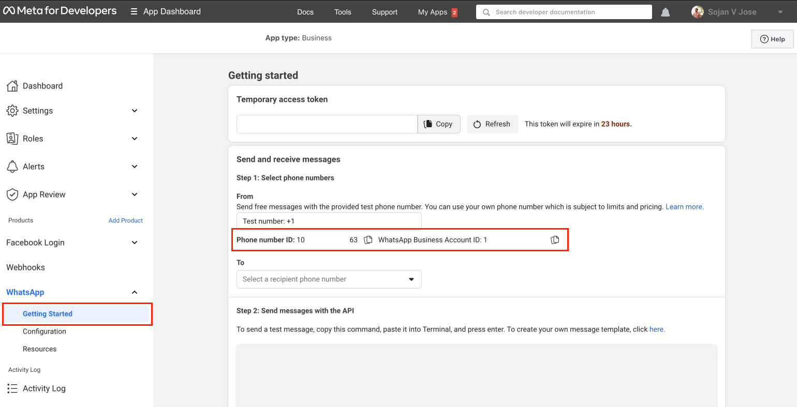
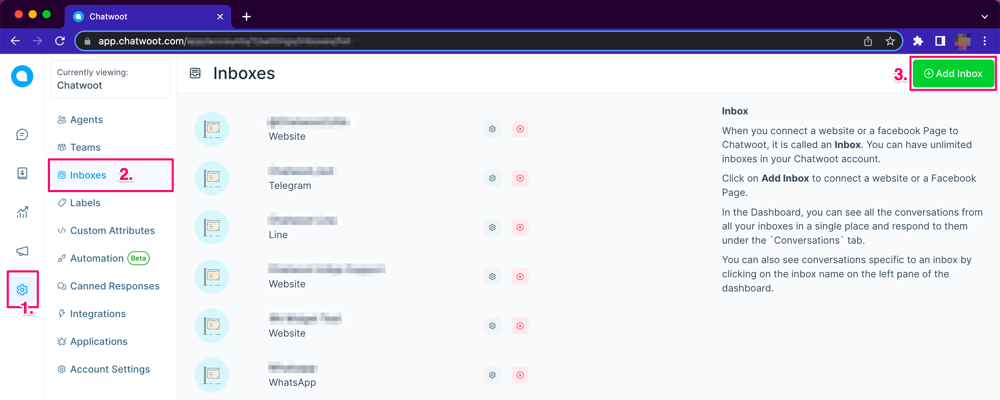
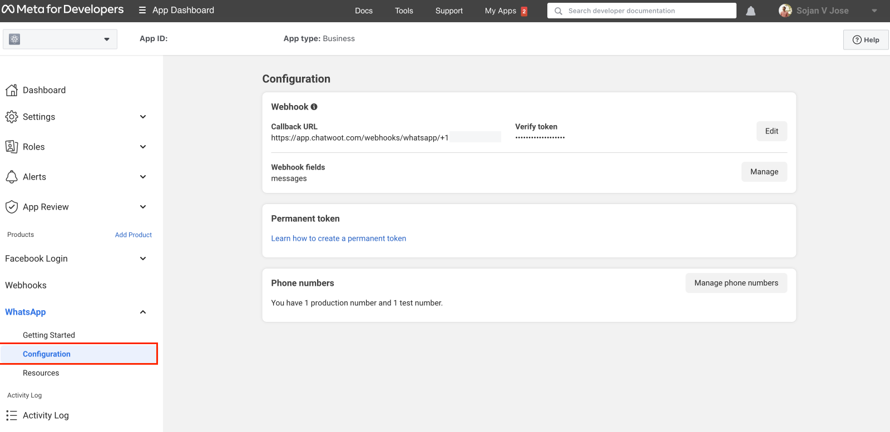

# How to configure WhatsApp Cloud in Chatwoot?

## Prerequisites

### Configure your Facebook Developer App

Follow the `Set up Developer Assets and Platform Access` step in [Whatsapp Cloud API Guide](https://developers.facebook.com/docs/whatsapp/cloud-api/get-started) to create your Facebook Developer app with `Whatsapp Product` enabled.

Once you finish this step, you can now configure your required phone numbers in the `Whatsapp` section of your Facebook developer app.
If you complete the steps successfully, you should be able to obtain the `Phone Number Id` and `Whatsapp Bussiness Account ID` as shown in the below screenshot. Chatwoot will require these values for creating the Whatsapp Inbox.

### Configure a system user for your Facebook Bussiness Manager

[Create](https://www.facebook.com/business/help/503306463479099?id=2190812977867143) a system user in your business manager with access to the Whatsapp App. Generate an access token for the user, which will be required for setting up an inbox in Chatwoot.

When generating the access token, make sure to provide `whatsapp_business_management,` and `whatsapp_business_messaging` permissions are selected.

## Configuring Whatsapp Inbox in Chatwoot

Finish the following steps to configure Whatsapp Cloud API Channel in Chatwoot.

- Open your Chatwoot dashboard. Go to *Settings* → *Inboxes* → *Add* *Inbox*.

- Choose "WhatsApp" amongst the options of channels.

- Choose "WhatsApp Cloud" as the API provider. Fill in the appropriate details

| Values        | Description |
| --------------- | --------------- |
| Name | Choose a name for your Inbox. Ex: Your Business Name             |
| Phone Number   | Fill in the phone number you have configured in Facebook Developer App              |
| Phone Number ID      | The phone number ID for the number as obtained in prerequisites              |
| Bussiness Account ID    | The Business Account ID for the number as obtained in prerequisites             |
| API Key  | The Business Account User API key for the number as obtained in prerequisites            |
| Webhook Verify Token | This token is required while configuring Webhook in Facebook Developer App. Fill in a secure alphanumeric string that you wish  |

- Finish the steps to obtain your Whatsapp `Webhook Callback URL`

## Final Steps

### Configure Webhook in Facebook Developer App
Head back to the `Whatsapp` section in Facebook Developer App. Navigate to the `Configuration` subsection and set up the `Callback URL`
- The value for the url should be the same URL you obtained at the end of your Chatwoot inbox creation and will look like `https://app.chatwoot.com/webhooks/whatsapp/+{phone_number}`.
- The value for the `verify token` should be the same value you configured for the `Webhook Verify Token` during inbox creation

You should also subscribe to message fields events under Webhooks Fields on your Facebook Developer app. Once you finish all the steps, the section should look like the below screenshot.

## FAQ

### How to configure multiple numbers configured under a single Facebook app?

Facebook App allows configuring only a single Webhook endpoint. So create Inboxes in Chatwoot for all the numbers as required. You will need to configure the Webhook url provided for only one of these inboxes in the Facebook app for all the other inboxes to work.

