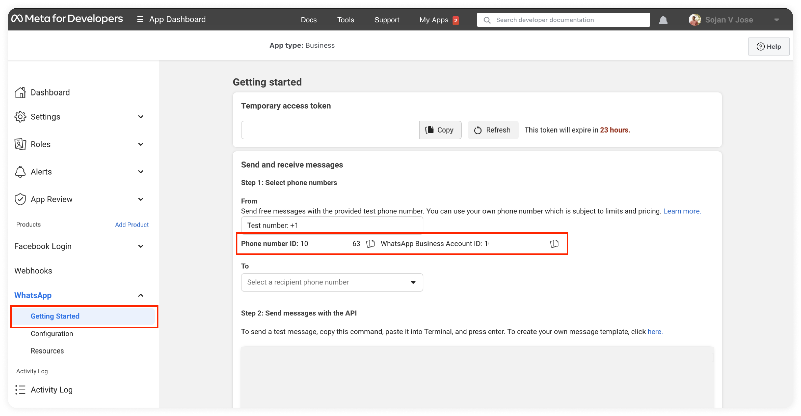
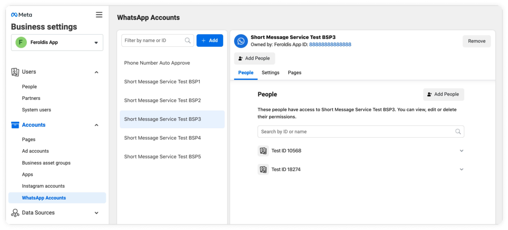
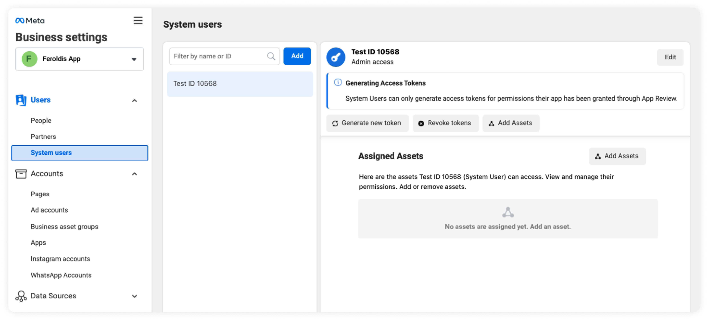
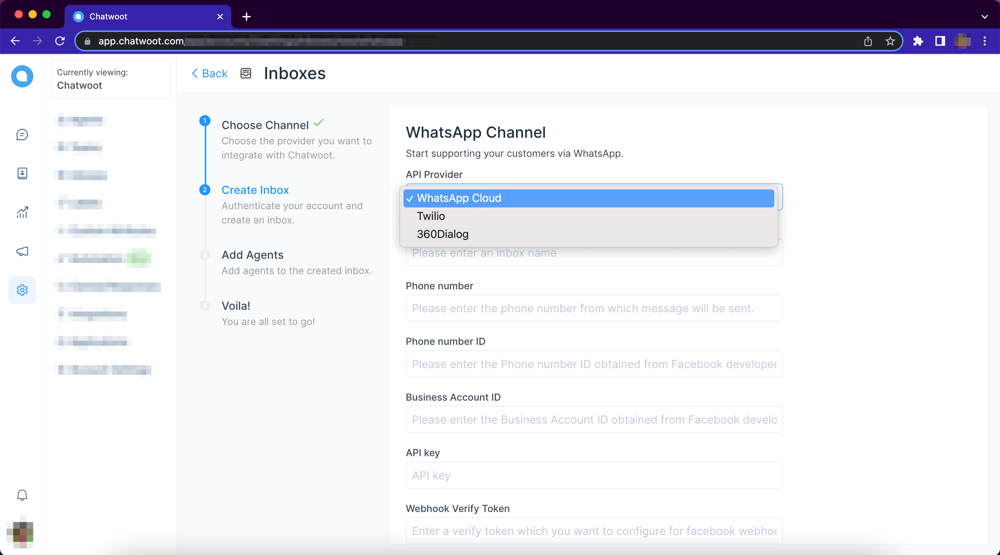
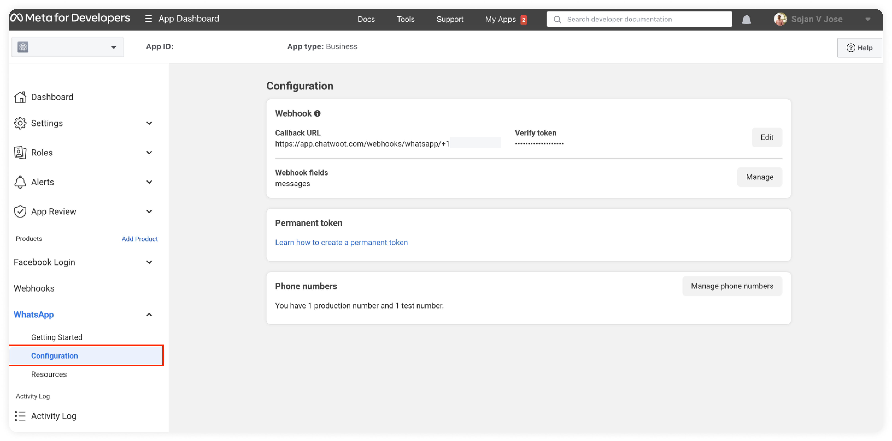

# Setup your WhatsApp channel with WhatsApp Cloud API

Chatwoot supports the official WhatsApp Business API. You can connect the phone number and start managing your WhatsApp customer queries from Chatwoot. Follow the steps given below to enable your WhatsApp inbox with WhatsApp Cloud API.

## Prerequisites

### 1. **Configure your Facebook Developer App**

First, you need to  create your Facebook Developer app, with `WhatsApp Product` enabled. Go to the [WhatsApp Cloud API Guide](https://developers.facebook.com/docs/whatsapp/cloud-api/get-started) and navigate to section called `Set up Developer Assets and Platform Access` and follow the steps.

Once you finish this step, you can now configure your required phone numbers in the `WhatsApp` section of your Facebook developer app. If you complete the steps successfully, you should be able to obtain the `Phone Number Id` and `Whatsapp Bussiness Account ID` as shown in the below screenshot. Chatwoot will require these values for creating the WhatsApp Inbox.

### 2. Configure a system user for your Facebook Business Manager

[Create](https://www.facebook.com/business/help/503306463479099?id=2190812977867143) a system user in your Business Manager with access to the WhatsApp App. Generate an access token for the user, which will be required as the API key for setting up an inbox in Chatwoot.

When generating the access token, make sure the `whatsapp_business_management`, and `whatsapp_business_messaging` permissions are selected.

**Step 1.** Create a system user in the System Users tab of Business Manager.

**Step 2.** Add the system user. Under the WhatsApp Accounts tab, select “Add People” and select the system user to grant access to the WhatsApp Business account.

Step 3. Generate the access token and request permissions.

Refer [this video](https://www.youtube.com/watch?v=gqiBzFlF44c) for detailed steps.

## Setup WhatsApp Inbox in Chatwoot

**Step 1.** Open your Chatwoot dashboard. Go to Settings → Inboxes → Add Inbox.

**Step 2.** Click on the "WhatsApp" icon.

**Step 3.** Choose "WhatsApp Cloud" as the API provider. Fill in the appropriate details.

| Values        | Description |
| --------------- | --------------- |
| Name | Choose a name for your Inbox. Ex: Your Business Name             |
| Phone Number   | Fill in the phone number you have configured in Facebook Developer App              |
| Phone Number ID      | The phone number ID for the number as obtained in prerequisites              |
| Bussiness Account ID    | The Business Account ID for the number as obtained in prerequisites             |
| API Key  | The Business Account User's access token for the number as obtained in prerequisites            |
| Webhook Verify Token | This token is required while configuring Webhook in Facebook Developer App. Fill in a secure alphanumeric string that you wish  |

Finish the steps to obtain your Whatsapp `Webhook Callback URL`.

## Enable the webhook

Configure the webhook in Facebook Developer App. 

Head back to the `WhatsApp` section in the Facebook Developer App. Navigate to the `Configuration` subsection and set up the `Callback URL`.

- The value for the URL should be the same URL you obtained at the end of your Chatwoot inbox creation and will look like `https://app.chatwoot.com/webhooks/whatsapp/+{phone_number}`.
- The value for the `verify token` should be the same value you configured for the `Webhook Verify Token` during inbox creation.

You should **also subscribe to message fields events** under Webhooks Fields on your Facebook Developer app. 

Once you finish all the steps, the section should look like the following screenshot.

## FAQ

### How to configure multiple numbers under a single Facebook app?

Facebook App allows configuring only a single Webhook endpoint. So create Inboxes in Chatwoot for all the numbers as required. You will need to configure the Webhook URL provided for only one of these inboxes in the Facebook app for all the other inboxes to work.

## Additional Inbox settings

Your freshly configured WhatsApp inbox should now appear in your list of inboxes. To see this and to make additional settings in your WhatsApp inbox, go to Settings → Inboxes → click the gear icon on the associated WhatsApp inbox. 

All the Additional Settings available are the same as those in your Twitter inbox. We recommend going through [this link](/docs/product/channels/twitter#additional-inbox-settings) to understand the same.
