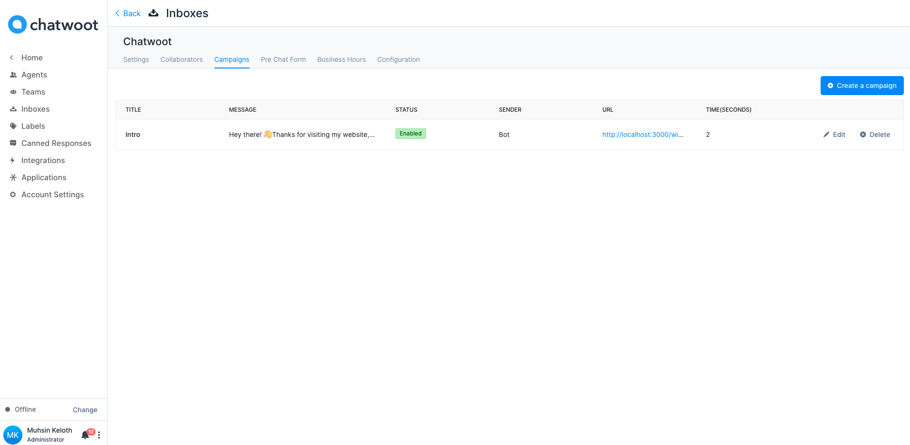
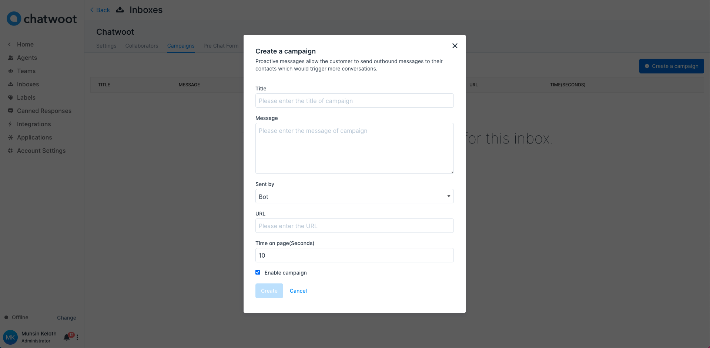
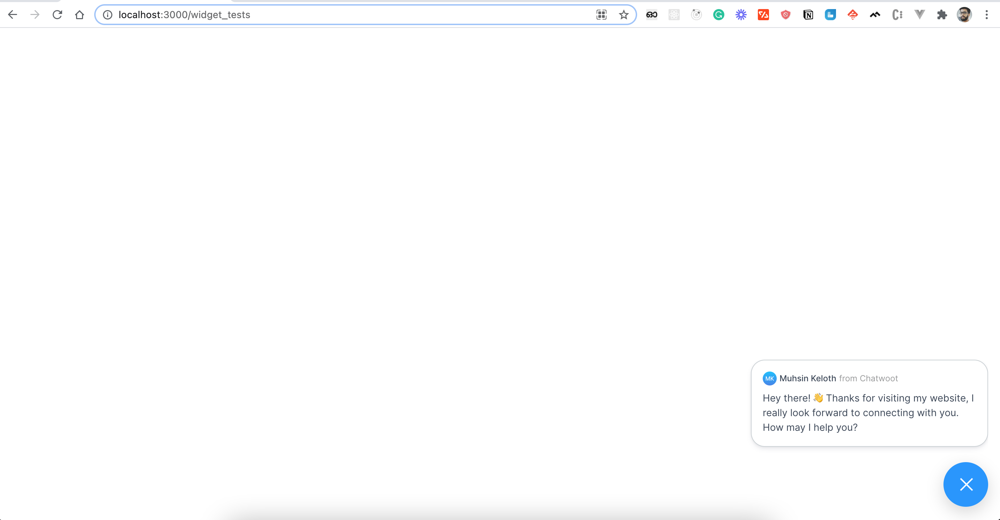

Campaigns allow the customer to send outbound messages to their contacts which would trigger more conversations. Currently, campaigns are supported in website live chat and Twilio SMS/Whatsapp channels.

**Step 1**. Click on the Campaigns tab in the sidebar. You will see the list of campaigns that you have already added to the inbox.

There are 2 types of campaigns available.

1. One-off campaigns: For SMS channels, you can select a list of users and send one time outbound message.
2. Ongoing campaigns: For Website live-chat, you can create an ongoing campaign so that if a user visited a page and stayed for x minutes, you could send outbound message. This will help in more conversions.

**Step 2**. Click on the "Create a campaign" button., it will display a modal where you can input the campaign details.

These are the inputs required to create the campaign:

| Input        | Description
--------------------------------------------------------------------------------------------------------------------- | ---------------------------------------------------------------------------------------------- |
| Title | Campaign name
| Message | Message to be sent in a campaign
| Sent by | Agent details
| URL | URL which campaigns work
| Time on page | Time to wait until the campaign should be displayed (Seconds)
| Enable campaign | The flag which shows whether the campaign is enabled or not

**Step 3**. Visit the URL specified in the campaign and wait for the time configured in the campaign.

