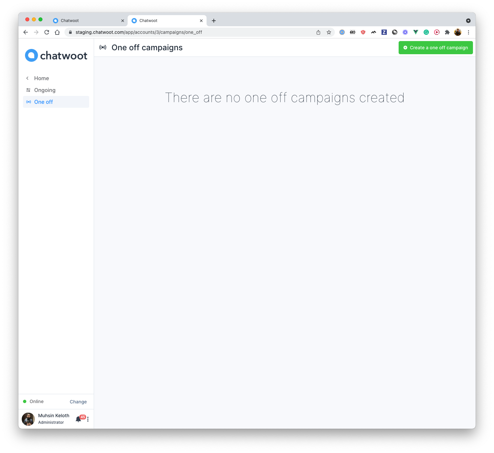
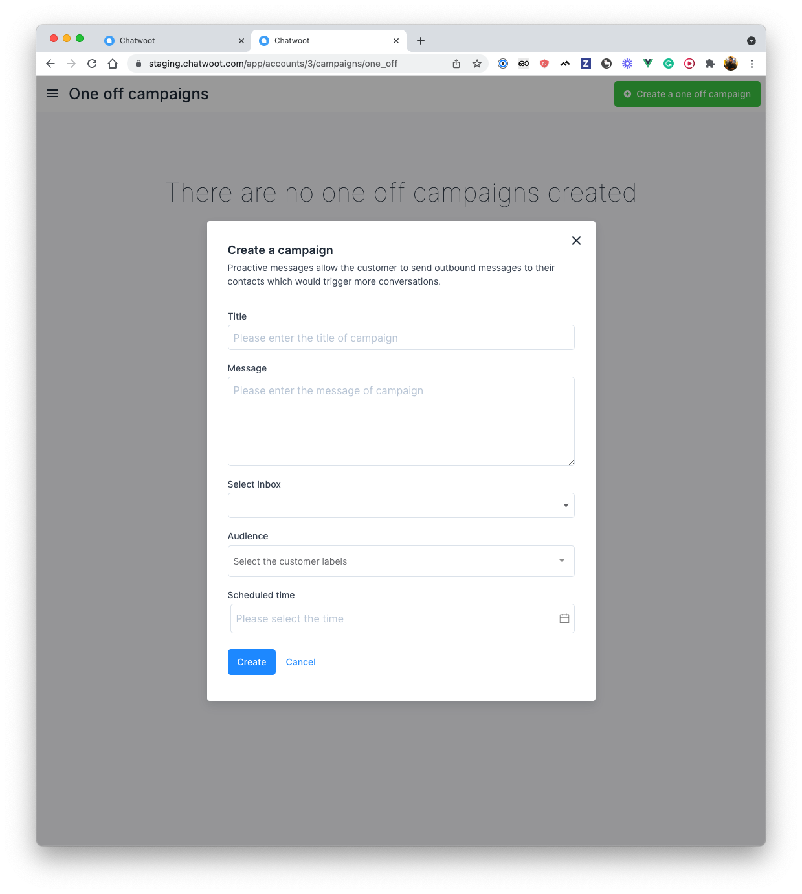

The one-off Campaigns allow the customer to send SMS campaign to a group of contacts.

**Step 1**. Click on the Campaigns tab in the sidebar. You will see the list of one-off campaigns that you have already added to the inbox.

**Step 2**. Click on the "Create a campaign" button., it will display a modal where you can input the campaign details.

 

These are the inputs required to create the campaign:

| Input        | Description
--------------------------------------------------------------------------------------------------------------------- | ---------------------------------------------------------------------------------------------- |
| Title | Campaign name
| Message | Message to be sent in a campaign
| Select Inbox | SMS Inbox
| Audience | Labels (Campaign will send to all the contacts which have selected label)
| Scheduled time| Campaign execution time

