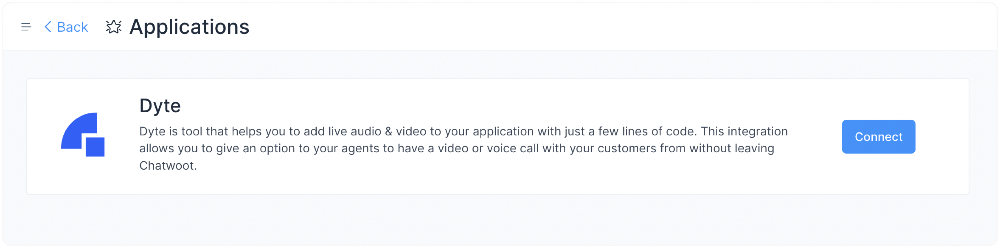
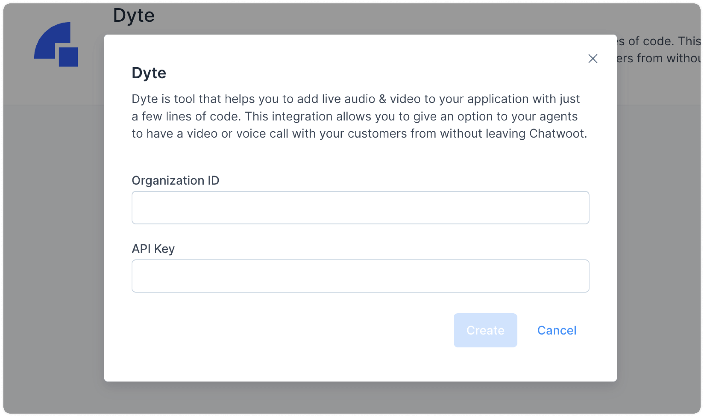
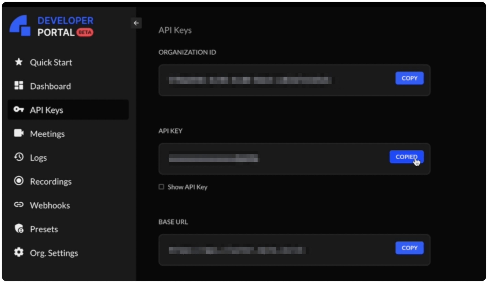
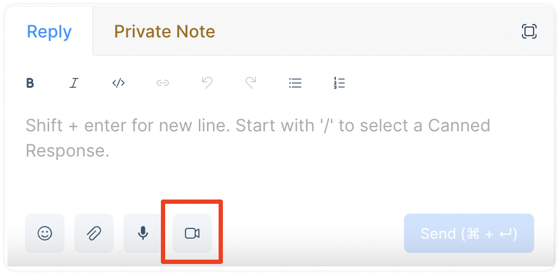
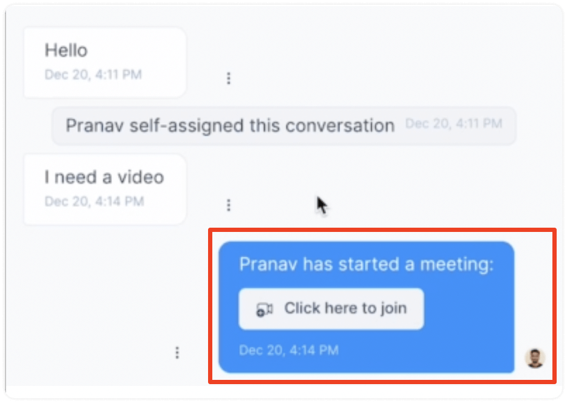
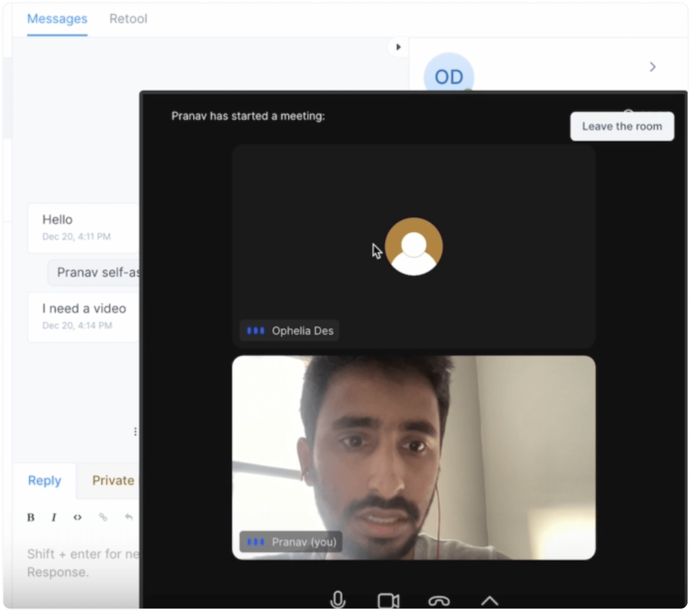
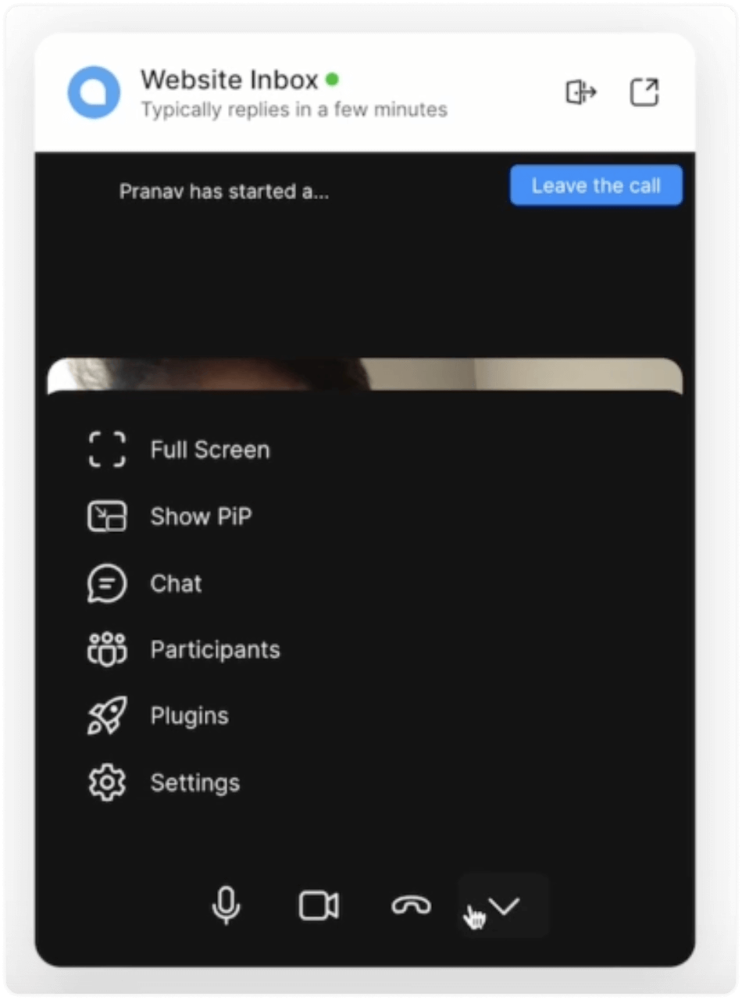

Video calling your customers is a great way to connect with them quickly, understand their problems effectively, provide faster resolutions, and gain valuable business insights. You can video call your customers through [website live chat](https://app.chatwoot.com/hc/chatwoot-user-guide-cloud-version/en/website-live-chat/474) in Chatwoot. To utilize this feature, you will need to enable the Dyte integration. This guide explains how.

P.S. If you don't have a Dyte account, you'll need to [create](https://dev.dyte.io/signup) one first.

## How to set up the Dyte integration in Chatwoot?

**Step 1.** Go to Settings → Applications → Dyte. Click the corresponding "Configure" button.

**Step 2.** You'll see the Dyte app page. Click the "Connect" button.

**Step 3.** Enter your Organization ID and API Key from Dyte.

**How to find your Dyte configuration values?**

To find these values, visit the "API Keys" section on your Dyte developer portal.

In Chatwoot, once you have entered the values, click the "Create" button.

Now, your Dyte integration is complete.

## How to video call your customers in Chatwoot?

Once the Dyte integration is enabled, you'll be able to see the video calling option on the website inbox chat window. To invite your customer for a video call, follow the steps described below.

**Step 1.** Click the video camera icon beneath the text editor.

**Step 2.** Chatwoot will send a message with an invitation to your customer to join the video call. Click the button "Click here to join" to join the room.

**Step 3.** Now you will be connected to your customer.

The video calling interface gives plenty of options to make your and the customer's experience more enriching. Some of these options are shown in the screenshot below:

