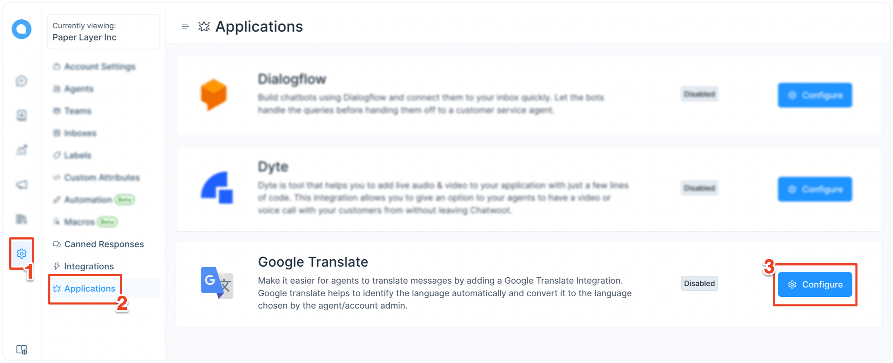
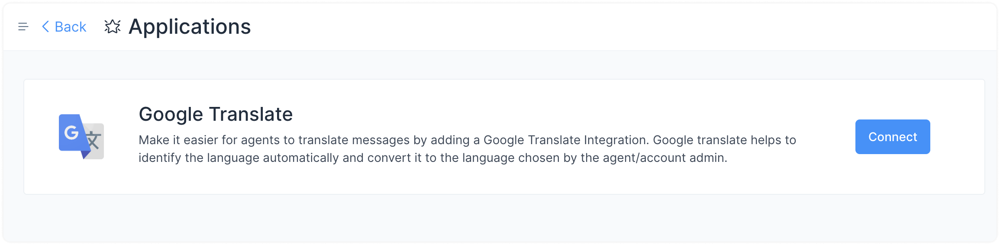
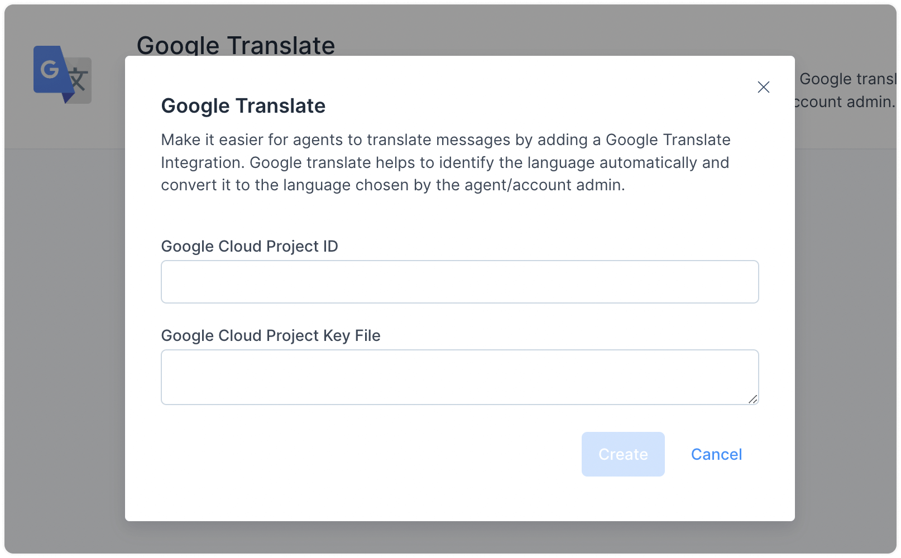
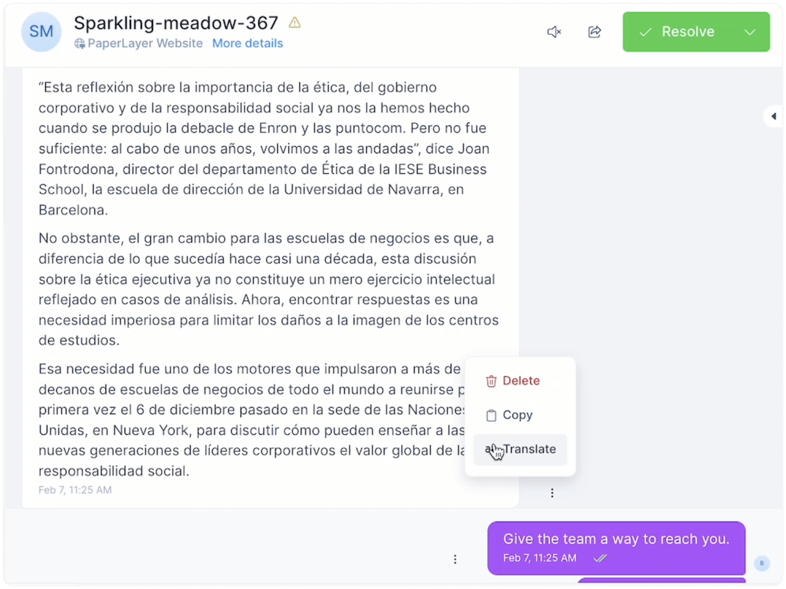
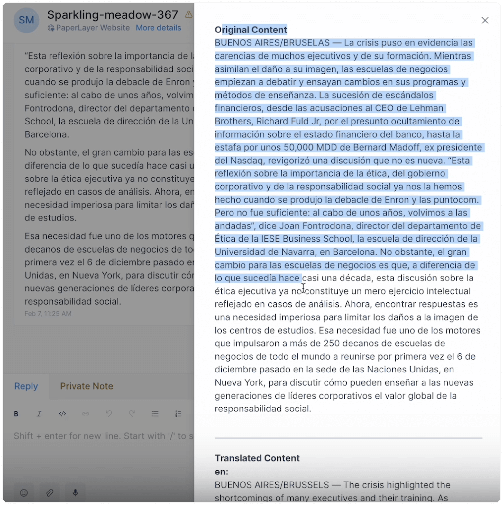

If you frequently receive queries in languages you/your team members don't understand, you can utilize the Google Translate integration in Chatwoot. When enabled, you can instantly translate incoming messages using the right-click menu. This way, you can easily communicate with customers in their native language, even if you don't speak it yourself.

## How to enable Google Translate?

**Step 1.** Go to Settings → Applications → Google Translate. Click the corresponding "Configure" button.

**Step 2.** You'll see the Google Translate app page. Click the "Connect" button.

**Step 3.** Enter your Google Cloud Project ID and Project Key File. If you need help obtaining these values, refer to this [doc](https://cloud.google.com/translate/docs/setup) from Google.

Once you have entered the values, click the "Create" button.

Now, your Google Translate integration is complete.

### How to change the translation language?

Your messages get translated into your site language. To select your site language, visit the "Account Settings" page.

**Step 1.** Go to Settings → Account Settings → Site Language. Open the dropdown and select your preferred language.

**Step 2.** Click the "Update Settings" button on the top-right corner of the page. This will translate your entire dashboard to the selected language.

**Note:** Agents can select their individual preferred languages too.

## How to translate incoming messages?

Whenever you receive a message in a language you need help with, click the 3 dots beside the message to open the menu and select "Translate".

Find the translated content in the popup window.

