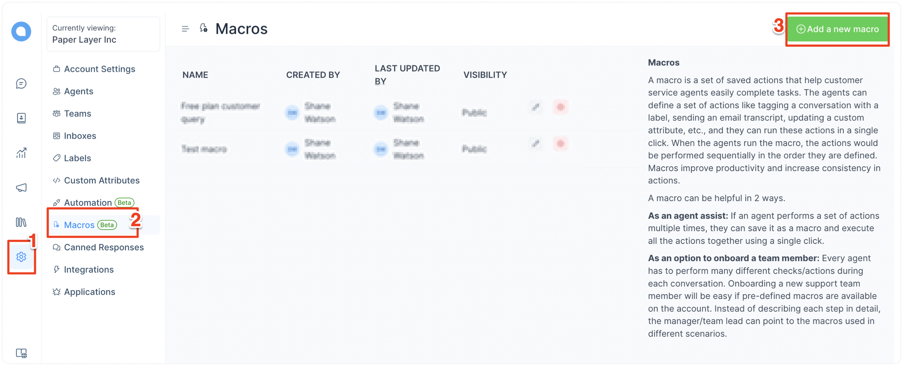
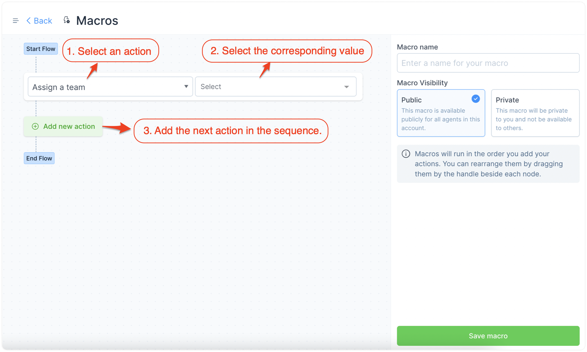
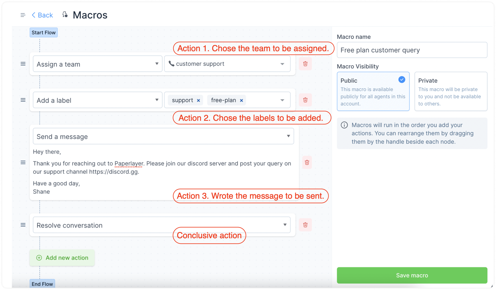
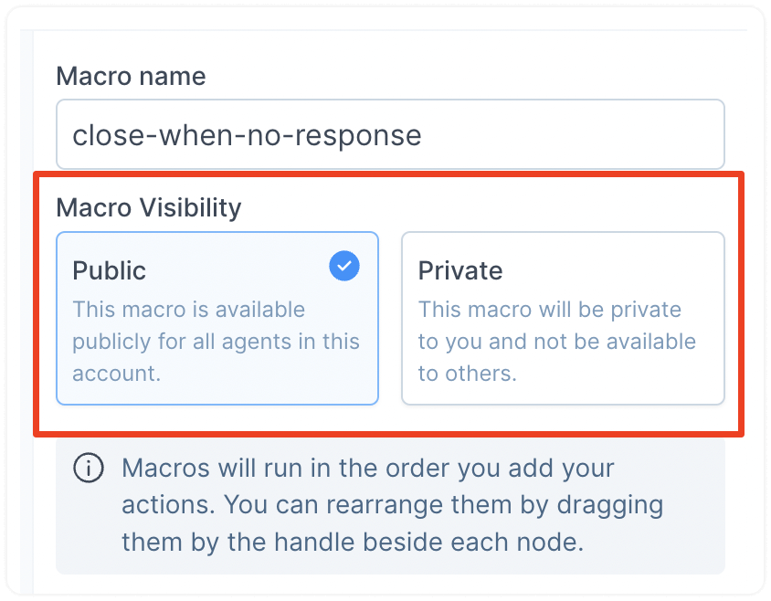
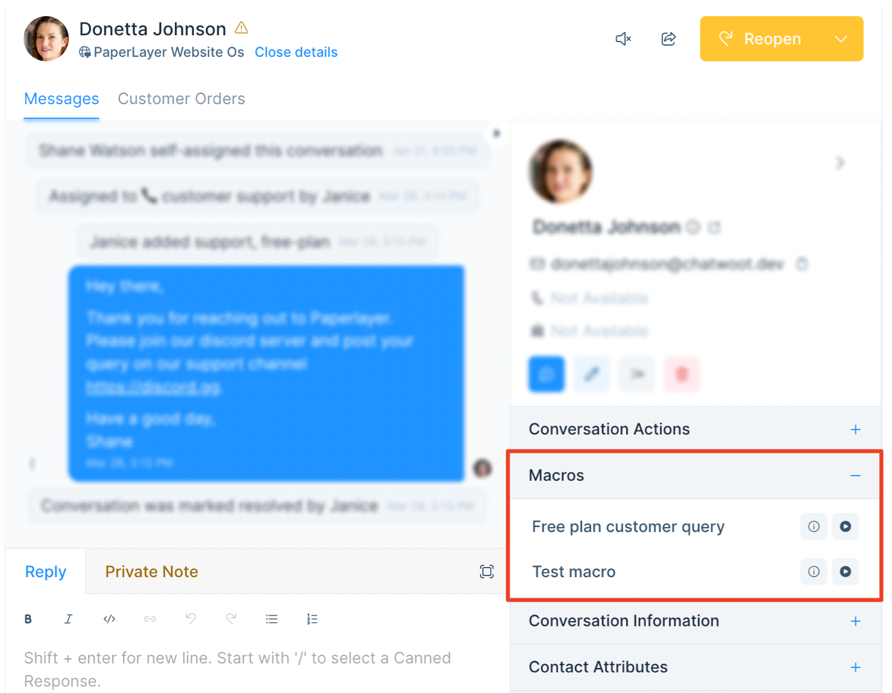
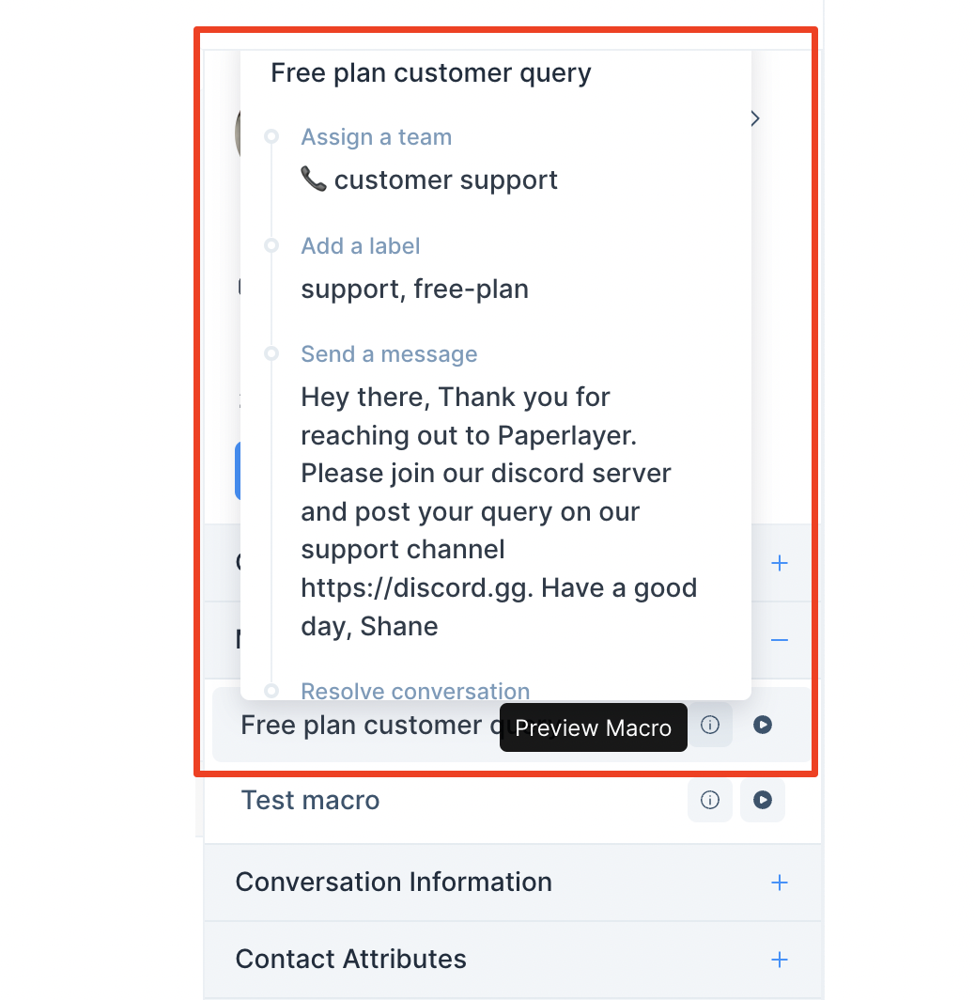
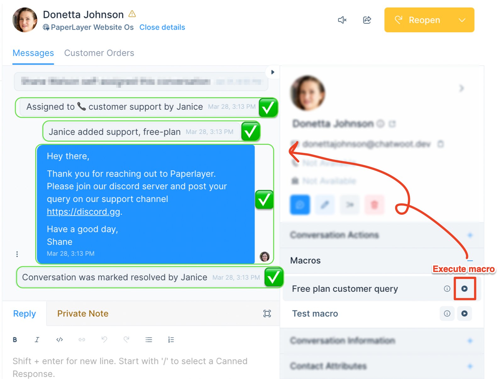

A macro is a set of sequential saved actions, like labeling a conversation, sending an email transcript, sending an attachment, etc., which you can define from your dashboard.

As a support agent, you will find that you need to repeat the same set of actions often. Here is an example: Whenever you receive a demo request, you assign the Sales team, send a standard message on how to book a slot, add the *Sales* label, and snooze the conversation. Or, whenever you receive spam, you send the same message about how they've come to the wrong place, assign the *Spam* label, and close the conversation.

Doing all these actions one-by-one, and multiple times a day can be painful and time-consuming. Instead, you can run a macro.

This guide explains, with examples, how to create macros––personal or public––and how to use them.

## How to create a macro?

**Step 1.** Go to Settings → Macros → "Add a new macro".

**Step 2.** You'll see a macro setup screen. Here, you can create a flow of the actions that must be performed when this macro is executed. You can also name your macro for internal reference in the right sidebar.

You can start by selecting an action from the dropdown. The currently available actions are shown below.

Select an action and set it up accordingly. When done, continue adding more actions.

### An example setup of a macro

Here is an example of the sequential actions performed whenever the Paper Layer team receives a query from a customer on free plan.

**Please note that the order you set these actions defines the order in which they will be performed.**

**Step 3.** Set the visibility for your macro. If you are creating it for your personal use, set "Private". If you want your team to be able to use it, set the visibility to "Public."

**Step 4.** Click the "Save macro" button on the bottom-right of the setup page.

Your macro is now ready to use!

## How to execute a macro?

**Step 1.** Locate the "Macros" section in the right sidebar of your chat window. Click the plus sign to expand it. This will show you the list of the macros created for your account – both private to you and public.

**Step 2.** Preview the macro if you are unsure of the actions it would perform. To preview, click the "i" icon. It would pop up a preview of the actions set in the specific macro.

**Step 3.** Execute the macro by clicking the play button. This would automatically perform all the actions in the defined sequence in a split second. You'll be able to see the respective success messages for different actions. Here's an example:

## How to edit or delete a macro?

To edit or delete macros, open the list of macros by visiting Settings -> Macros. Find the specific macro and use the corresponding edit or delete button, as shown in the screenshot below.

