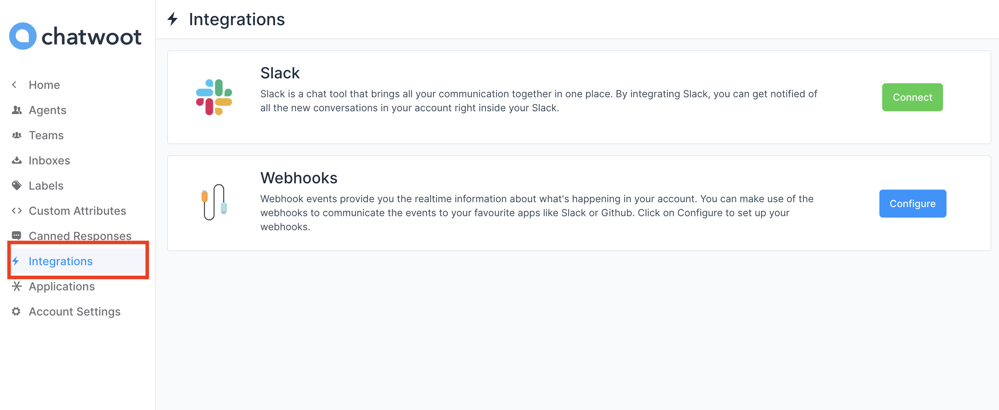
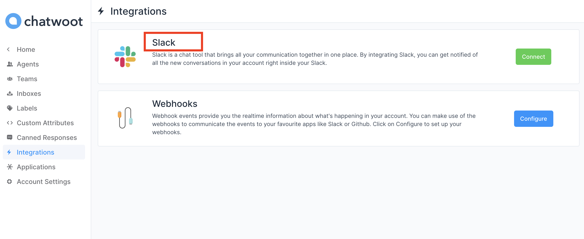
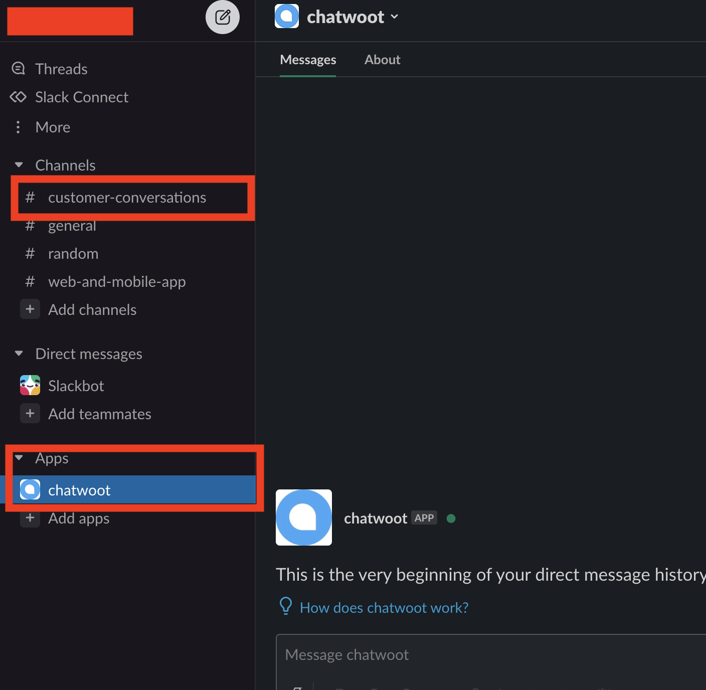

If your account/project is using Slack as a medium of communication, you can integrate slack with chatwoot inbox to get all the inbox conversations to your slack workspace.

To integrate slack with Chatwoot follow the steps mentioned below.

**Step 1** Go to the Chatwoot app and click on the integration link in the setting sidebar.

**Step 2** A screen opens up where you can directly give the workspace Slack URL to connect to your Slack account.

**Step 3** After logging into your slack workspace, the window will pop up to give permissions to the Chatwoot app.

**Step 4** After you allow the access, you will be able to see the Chatwoot app in your workspace app section. And when you receive any message against your chatwoot inboxes, you will be able to see them under the **#customer-conversations** channel in your workspace.

**Step 5** Check your message under **customer-conversations** channel.

### FAQ

Q: We have integrated slack correctly, but we are not able to see the channel.

A: Press the` cmd+k`/`ctrl+k` key and search for **customer-conversations** channel and verify if it got created. Your conversations from Chatwoot will come under this channel.

Q. I am replying to a message but it's not showing up in the chatwoot inbox.

A: When you reply to the message make sure you reply under the same thread. Each thread represents a separate conversation, so to show your reply to the same message you should reply under the thread. We use thread id to verify the separate conversation.
