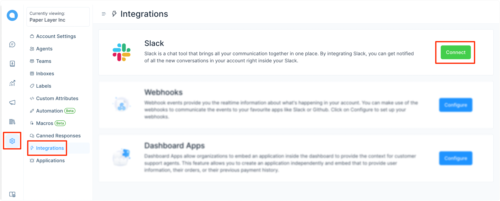
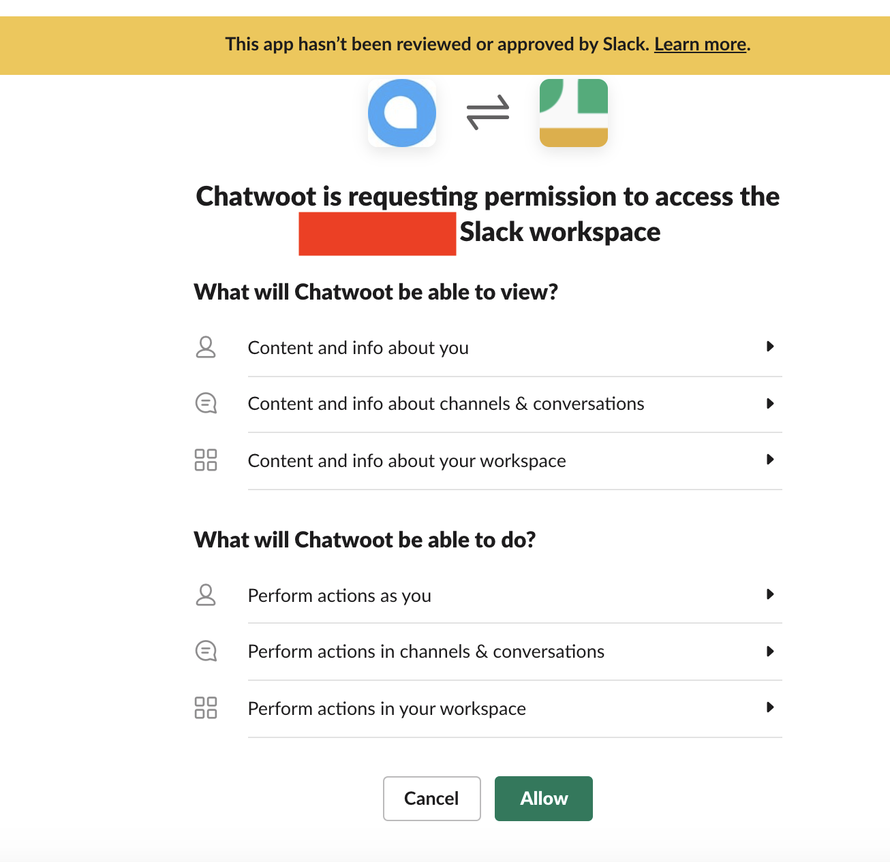
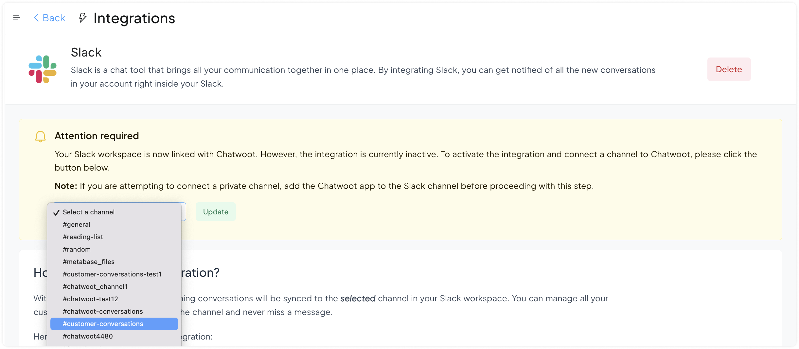
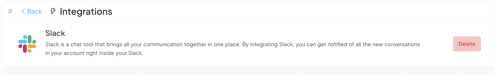
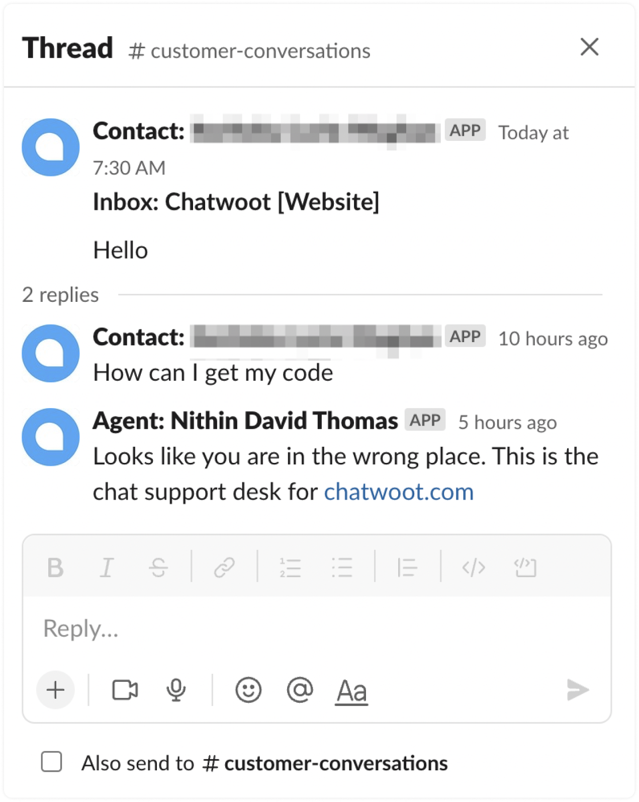
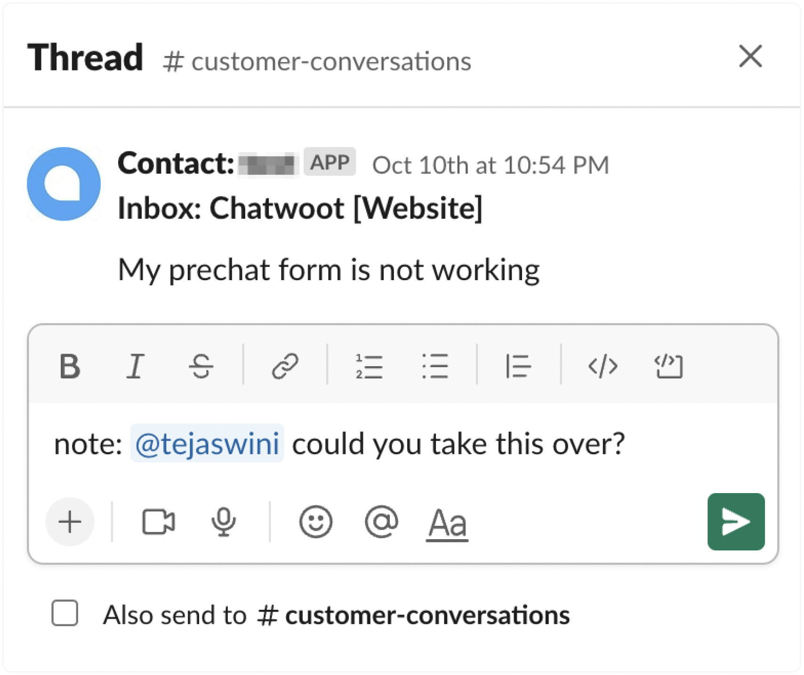

If your company/account/project is using Slack as a medium of communication, you can integrate Slack with Chatwoot to get all the inbox conversations to your slack workspace.

To start the quick setup, follow the steps explained below. If you are using a self-hosted Chatwoot instance, please follow this [guide](/docs/self-hosted/configuration/features/integrations/slack-integration-setup).

## How to integrate Slack with Chatwoot?

**Step 1** Go to Settings -> Integrations -> Slack -> Connect.

**Step 2** Enter your Slack workspace URL as prompted.

**Step 3** Review the permissions and allow the Chatwoot app to access your Slack workspace.

**Step 4** You will be redirected to the setup screen, where you will be able to see a list of your Slack channels (public and private). You need to select a channel of your choice from the dropdown menu where you want to receive your Chatwoot conversations.

Click the Update button. Now, the integration is complete.

### Important note

If you have connected Slack before September 2023, you would not have had the option of selecting a specific Slack channel to manage your conversations from. If you would like to change that and select a specific channel of your choice, you will need to delete your existing Slack integration from the Chatwoot app and connect it again.

### FAQ

Q: We have integrated slack correctly, but we are not able to see the channel.

A: Press the` cmd+k`/`ctrl+k` key and search for **customer-conversations** channel and verify if it got created. Your conversations from Chatwoot will come under this channel.

Q. I am replying to a message but it's not showing up in the chatwoot inbox.

A: When you reply to the message make sure you reply under the same thread. Each thread represents a separate conversation, so to show your reply to the same message you should reply under the thread. We use thread id to verify the separate conversation.

## Supported features

### Answer from your agent profile

When you reply to a conversation from Slack, the customer receives the reply from your Agent profile in Chatwoot.

### Create private notes from Slack

You can create a [private note](https://www.chatwoot.com/features/private-notes) in Chatwoot from Slack. If you prefix a message with "note:", it converts into a private note and notifies any tagged agents. Here is an example:

