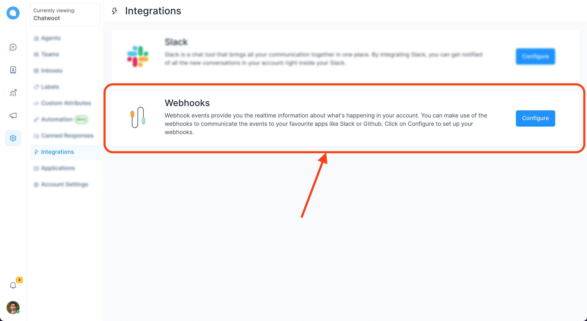
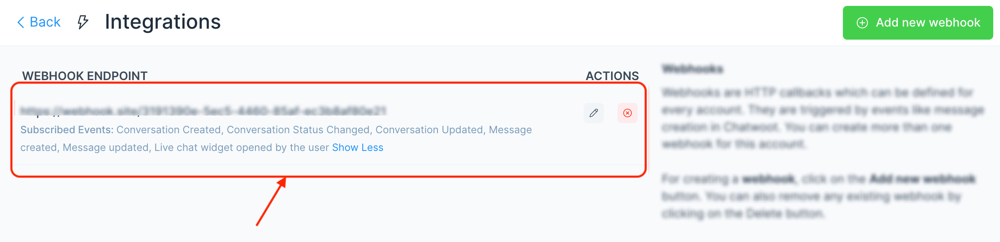
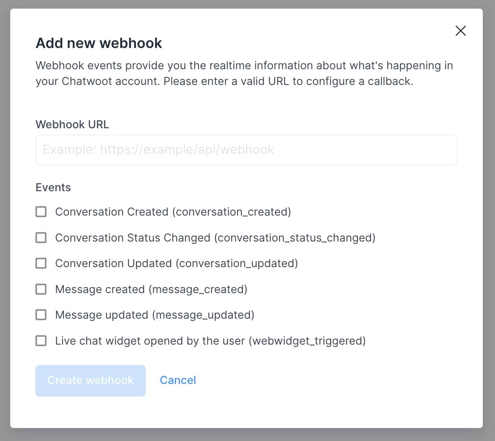

Webhooks are HTTP callbacks that are defined in every account. These events are triggered when an action like message creation happens in Chatwoot. You can create more than one webhook for an account.

**Step 1** Click on the Integrations link in the settings sidebar. Next, click on "Configure" button.



**Step 2**. You will see the list of webhooks you have already added to the account.



**Step 3**. Click on the "Add new webhook", and it will display a modal where you can input the URL to which the POST request should be sent. Next, you need to select the events you want to subscribe. This option would allow you to only listen to the relevant events in Chatwoot.



Chatwoot will send a POST request with the following payload to the configured URLs for various updates happening in your account.

### A sample webhook payload

```json
{

  "event": "message_created", // The name of the event
  "id": "1", // Message ID
  "content": "Hi", // Content of the message
  "created_at": "2020-03-03 13:05:57 UTC", // Time at which the message was sent
  "message_type": "incoming", // This will have a type incoming, outgoing or template. The user from the widget sends incoming messages, and the agent sends outgoing messages to the user.
  "content_type": "enum", // This is an enum, it can be input_select, cards, form or text. The message_type will be template if content_type is one og these. Default value is text
  "content_attributes": {} // This will an object, different values are defined below
  "source_id": "", // This would the external id if the inbox is a Twitter or Facebook integration.
  "sender": { // This would provide the details of the agent who sent this message
    "id": "1",
    "name": "Agent",
    "email": "agent@example.com"
  },
  "contact": { // This would provide the details of the user who sent this message
    "id": "1",
    "name": "contact-name"
  },
  "conversation": { // This would provide the details of the conversation
    "display_id": "1", // This is the ID of the conversation which you can see in the dashboard.
    "additional_attributes": {
      "browser": {
        "device_name": "Macbook",
        "browser_name": "Chrome",
        "platform_name": "Macintosh",
        "browser_version": "80.0.3987.122",
        "platform_version": "10.15.2"
      },
      "referer": "http://www.chatwoot.com",
      "initiated_at": "Tue Mar 03 2020 18:37:38 GMT-0700 (Mountain Standard Time)"
    }
  },
  "account": { // This would provide the details of the account
    "id": "1",
    "name": "Chatwoot",
  }
}
```

Find the full list of events supported by the webhooks [here](/docs/product/others/webhook-events).

### Best practices for using webhook

#### Return a success(2xx) response quickly
Webhook events in Chatwoot have a timeout of 5 seconds. If you are using the event with another integration, we suggest performing it in the background instead of directly within the request. This allows you to send the acknowledgement response back to Chatwoot and process it in the background without impacting any services.

#### Listen to the required events only
Configure your webhook endpoints to receive only the necessary events for your integration. Listening for additional events or all events can overload your server and it is not recommended.
