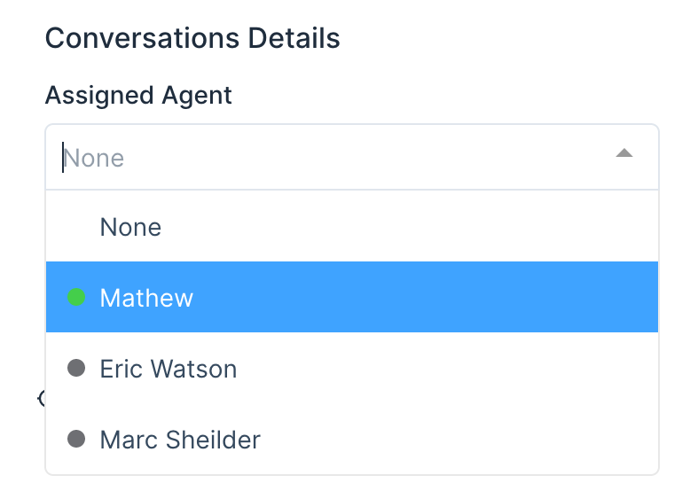
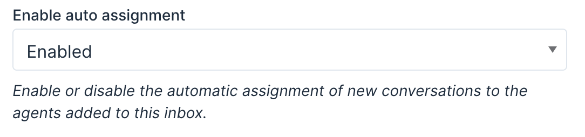

Every conversation in Chatwoot can have an assignee. An assignee can be manually added to the conversation via web console or the API or the organizations can opt for round robin assignment system. This doc explains how you can assign an agent to the conversation.

## Manual assignment

A conversation can be manually assigned to 2 category of users.

1. Agents who have access to the inbox in which the conversation is created.
2. Administrators who can access every conversation in the system.

To assign an agent or admin to a conversation, an admin/agent can select the assignee from the dropdown named under "Assigned Agent" from the "Conversation Details" section in the right sidebar, as shown below.

## Auto assignment

Chatwoot provides a round-robin auto assignment system for conversations. The assignment follow the logic mentioned below.

_Note_: Round robin assignment is enabled by default.

1. If there are agents online who have access to the inbox in which a conversation is created, then the system would distribute the conversations equally among the online agents.
2. If all the agents are offline, the system would distribute the conversations equally to all agents.

### Enable round robin assignment

To enable round robin assignment in your inbox, follow the steps below.

1. Go to Settings -> Inboxes.
2. Click on the inbox settings link of the inbox you want to enable round robin assignment.
3. Scroll down to see the setting for Round robin as shown below.

4. Change it to "Enabled" and click on "Update".
