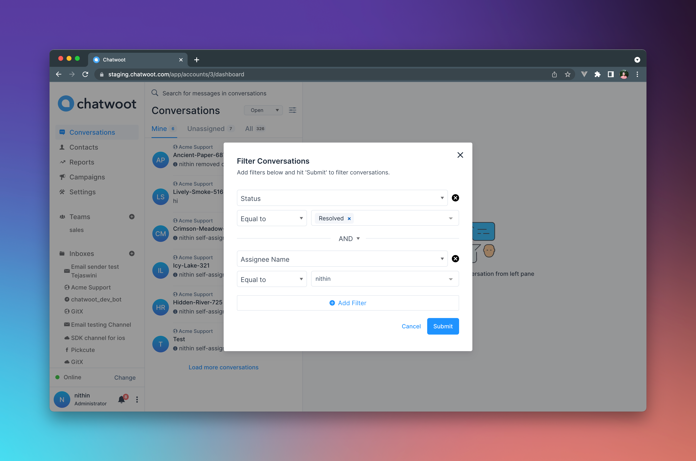
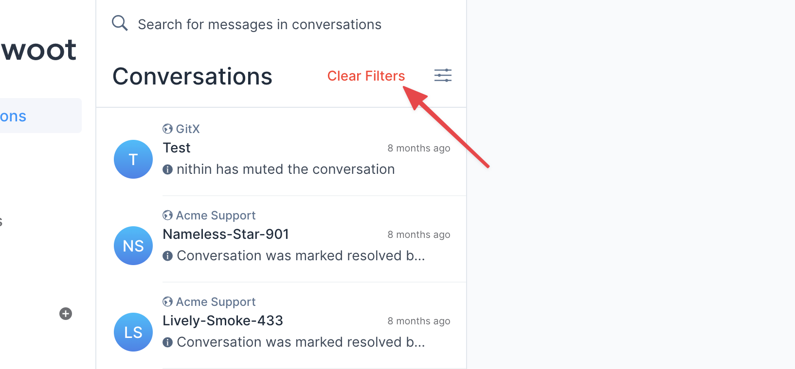

Chatwoot let's you apply advanced filters for your conversations. You will have the ability to filter conversations with multiple attributes at once and even query them with AND and OR operators.

 offers filtering conversations by the below attributes:

1. Conversation Status
2. Agent Assigned
3. Inbox
4. Team
5. Conversation Identifier
6. Labels
7. Campaigns
8. Browser Language
9. Country
10. Referrer Links

> You will still be having access to the old status filter dropdown at it's place.

You can simply click on the filter icon to open the conversation list panel.

You will now be presented with the filters popup, which let's you select the filter type, the operator (equal to, not equal to, present, not present) and the value.

### Filter Example
In order to get all conversations that are "Resolved" by agent "Nithin", you set the filters as below

1. Set the filter type as "Status", the operator as "Equal to" and the value as "Resolved"
2. Set the "Assignee Name" as the filter type, "Equal to" as the operator and "Nithin" as the value.
3. Hit Submit, and the conversation list will now be filtered by the above criteria.

You can apply as many filters as you want, by combining them with AND and OR operators to create complex queries and funnel you list to specific needs.

To clear the filters and go back to the original list, simply click on the "Clear Filters" button.

### API
Chatwoot also provides you with an API for filtering conversations. You can find the [docs](https://www.chatwoot.com/developers/api/#operation/conversationFilter) here
