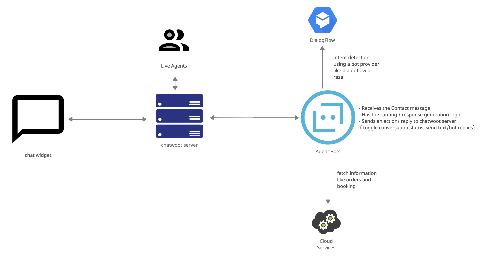

AgentBot is a web service connected to a chatwoot inbox and can act as a bot handling customer queries. Chatwoot allows you to easily connect your custom bot logic into conversation handling via AgentBot APIs. 

Once you connect agent bot to an inbox, all the new conversations created in your inbox will initially be assigned 'bot' status. Chatwoot will send each conversation events to your bot URL as webhook events. To which your AgentBot can react through the chatwoot [APIs](https://www.chatwoot.com/developers/api/)

### Workflow

- The connected agent bot receives events like `widget_triggered`, `message_created`, `message_updated` etc based on customer action
- The agent bot can process the information received and come up with a response. 
- The agent bot can also rely on external system APIs to fetch additional user information like order status, booking trigger, etc
- The agent bot can also rely on services like rasa, dialogflow, lex etc to do intent detection
- The agent bot can post the generated response back into the widget by calling chatwoot APIs like message_create
- The agent bot can toggle a conversation status to open to hand off the conversation to a human agent
- The agent bot can continue to listen to open conversations and see if it can provide contextual information to the support agent.

### Use Cases

- Businesses with high volume customer support queries can use a bot to further authenticate and filter queries before passing to agents
- Ecom websites can hook up  the bot to their existing database and provide order/shipping status
- News/Content websites can leverage card messages to send recommendations via bot
- Hotel/Movie booking websites can handle the booking via bot

### Implementation Examples
1. https://github.com/chatwoot/dialogflow-agent-bot-demo : example hotel booking implementation using dialogflow
2. https://github.com/chatwoot/rasa-agent-bot-demo : example implementation using rasa.


> Look into interesting ways to leverage [bot-message types](/docs/product/others/interactive-messages) on chatwoot.


## Adding Agent Bots to Chatwoot

There are two types of agent bots in chatwoot.
1. **Global Bots** : Global Bots have a permission scope for all the accounts in a chatwoot installation. They can interact with bot accessible endpoints in respect to any account in that installation.
2. **Account Bots** : Account Bots have a permission scope that is limited to the account for which the bot was created. 

You can provision Agent Bots in Chatwoot either through our API or using Rails Console.

### Creating agent bots via API
1. ** Global Bots** can be created by interacting the [agent bot APIs](https://www.chatwoot.com/developers/api/#tag/AgentBots). 
2. ** Account Bots** can be created by interacting with the [account bot APIs](https://www.chatwoot.com/developers/api/#tag/Account-AgentBots).


###  Creating agent bots via Rails console

go to your chatwoot directory and ensure your local server is running.  Start a rails console in your directory.

```
bundle exec rails c
```

Inside the rails console, type the following commands to create an agent bot and get its access token. Save the retrieved token as you would need to use in when calling the chatwoot APIs

```
# specify a url when your bot logic resides
# pass account_id attribute to create an account bot instead of global bot
bot = AgentBot.create!(name: "Your Bot", outgoing_url: "http://localhost:8000")
bot.access_token.token
```

Add an avatar to your bot (optional)
```
avatar_file = Down.download("image url")
bot.avatar.attach(io: avatar_file, filename: avatar_file.original_filename, content_type: avatar_file.content_type)
```

Connect Agent Bot to your inbox by running the following command

```
# Replace Inbox.first with Inbox.find(inbox_id) for specific inboxes
AgentBotInbox.create!(inbox: Inbox.first, agent_bot: bot)
```


## FAQ

### Human Agent Handoff ?

When an agent bot is connected to an inbox, conversations are created with `pending` status instead of `open`. This lets the intial triaging to happen via 
the bot before the conversation is passed on to an agent. When the bot decides that its best for the conversation to be handled by a human agent, It can call the conversation update API
and toggle the conversation status to `open`

Sometimes the agents would want to push back a conversation which was handed off, back again into the bot queue. They can do this by changing the conversation status back to `pending` again so that the bot can start responding to that conversation again. 


