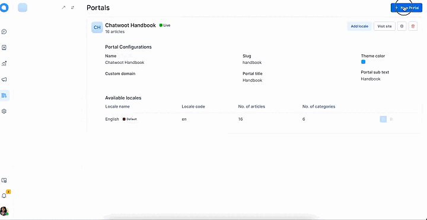
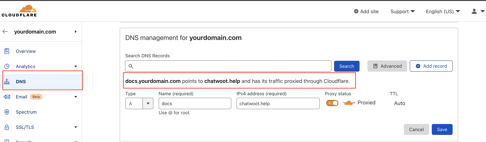
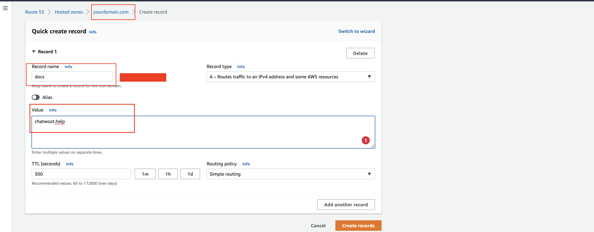
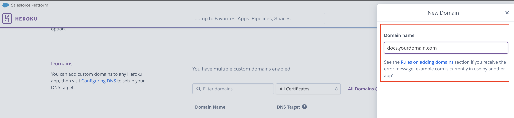
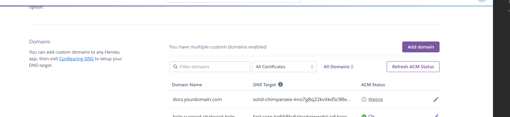
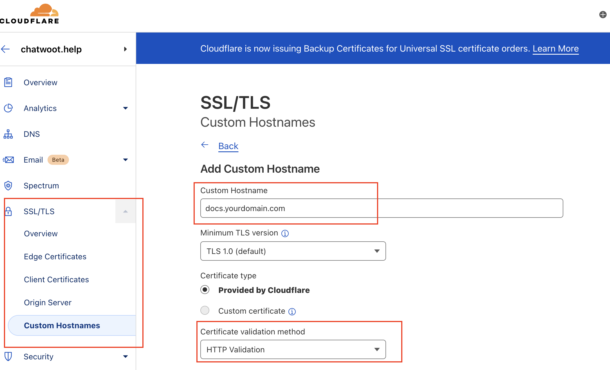
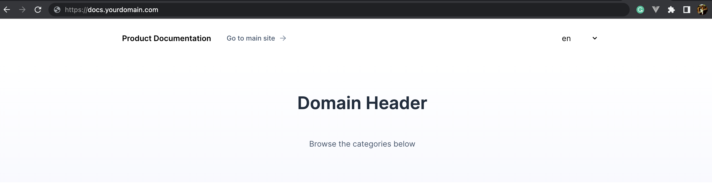

Help center allows you to create portal and add the articles from the chatwoot app dashboard. You can point to these help center portal articles from your main site and display it as your help documentations.
We provide SSL certificate for your help docs though our chatwoot domain.

## How to get SSL certificate for your custom domain

### Create Portal in chatwoot's dashboard

Let's create product documentation portal for `yourdomain.com` which will be served at custom-domain `docs.yourdomain.com`

1. Navigate to Help Center
2. Click on "New Portal"
3. Add basic information about your portal.
  - Add custom domain at which you want to serve your portal: e.g yourdomain.com is your main site and you want your portal at docs.yourdomain.com then this will be your custom domain.
  - Add portal name, this is the heading of your portal
  - slug is auto-generated `do not change it`
4. Add customization information about the portal like theme color, page title, header text and homepage like which would be yourdomain.com in this case.
5. Your portal is ready with no articles, so click on portal settings button and add new categories and add articles in the respective category.

One step is completed, you have now your portal information with articles.

### Point your custom domain to chatwoot.help

1. Go to your nameserver, go to it's DNS settings and add new CNAME record.
   - For above example, add docs as CNAME record and point it to the chatwoot.help
   - For cloudfare nameserver please below attached image for the reference, it's under DNS tab.

   

   - For the AWS nameserver please see below attached image for the reference, it's under Route53 service.

   

   - If you are using some different name server the settings wil be similar, just go to the DNS settings and add CNAME record. Or serch for `How to add CNAME record with your nameserver?`.
2. This will make sure that your record is pointing to our server and we provide you your portal information as well as the SSL certificate for your custom domain. In this case `docs.example.com`

### Providing SSL

1. This process will be handled by us for all the cloud customer.
2. You need to reach out to us through the chatwoot support with your portal custom domain record.
3. Or you can just email us with subject of "Issue SSL certification for {Portal Slug}"
#### NOTE: This step will take 1/2 working day/s from chatwoot team for the setup.

Voila!

`docs.yourdomain.com` is live with secure connection and your portal data is visible.

### How does this work.

These are the engineering details to understand `How does docs.yourdomain.com` gets the portal data with SSL certificate.

1. When customer point docs.yourdomain.com to chatwoot.help through CNAME, DNS points it to our site, but it's not valid yet.
2. Then Customer contact us to serve `docs.yourdomain.com` endpoint with portal's data.
4. To validate the routing from `docs.yourdomain.com` to `chatwoot.help`, we add a record in our heroku.
  - This is to validate heroku DNS routing and validate custom domain.
  - Go to Heroku `dashboard -> Chatwoot -> Settings`
  - Go to Domains section and add new domain to serve, in this case `docs.yourdomain.com`

  

  - After we add the domain successfully and ACM status will be waiting to verify the cert issue and will show error later as SSL is not yet provided for the custom domain.

  

5. Heroku won't allow to serve `docs.yourdomain.com` until we provide the SSL certificate.
6. For this we go to our cloudfare dashboard and certify the record for `docs.yourdomain.com`
   - Go to cloudfare dashboard -> chatwoot.help
   - Go to SSL/TLS -> custom hostname
    

   - Add a record for docs.yourdomain.com, with certification validation method `HTTP Validation` and certificate type `Provided by cloudfare`
7. Wait till the cutom hostname reflects with SSL certificate active.
8. Go back to heroku and check ACM status for the `docs.yourdomain.com` is shows `Ok` now.

Cloudfare's custom hostname functionality provides the certificate to custom domain that we add.

1. `docs.yourdomain.com` resolves by customer's nameserver and redirects to chatwoot.help.
2. `chatwoot.help` nameserver certifies the `docs.yourdomain.com`
3. Chatwoot's heroku domain's settings validate the certificate and routes to chatwoot.help root dashboard.
4. `chatwoot.help` check for the portal record with custom-domain `docs.yourdomain.com`
5. Redirects to the portal records for the domain `docs.yourdomain.com`
 - 

Yaay!!

Now you can have your own help-center, product-documentation related portal saved at chatwoot dashboard and served at your own domain with our provided SSL certificate.

